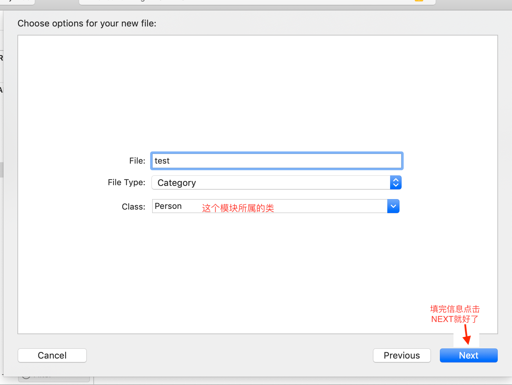

# Objective-C

OC是在C语言的基础上增加了一部分的面向对象的语法，将C语言复杂的、繁琐的语法封装的更为简单。OC是完全兼容C语言的。在OC中可以写任意的C代码，且效果一致。

## 与C的异同

- OC文件后缀名为`.m`而C文件后缀为`.c`

- 引入文件OC使用`#import <xxx>` 而C是 `#include <xxx>`

  - Import 是 include 的增强版，在预编译的时候将引入文件的内容拷贝到写指令的地方，同一个文件无论import多少次，只会包含1次，就像webpack ES6打包一样
  - 如果include像实现import的效果则需要条件编译指令

  ```c
  // 如果是用 include 为防止多次引入
  #ifndef test_h
  #define test_h
  #include <stdio.h>
  void sayHi();
  #endif /* test_h */
  // 如果是用 import 引入，因为import本身就防止多次引入
  void sayHi();
  ```

- OC把所有的代码都放在 `@sutoreleasepool{}`这个代码块中，这个是一个自动释放池

- 控制台打印用NSLog()函数，这个函数在foundation框架中，因此一定要引入这个框架

  - NSLog()是printf的增强版，会在printf的基础上**加一些调试信息时间、run的项目名、进程编号、线程编号**最后才是输出的信息，并且输出万信息之后会**自动换行**、**OC中新增的数据类型也只能用NSLog()输出**

- C中字符串存储方式是使用字符数组存储和使用字符指针\0位字符串结束符，而OC中有一个更为好用的用来存储字符串的数据类型 NSString

  - NSString 类型的指针变量 专门存储OC字符串的地址
  - OC字符串常量必须使用一个前缀@
    - `"jack"` C语言字符串
    - `@"jack"` OC字符串
  - NSString类型的指针变量，只能存储OC字符串的地址，因此使用方式是`NSString *str = @"jack";`，如果把C语言字符串直接付给 NSString 会直接报错

- OC的NS前缀，这就关系到这么语言的历史了，NS是NextStep的缩写，因为这些方法或者数据类型都是NextStep公司编写或者定义的。

- OC与C的注释一摸一样

- 函数的定义和调用是一样的

- 运算符和C一摸一样

- OC支持C的所有控制语句

- OC支持C关键字，也新增了一些关键字绝大多数以@开头

- 数据类型，OC中支持所有的C数据类型，以下列举一些新增的类型

  - OC字符串：NSString *str = @"test";
  - 布尔类型 BOOL： YES/NO （相对于别的语言中的 true/false）`BOOL b1 = 10 > 20;bool b2 = YES;`，定义时写 BOOL / bool 都可以
    - 本质上 bool 就是语法糖 char 的 typedef，YES/NO 就是 1/0强转为 char 的 define
  - 布尔类型 Boolean：true/false `Boolean b1 = 10>20;Boolean b2 = false;`
    - 本质上 Boolean 就是语法糖 unsigned char 的 typedef，YES/NO 就是 1/0 的 define
  - 类 class：[面向对象语法所用到的类型](#OC的面向对象)
  - id类型 万能指针：
  - nil：与 NULL 差不多
  - SEL 方法选择器：
  - block 代码段：

因此我们在编写OC代码的时候都用`#import`方式引入，并且都用NSLog()打印信息，字符串都用OC字符串

一个简单的OC例子

```objc
#import <Foundation/Foundation.h>
// 兼容C文件
#import "test.h"
double area(double a, double b) {
    return a * b;
}
int main(int argc, const char *argv[]) {
    @autoreleasepool {
        NSLog(@"3*3=%f", area(3.0,3.0));
        int a = sayHi();
        NSLog(@"%d",a);
        NSString *str = @"test";
        NSLog(@"%@",str);
        // argc 就是第几个条件
        // 终端输入 ./ex1 -s aa
        //   argc==3 argv[0]=="./ex1" argv[1]=="-s" argv[2]=="aa"
        for (int i = 0; i< argc; i++) {
            NSLog(@"%s", argv[i]);
        }
    }
    return 0;
}
```

**编译**：可以用Xcode创建工程后直接运行，也可以用terminal编译连接执行（前提是安装了Xcode命令行工具）

```shell
# 编译，生成xx.o文件
$ cc -c xx.m
# 链接头文件，如使用到了foundation框架，生成a.out可执行文件
$ cc xx.o -framework Foundation
# 执行
$ ./a.out
```

## OC的面向对象

OC在C的基础上增加了一小部分的面向对象的语法，面向对象的三大特征就是：封装、继承、多态

定义类的语法，直接写着源文件中，不要写着main函数中，语法：

- 类的声明

```objc
@interface 类名 : NSObject {
// 类的共同特征（属性/成员变量/字段）
  // 要想属性被外部反问则加一个@public关键字
  @public
  NSString *_name;
  int _age;
  float _weight;
}
// 类的共同行为（方法的声明）
// 无参数方法 - (返回值类型)方法名称;
// 一个参数 - (返回值类型)方法名称:(参数类型)形参名称;
// 带多个参数 - (返回值类型)方法名称:(参数类型)参数名称 :(参数类型)参数名称;
- (void)run;
- (void)eat:(NSString *)food;
- (int)sum:(int)num1 :(int)num2;
// 声明尽量写详细一点，如下面那样，这个代码规范 
- (int)sumWith:(int)num1 and:(int)num2;
@end
```

- 类的实现

```objc
@implementation 类名
// 方法的实现写在这里
- (void)run {
  //语句
  // 这里可以直接访问属性，不需要让属性公有化，方法中的属性是实例对象的属性
  _weight -= 0.5f;
  NSLog(@"running...");
}

- (void)eat:(NSString *)food {
  _weight += 0.7f;
  NSLog(@"eat %@", food);
}

- (int)sum:(int)num1 :(int)num2 {
  return num1 + num2;
}
- (int)sumWith:(int)num1 and:(int)num2 {
  return num1 + num2;
}
@end
```

类的定义中必须要有类的声明和实现，类名的每一个单词的首字母要大写，为类定义的私有属性名开头用下划线

**注**：声明和实现不能相互嵌套，类一定要先声明后实现，一个类声明和实现都要有，类的声明必须放在使用类的前面，实现可以放在使用类的后面，属性名异地昂要以下划线开头，类名开头要大写，这是规范。声明属性的时候不能赋值，会直接报语法错误。

除去特殊情况（只有实现没有声明），类声明和实现都要有，如

```objc
@implementation Student : NSObject
{
  NSString *_name;
}
- (void)sayHi {
  NSLog(@"test");
}
@end
// 调用
Student *s1 = [Student new];
[s1 sayHi];
// 上述代码是可以正常执行的，这样写感觉就有点像java了，虽然可以，但是在OC中极度不推荐
```

- 类是无法直接使用的，如果要使用这个类的话，必须要先生成对象

  ```objc
  // 类名 *对象名 = [类名 new];
  Person *Leo = [Person new];
  ```

- 访问对象的属性，通常来说对象的属性是不允许外界直接访问的

  - 如果想要对象的属性允许被访问，要在声明属性时加上@public
  - 取值`对象名->属性名/(*对象名).属性名` ，赋值`对象名->属性名=值/(*对象名).属性名=值`

- 类的方法的调用

  - 无参数 `[对象名 方法名]; [s1 run];`
  - 带一个参数 `[对象名 方法名:实参]; [s1 eat:@"bat"];`
  - 带多个参数 ``[对象名 方法名:实参1 :实参2]; int sum = [s1 sum:1 :2]; int sum = [s1 sumWith:1 and:2];`

### 方法和函数的异同

C语法的函数就叫做函数，OC类中写的方法就叫方法。

- 都是用来封装代码的，将一段代码封装在其中，表示一个相对独立的功能
- 函数和方法声明和定义的语法是不同的
- 函数和方法定义的位置是不同的
  - OC方法的声明只能写着@interface中，定义只能写在@implementation中
  - 函数声明和定义除了在函数内部和@interface的大括号（属性的地方）中，其他地方都可以写
- 函数可以直接调用，而方法必须先创建对象，用对象来调用
- 方法是属于类，而函数是独立的

**注**：就算把函数写在类中，函数也不属于类，创建的对象中也没有这个函数

### 对象和方法

对象可以作为方法的参数，对象也可以作为方法的返回值

类的本质其实是我们自定义的一个数据类型，那么什么是数据类型呢，其实数据类型就是在内存中开辟空间的一个模版。类的本质就是一个数据类型，因为对象在内存中的大小是由我们决定的，多写几个属性，对象占的空间就大一点。

正因为类的本质就是一个数据类型，所以我们可以把类作为一个方法的参数或者返回值

- 类作为方法的参数

```objc
// Person.h
#import <Foundation/Foundation.h>
#import "Dog.h"
@interface Person : NSObject {
  NSString *_name;
  int _age;
}
- (void)sayHi;
- (void)dogShout:(Dog *)dog;
@end
  
// Person.m
#import "Person.h"
@implementation Person
- (void)sayHi {
  NSLog(@"Hi");
}
- (void)dogShout:(Dog *)dog{
  // 这个Dog类里有个sayHi方法
  [dog sayHi];
}
@end
 
// main.m
#import "Person.h"
  // 因为Person.h里引入过Dog.h了，所以不用再引一边Dog.h,不过为了可维护行我们也可以加上
int main{
  Person *p1 = [Person new];
  [p1 sayHi];
  Dog *d1 = [Dog new];
  [p1 dogShout:d1];
  return 0;
}
```

- 类作为返回值

```objc
// Person.h
#import <Foundation/Foundation.h>
#import "Dog.h"
@interface Person : NSObject {
  NSString *_name;
  int _age;
}
- (void)sayHi;
- (Dog *)createDog;
@end
  
// Person.m
#import "Person.h"
@implementation Person
- (void)sayHi {
  NSLog(@"Hi");
}
- (Dog *)createDog {
	Dog *d1 = [Dog new];
  return d1;
}
@end
 
// main.m
#import "Person.h"
  // 因为Person.h里引入过Dog.h了，所以不用再引一边Dog.h,不过为了可维护行我们也可以加上
int main{
  Person *p1 = [Person new];
  [p1 sayHi];
  Dog *d1 = [p1 createDog];
  [d1 sayHi];
  return 0;
}
```

- 对象作为类的属性

引入好之后在属性中直接写就好了

- 类的实现中如何调用自身别的方法 `[self fun];`

### 类方法

OC中的方法分为两种：对象方法/实例方法和类方法。

对象方法就是必须先创建对象，通过类名来调用的方法；类方法的调用不依赖于对象，如果要调用类方法，不需要创建对象，而是直接通过类名来调用

对象方法的声明使用 - 号 如`- (void)sayHi;` 

类方法的声明使用 + 号，语法和对象方法一样；实现也是在 @implementation 中使用和对象方法也差不多 `[类名 类方法];`

类方法的特点：

- 节约空间：因为调用类方法不用创建对象
- 提高效率：因为调用类方法不需要先找对象指针再找isa指针再找到代码段中的方法，一步到位

**注**：在类方法中不能直接访问属性，也不能调用对象方法。如果方法不直接访问属性，也不调用对象方法，我们可以把方法定义为类方法，这样节约空间。如果我们写一个类，那么就要求为这个类提供一个和类名同名的类方法，这个方法一个最纯洁的对象返回。苹果和第三方都遵循这个规范。可以通过类方法给对象初始化值 `+ (void)类名With属性1:()属性 and属性2:()属性`

### 匿名对象

创建对象不赋值给对象指针，那么这个创建的对象就是匿名对象

### 对象之间的关系

主要是四种关系：组合关系、依赖关系、关联关系、继承关系

- 组合关系

  多个小的类组成一个大的类

- 依赖关系

  一个对象的方法的参数是另外一个对象，即对象作为类方法的参数，就叫依赖关系。如果是A类的 fun:(B *)classB; 那么A就依赖于B。这是高耦合的关系

- 关联关系

  简单来说就是一个类作为另外一个类的属性，但是又不是组合关系，而是一个类似于拥有的关系，那么就是关联关系

#### 类的继承

子类继承父类的属性和方法，语法@interface 类名 : 父类名

子类拥有父类所有成员属性和方法，因此只要子类不能继承的属性或方法，父类就不要写

OC所有类的祖宗类：NSObject，new方法就是它的方法，isa指针也是它的属性

OC继承的特点：

- 单根性：一个类只能有一个父类，不能有多个父类
- 传递性：子类拥有所有祖宗类的所有成员

注意如果子类的属性和父类的属性同名则会报错，因为子类继承了父类的锁哟欧成员，再定义一个同名属性就相当于一个变量定义了两侧，所以会产生冲突了报错。

**方法的重写：**

子类从父类继承，就继承了父类的方法，但是有时对于某些方法，子类的实现和父类是不同的，因此要对那些同名方法进行重写

重写方法：在子类中不用重新声明，直接在实现里重写一遍实现就好了

**里氏替换原则（LSP）：**

子类可以替换父类的位置，并且程序的功能不受影响，因为子类就是一个父类，子类拥有父类的所有功能，所以程序不会受影响

里氏替换原则的表达形式：一个父类指针指向一个子类对象

LSP的作用：一个指针不仅可以存储本类对象的地址还可以存储子类对象的地址；如果一个指针的类型是NSObject，那么这个指针可以存储任意OC对象的地址

注意：一个父类指针指向一个子类对象的时候，这个父类指针只能去调用子类对象中的父类成员，子类特有的成员是调用不了的。如果父类指针指向子类对象中，子类对父类的方法进行重写了，那么这个指针调用的方法是重写后的方法。

### 多态

同一个行为，对于不同的事物具有完全不同的表现形式。如一个父类有几个子类，而这几个子类都对父类的某一个方法进行了不一样的重写，又由LSP原则，我们可以用父类指针指向子类对象，但是对于不同的子类实现同一个方法的方式是不一样的

## OC中类的本质

这一节了解为主

### 对象在内存中的存储

OC是兼容C的所以C的内存区域就是OC中的内存，C的内存有五大区域：栈（局部变量）、堆（程序员手动申请的字节空间 malloc calloc realloc）、BSS段（存储未被初始化的全局变量和静态变量）、数据段（常量区、存储已被存储的全局变量、静态变量和常量数据）、代码段（存储程序代码）

- 类加载

  - 创建对象的时候需要访问类的
  - 声明一个类的指针变量也会访问类

  在程序运行期间，当某个类第一次被访问到的时候，会将这个类存储到代码段区域，这个过程叫做类加载，只有类在第一次被访问的时候才会被加载，一旦类被加载到代码段以后，直到程序结束才会被释放。

- 对象在内存中究竟是如何存储

  - Person *p1 = [Person new]; 

    - 首先 Person *p1 会在栈内存中申请一块空间，在栈内存中声明一个Person类型的指针变量p1，因为p1是指针变量，所以只能是地址
    - [Person new] 真正在内存中创建对象的事这个代码，这个 new 在堆内存中申请了一块一个合适大小的空间，在这个空间中根据类的模版创建对象，类模版中定义了什么属性，就把这些属性依次声明在对象（这块空间）之中，对象中还有**另外加上了一个属性 isa指针**，这个指针指向对象所属的类在代码段的地址
    - 而在代码段中也有一个isa指针，此指针指向本类的父类的方法所在代码段的地址，父类的指针再指向父类，直到指到NSObject
    - 初始化对象的属性 如果属性的类型是基本数据类型则复制为0 如果是C语言的指针类型则赋值为NULL 如果属性是OC的类指针类型则赋值为 nil 返回对象在堆中的地址，即p1指针就是对象在堆中的地址

    通过一大段的分析得，对象在内存中是只有属性（自定义的属性加isa指针），没有方法的。

  - 因为对象是哪有方法的那么对象是如何调用对象的方法的呢，其实就用到了**isa指针**，调用方法时p1指针找到堆中对象位置，然后在通过isa指针找到类在代码段中的位置，之后调用代码段中的方法

  - 那么为什么不把方法放入对象中呢，因为对象的属性是互不干扰的，所以没创建一个对象都要申请一块空间，而对象的方法是高度相同的，如果每次new都申请一块空间，那么将极大的浪费内存，因此对象方法不会放入对象（堆中的空间）中

### 类在内存中的存储

当类第一次被访问的时候，这个类就会被加载到代码段中存储起来，这个过程叫做类加载，一旦类加载到代码段是不会被回收的，除非代码结束或者断电。

- 类存储与代码段的形式

  任何存储在内存中的数据都有一个数据类型（如 'a' 就是字符类型，一个字节）。任何在内存中申请的空间也有自己的类型。

  在代码段中存储类的步骤：1. 先在代码段中创建一个Class对象，Class是Foundation框架中的一个类。这个Class对象就是用来存储类信息的 2. 将类的信息存储在这个Class对象中(Class对象有 类名、类的属性、类的方法、isa指针等属性)。

  所以类是以Class对象的形式存储在代码段的，Class对象也叫类对象，用来存储类|的一个对象（|断句）。这个存储类的类对象也有一个isa指针，用来指向存储父类的类对象。

- 拿到类存储在代码段中的Class对象

  调用对象的class方法或者类的class方法`Class c1 = [Person class];Class c2 = [p1 class];` 得到的是类对象的地址注意c1是一个指针但是不用加*，因为OC在定义的时候已经加过了。调用class 方法后的c1地址就是Person类在代码段中的地址了

  对象中的isa指针地址其实就是Class对象的地址

- 使用类对象

  - 上一点中因为c1的地址和Person类在代码段中的地址一样了，所以 c1 就可以看作一个Person类，即 ` [c1 new];` 就可以创建一个Person对象，此外还可以调用Person类的其他类方法

### selector选择器

SEL 是一个数据类型，所以要在内存中申请空间存储数据。SEL可以理解为一个类，SEL对象。上文中Class对象的属性那里提到类方法是属性，但是类方法不是一个数据类型，不能存到内存中，所以这就用到了SEL对象了，SEL 就是用来存类方法的一个对象。即这个SEL对象是Class对象的一个属性。

- 拿到存储方法的SEL对象

   `SEL s1 = @selector(方法名);` 和Class同理，已经定义是个指针了所以不用加*。

- 对象调用方法的本质

  `[p1 sayHi];` 1. 先拿到存储sayHi方法的SEL对象，也就是拿到存储sayHi方法的SEL数据（SEL消息）。2. 将SEL消息发送给p1对象。3. 这时候，p1对象接收这个SEL消息以后就知道要调用方法。4. 根据对象的isa指针找到存储类的Class对象。5. 找到这个类对象后，在这个类对象中去搜寻是否有和传入的SEL数据相匹配。有则指向，无则找父类，直到NSObject

- 这就体现了OC最重要的一个机制：消息机制。调用方法的本质其实就是发送SEL消息

- 手动给对象发送SEL消息(模拟调用方法的本质)

  等效一个 `[p1 show];`

  - 先的到方法的SEL消息

    `SEL s1 = @selector(show);`

  - 将这个消息发送给p1对象

    `[p1 performSelector:s1];`

## 结构体与类的异同

- 相同点
  - 都可以将多个数据封装为一个整体
- 不同点
  - 结构体只能封装数据，而类不仅可以封装数据还能封装行为
  - 结构体变量分配在栈空间中（如果是一个局部变量的情况下），而对象分配在堆空间中
    - 栈的特点：空间相对较小，但是存储在栈中的数据访问的效率更高一些
    - 堆的特点：空间相对较大，但是存储在堆中的数据访问的效率相对低一些
  - 赋值：结构体是值赋值，而类是对象指针地址赋值

## OC特有东西

### nil 与 NULL

NULL只能作为指针变量的值，如果一个指针变量的值为NULL则代表这个指针不指向内存中的任何空间，其实NULL等价于0，但是不完全等价，他不是整型的0

nil只能作为指针变量的值代表这个指针不指向内存中的任何空间 nil完全等价于NULL

虽然两者完全等价，还是要建议一下，nil只用于OC的类指针，NULL用于C指针，如果类指针指向nil如 `Person *p1 = nil; ` 那么如果访问对象属性则会报错，但是掉用对象方法不会报错，而是不会执行任何操作，跳过这条语句了

### NSString 常用类方法

- `+ (instancetype)stringWithUTF8String:(const char *)nullTerminatedCString;`

  - instancetype 作为返回值表示返回当前这个类的对象，作用：把C语言字符串转化为OC字符串对象

  ```objc
  char *s0 = "rose";
  NSString *s1 = [NSString stringWithUTF8String:s0];
  ```

- `+ (instancetype)stringWithFormat:(NSString *)format,... `

  - 作用：拼接字符串，使用变量或者其他数据拼接成OC字符串

  ```objc
  int age=10;
  NSString *name=@"ming";
  NSString *s = [NSString stringWithFormat:@"大家好我叫%@,今年%d岁",name,age];
  ```

- [str length] 对象方法

  - 得到字符串长度

  ```objc
  NSString *str = @"test";
  NSUInteger len = [str length];
  NSLog(@"%lu",len); // 4
  // NSUInteger 其实就是 typedef unsigned long NSUInteger;
  ```

- [str characterAtIndex:2]

  - 得到对应位置的字符

  ```objc
  NSString *str = @"你好啊";
  unichar ch = [str characterAtIndex:2]; // 啊
  NSLog(@"第三个字符是 %C", ch);// 啊，注意这里时大写的C
  // unichar 就是一个官方定义 typedef unsigned short unichar;
  ```

- `- (BOOL)isEqualToString:(NSString *)aString;`

  - 判断两个字符串是否相等

  ```objc
  NSString *str1 = @"jack";
  NSString *str2 = [NSString stringWithFormat:@"jack"];
  if([str1 isEqualToString:str2]){
    NSLog(@"==");
  }
  // 判断不能直接用 == 判断，== 只对都是用str1的方式创建的OC字符串有效
  ```

### OC异常处理

什么是异常：当程序在执行的时候处于某种特定调价下，程序的执行会终止。

OC有自己的异常机制@try{}@catch(NSException *ex){}，将有可能有异常的代码放入@try{}中，如果出现异常，程序不会崩溃，而会立即跳入@catch中执行catch代码，和别的语言的try...catch 是一样的。正如别的语言一样OC也可以在try...catch后加一个@finally，即无论成功失败都会执行的代码。

**注**：不是所有的运行时异常try...catch都能捕获到的，如C语言的异常是无法处理的，比如除数为0，所以用的是比较少的，避免异常的方式还是用逻辑判断。

### OC关键字

- static 关键字

C语言中用于修饰局部变量（使变量储存在常量区函数执行完毕后变量还存在，不会被回收）、修饰全局变量、修饰函数

OC中static关键字不是修饰类属性和类方法，但可以修饰类方法中的局部变量作用和C语言一样

- self 关键字

在方法额你不可以定义一个和属性名相同的局部变量，这个时候如果在方法中访问这个同名变量，那么访问的是局部变量，如果不改变局部变量名就是要访问那个同名的属性`self->属性`，或者在对象方法内调用调用当前对象的另外一个对象方法`[self fun]`。这就要用到self关键字了。

self是一个指针，在对象方法中self指向当前对象（堆），在类方法中self指向当前类（代码段）

对象方法和类方法的class方法可以查看对象所属的类或者类本身在代码段中的地址，可以用来验证类方法中的self指针指向的地址

- super 关键字

super关键字可以用在类方法和对象方法中。注意：super只能用来调用方法，不能用来访问属性

​	**对象方法**

​	在对象方法中使用super关键字可以调用当前对象从父类继承过来的对象方法，如父类有个对象方法，子类在对象方法中想调用，可以用`[super sayHi];` 也可以用  `[self sayHi];`

​	**类方法**

​	在类方法中使用super关键字可以调用当前类从父类继承过来的类方法，`[super fun]` 当然因为是类方法所以 `[父类名 fun];[子类名 fun];[self fun]`的方式调用都是可以的。

​	如果方法是继承过来的，那么建议用super调用方法，因为这样可读性更高

- property关键字

我们写一个类，要先为类属性，然后在声明属性的getter和setter方法，最后实现getter和setter方法，十分的繁琐。用property关键字就可以自动生成getter和setter的声明，因为省生成方法的声明所以房在类的声明之中。

```objc
@interface Person : NSObject
{
  NSString *_name;
  int _age;
}

@property int age;
@property NSString *name;

@end
```

注意：实现还是要自己写的

- synthesize关键字

这个关键字就是帮我们自动生成getter和setter的实现的代码，所以要写在类的实现之中

```objc
@implementation Person
  
@synthesize age;
/*
	- (void)setAge:(int)age
	{
	// 这里的 age 是自动生成的私有属性，并不是自己定义的属性
		self->age = age;
	}
	- (int)age{
		返回自动生成的值
		reutrn age;
	}
*/
@synthesize name;

@end
```

注意这个自动生成的代码赋值给的是@synthesize在implementation中自动生成的私有属性，而不是修改对象的属性，并且没有做任何的逻辑验证。

如果根据默认的synthesize方法的话是自动生成的属性，无法根据需求设置访问权限，不好，我们希望@synthesize不去自动生成私有属性，操锁我们已经写好的属性

```objc
@synthesize age = _age;
// 这样就不会自动生成私有属性，而是直接生成setter和getter的实现
```

注意：如果数据要进行逻辑验证那么还是老老实实自己写getter和setter的实现，如果多个property的类型是一致的可以批量声明 `@property float height, weight;`。如果是批量实现那么都可以写在一起 `@synthesize name = _name, weight = _weight, height = _height;`类型不一样也可以。

- property增强

上述的快速生成getter和setter的写法是Xcode4.4之前的写法，这之后Xcode对property做了一个增强，只用写一个property，**私有属性**、声明、实现全部帮你写好，属性的名称也自动帮你加了下划线。如果我们重写的setter方法，getter方法还是会自动生成的，如果同时重写getter和setter那么就不会自动生成私有属性了。

注意：因为生成的是私有属性，所以如果父类使用@property生成的属性，子类访问只能用getter方法访问属性。比如子类的方法实现中用 self.age 调用继承自父类的属性

- @property参数

  `@property(参数1,参数2,参数.....)数据类型 名称;`参数类型：

  - 与多线程相关的两个参数：atomic、nonatiomic

    - atomic默认值：如果写则生成的setter方法就会加上线程安全锁，安全但效率低
    - nonatiomic：不会加上现场安全锁，不安全但效率高，如果没有多线程使用这个

  - 与生成的setter方法相关的连个参数：assign、retain

    - assign默认值：生成的setter方法实现就是直接复制
    - **retain：生成的setter方法的实现就是标准的MRC内存管理代码，注意dealoloc的代码还有手动的release的**

  - 与生成读写相关的参数：readonly、readwrite

    - readwrite默认值：同时生成getter setter
    - readonly：只会生成 getter 不会正常 setter

  - 与生成的getter setter方法名字相关的参数：getter、setter

    默认情况下生成的名字都是最标准的名字

    - getter=xxx：把getter方法名改成xxx
    - setter=yyy:（注意这里又个冒号）：把setter方法名改成yyy: 

    改名后的点语法任然有效，只是本来是`.属性名`的，变成了`.修改后的名字`
    
  - 与生成的私有属性是强类型还是弱类型的参数：strong、weak

    - strong 默认值：强类型
    - weak：弱类型

    注意：不是OC对象不能使用这两个参数

- instancetype关键字

instancetype 只能作为返回值表示返回当前这个类的对象。

```objc
@interface Person : NSobject
@property NSString *name;
@property int age;
// 根据规范洗一个声明一个纯净对象的类方法，子类继承也能用
+ (instancetype)createSelf();

@end
  
@implement Person
+ (instancetype)createSelf {
  return [self new];
}
@end
  // ------------------
@interface Person : Student
@property NSString *stuNumber;
@end
  
@implement Person

@end
  // -------------------
int main(){
  Person *p = [Person createSelf];
  Student *s = [Student createSelf];
  return 0;
}
  
```

### 访问修饰符

用来修饰属性，可以限定对象的属性在那一段范围之中访问，不能用来修饰方法

```objc
@interface xxx : yyy
{
  @访问修饰符
  //属性
}  
@end
```

- @private
  - 私有：即属性只能被本类的内部被访问（只能在本类的方法实现中访问）。注意：子类任然是可以继承父类被@private修饰的属性的，只是不能访问而已。如果父类有getter和setter方法，那么子类可以调用这类方法间接访问私有属性
- @protected（当不写访问修饰符，这个就是默认值）
  - 受保护：即该属性只能在本类以及本类的子类中访问（只能在本类及本类的子类的方法实现中被访问）
- @package
  - 可以在当前框架中被访问
- @public（建议无论什么情况下都不要使用）
  - 所有地方都可以被访问

访问修饰符的作用域：一个访问修饰符开始往下，直到遇到第二个访问修饰符或者结束括号结束

```objc
@interface xxx : yyy
{
  @private
    int _age;
  	float _height;
  @public
    NSString *_name;
  	int _weight;
}
@end
```

即使是加了一个@private Xcode也是会提示的，想连Xcode都不提示，做到真正的私有，我们可以把属性写在@implementation里面

```objc
@implementation xxx
{
  //属性
} 
//方法的实现
@end
// 如果这样写私有属性的话，在@implementation中写什么访问修饰符都是没有用的，都会当成私有属性
```

#### 私有方法

想写一个方法只能是本类的其他方法调用，外界不能调用，那么这样的方法就是私有方法

如果想方法不被外界调用，我们***可以只写实现不写声明***，那么这个方法就是私有方法了，外界就不能调用了。本类调用 `[self fun];`

### 点语法

OC中也有点语法，OC中可以使用点语法访问对象的属性，但是OC的点语法和Java C#的点语法的原理是完全不一样的

使用点语法访问对象的属性，语法：`对象名.去掉下划线的属性名`。可以读写

读 `p1.name;` 写 `p1.name = @"mike";`

**点语法的原理**

其实是点语法就是帮我们自动调用getter 和 setter 方法而已，因此和别的语言是不一样的。注意如果我们的setter和getter方法的命名不符合规范则点语法失效而报错。

### 

### 动态类型和静态类型

OC编译的时候语法检查没有那么严格，因此有优点也有缺点。

静态类型：一个指针指向的对象是一个本类对象

动态类型：一个指针指向的的对象不是本类对象（不只是父类对象）

编译检查：编译器在编译指针调用对象的时候，如果指针所属的对象有这个方法则编译通过，没有则失败。因此如果强转指针类型调用对象不存在的方法是可以骗过编译检查的，但是程序运行时会报错。

### NSObject

NSObject 是所有类的基类，根据LSP原则，NSObject指针可以指向任意的OC对象，所以NSObject指针是一个万能指针。但是如果要调用指向的子类对象的独有的方法，就必须要做类型转换。

### id指针

是一个万能指针可以指向任意的OC对象，id 定义的时候已经加了*了，所以变量名不用加星号了。如果用NSObject调用对象方法的时候会做编译检查，但是用id指针的话就可以直接通过编译。

注意：id指针只能调用方法，不能使用点语法，如果使用点语法会直接报编译错误

### 动态类型检查

我们希望可以写代码来先判断一下对象中是否有这个方法，如果有在去执行

```objc
Person *p1 = [Person new];
// 这个方法只能判断对象方法
if ([p1 respondsToSelector:@selector(sayHi)]) {
  [p1 sayHi];
} else {
  NSLog(@"此对象中无此对象方法");
}
// 这个方法判断类中是否有类方法
if ([Person instancesRespondToSelector:@selector(sayHi)]) {
  [Person sayHi];
}
```

判断某个对象是否属于一个类包括其子类

```objc
Person *s1 = [Student new];
BOOL b1 = [s1 isKindOfClass:[NSObject class]];// YES
BOOL b2 = [s1 isKindOfClass:[Student class]];// YES
BOOL b3 = [s1 isKindOfClass:[Dog class]];// NO
```

判断某个对象是否属意一个类不包括其子类

```objc
BOOL b1 = [s1 isMemberOfClass:[Student class]];// YES
BOOL b2 = [s1 isMemberOfClass:[NSObject class]];// NO
```

判断类是否为另外一个类的子类

```objc
BOOL b1 = [Student isSubClassOfClass:[Student class]];// NO
BOOL b2 = [Student isSubClassOfClass:[NSObject class]];// YES
```

### 构造方法

`[Person new];` 这个new内部其实是先调用alloc方法在内存中申请空间再调用init方法初始化对象。注意：有的时候未经初始化的对象也是可以用的，但是千万不能这样做，使用一个未经初始化的对象是极其危险的，以为危机初始化的指针是一个随机值，万一指向一个重要的地方就完了

`[Person new]; ` 其实就是 `[[Person alloc] init];` 这个init方法我们就叫做构造方法，其实就是为对象的方法赋初值。我们可以重写init方法给对象的属性赋自定义值。

重写init方法的规范，一点要写调用父类的init方法(有的别的语言的味道)，然后将方法的返回值赋值给self。但是调用init方法是有可能失败的，如果失败返回值就是nil，因此要进行判断

```objc
// 在类的实现中重写init方法
- (instancetype)init{
  // 这里没写错，是先赋值再判断
  if (self = [super init]){
    self.name = @"jack";
  }
  return self;
}
```

自定义构造方法，即由初始值参数传入。自定义构造方法也是有规范的，返回值必须是instancetype，名称必须是以initWith开头，方法的实现和init重写是一样的因为编译器只能让self在init方法中赋值（initWith开头编译器就把它当作构造方法），其他地方是不允许的

```objc
// 先在类的声明中声明
- (instancetype)initWith:(NSString *)name andAge:(ini)age;
// 再在类的实现中实现
- (instancetype)initWith:(NSString *)name andAge:(int)age {
if (self = [super init]){
    self.name = name;
  	self.age = age;
  }
  return self;
}
// 创建对象
Person *p = [[Person alloc] initWith:@"Leo" andAge:18];
```

## 内存管理

内存的作用是管理数据的，内存的五大区域为栈、堆、BSS段、数据段、代码段。声明变量，然后数据就被存进去了内存，如果内存占用过多系统就会卡，因此内存空间的释放就变得喊重要

### 内存空间的释放

- 栈中的局部变量的作用与被执行完毕之后，局部变量就会被回收
- BSS段中的为初始化的全局变量、静态变量一旦初始化就会被回收，并转存到数据段中
- 数据段中已被初始化的全局变量、静态变量在程序结束后被回收
- 代码段中的代码也是在程序接受后被回收

上述四个区域的数据都是系统自动回收的

- 堆：OC对象，C函数动态分配的空间，系统是不会自动回收的，默认程序结束的时候才会回收，所以OC对象当用完后就应该回收。
  - 每一个对象都有一个属性叫做retainCount（引用计数器）类型是unsigned long 占八个字节。用来记录有多少人再使用它，创建对象后的默认值为1
  - 当每多一个人使用我们就应该先给retainCount属性加一 代表这个对象多一个人实现，而每个人用完后都应给给retainCount减一 代表少一个人使用，当retainCount == 0时系统就会自动回收，当对象被回收后就会自动调用对象的dealloc方法

操作引用计数器的方法：给对象发送一条retain消息`[p1 retain];`，引用计数器就会加一，给对象发送一条release消息`[p1 release];`，引用计数器就会减一。给对象发送一条retainCount消息就可以看到值`[p1 retainCount];`。因此在MRC模式下不要使用匿名对象。

**内存管理的分类**

MRC：Manual Reference Counting 手动引用计数，手动管理内存，就是程序员手动操作引用计数器。

ARC：Automatic Reference Counting 自动引用计数，自动内存管理，就是系统自动的再合适的地方帮我们操作引用计数器。

### MRC

因为再ARC机制下是无法调用retain、release、dealloc这些方法的，又因为早就支持ARC了，所以我们要关闭ARC


当对象的引用计数器为0的时候，系统会自动回收对象，并自动调用对象的dealloc方法，因此我们可以重写dealloc方法，重写的规范：必须要调用父类的dealloc方法，并且要放在最后一句代码

```objc
- (void)dealloc{
    NSLog(@"%@对象被回收",_name);
    [super dealloc];
}
// 测试
Person *p1 = [Person new];
p1.name = @"Jack";
NSUInteger count = [p1 retainCount];
NSLog(@"retainCount is %lu", count);// 得 默认为 1
[p1 retain];
// 因为retainCount是一个属性所以用点语法调用也是可以的
NSLog(@"retainCount is %lu", p1.retainCount);//2
[p1 release];
NSLog(@"retainCount is %lu", p1.retainCount);//1
[p1 release];// 回收
```

**内存管理的原则：**创建对象就要匹配一个release；此外，加几个retain就要再加几个release；谁用谁retain，谁不用谁release；只有在对一个人用才retain，少一个人使用才release。

- 野指针：C语言中的野指针就是定义一个指针变量不初始化，此时这个指针指向一块随机空间。OC中的野指针，指针指向的对象已经被回收了

**内存回收的本质**：当申请一个变量，实际上就是申请一块空间，这块空间不能给别人用。回收的本质其实就是又可以分配给别人了，但是字节空间中存储的数据还在，这就是垃圾值的由来。

因此当对象被回收后，如果这块空间没有被别的变量使用那么这个对象的数据其实还在的。

- 僵尸对象：一个已经被释放的对象，但是这个对象所占的空还没有分配给别人，这样的对象叫做僵尸对象。因此我们通过野指针访问一个僵尸对象的时候有可能有问题也有可能没问题（薛定谔的猫？）

只要对象是僵尸对象，那么无论如何都不能访问，因此我们希望，如果访问了就报错。我们可以将僵尸对象的实时监测机制打开，打开之后，无论空间是否被分配了只要访问了就会报错。打开方式:


一旦打开了僵尸对象检查，每访问一个对象都会检查此对象是否为僵尸对象，这样及其消耗性能，因此这不是最优方案。因此每当一个指针称为野指针我们应该把这个指针赋值为nil这样就可以避免因僵尸对象而产生的错误。

注意：当一个对象被回收是无法复活的，对僵尸对象调用retain方法也没用

**内存泄漏**：指一个对象没有被及时回收，即该回收是没有被回收，一直留在内存中，直到程序结束才被系统自动回收。

发生内存泄漏的原因：1. 不符合内存管理原则。2. 不适当的时候给对象指针赋值为nil。3. 在方法中为传入的对象进行不适当的retain（对象作为参数传给方法，方法体中对象调用了retain方法）

避免上述原因的操作就可以完美的避免内存泄漏。

- setter方法的内存管理

  - 当属性是一个OC对象的时候，setter方法的写法：将传进来的对象赋值给当前对象的属性，代表被传入的对象对一个人使用。因此赋值前要先发送一条retain消息；当当前对象被消耗的时候，代表属性就少一个人使用，因此在当前对象被回收前要先把属性release

  ```objc
  @implementation Person
  // 如果车类是人类的关联属性，那么人拥有车的时候，车就多一个人使用所以retainCount要加一
  - (void)setCar:(Car *)car {
    _car = [car retain];
  }
  // 如果人被回收了，那么被对象正在使用的车就少一个人使用了，所以retainCount要减一
  - (void)dealloc {
    [_car release];
    // NSLog(@"%@人类对象被回收了", _name);
    [super dealloc];
  }
  @end
  ```

  上述代码还是有点问题的，因为如果Person对象中途换车（给car对象重新赋值），那么就的那台车就发生了内存泄漏

  - 因此重新赋值前应该先把旧的属性对象给release了，因此要重写一下setter方法

  ```objc
  - (void)setCar:(Car *)car {
    // 如果是重新赋值则代表旧对象少一个人使用，新对象代码对一个人使用
    [_car release];
    _car = [car retain];
  }
  ```

  修改后的代码意识还是有点问题的，如果同一辆车给人对象赋值了两次就会有问题，（前提根据通常写法在重新赋值前应该先把老车对象release一次）因为在第二次赋值的时候先执行了 release 方法，那么此时这辆车已经被回收了，而执行完release后又要此被回收的僵尸对象执行一次retain，这是无效的，会报错。

  - 因此setter完美写法是先做个判断，不是同一个对象才release

  ```objc
  - (void)setCar:(Car *)car {
    if (car != car) {
      [_car release];
      _car = [car retain];
    }
  }
  ```

  注意：在MRC模式下连OC自带的 NSString 等类也要手动回收。如果不是OC对象则不用这样写。如果用ARC模式下也就是用默认参数的property参数写法是要自己重写setter方法的。或者用带参数的写法，参数改成retain


**@class**

如果两个类互相引用的时候会发生循环引用会发送无限递归从而报错，为了避免这个问题我们其中一个文件不要用import引入用 `@class 类名` 引入，这样就可以在不引入对方头文件的情况下告诉编译器这是一个类。

#import是把文件内容拷贝到本文件中，如果相互调用就出现的无限的递归（A.h import B.h，B.h import A.h），而@class只是告诉编译器这是一个类，不会拷贝内容，因为知识告诉编译器这是个类，但是类的声明他都没有素以编译器无法出现自动提示(A.h import B.h, B.h @class A)。如果想出现提示，可以自写@class的头文件这个类的实现文件中用import引入，这样就有提示了(B.m import A.h)。

**两个对象相互引用**

即A类是B的属性，B类又是A的属性，如果两边都是用retain，则会发生内存泄漏。

a = new A, b = new B, b = a.bclass ,a = b.aclass,那么retain中A变成了2，B也变成了2。 这样调用的时候安装正常的创建匹配一个release原则，这样A，Bretain都变成了1，并不是0 因此发生内存泄漏。

解决方法：一边使用retain另外一边使用assign，在assign那边的dealloc中不用再release这个属性了。

**自动释放池 @autoreleasepool{}**

- 原理：存入到自动释放池中的对象，再自动释放池被销毁的时候会自动调用存储在该自动释放池中的所有对象的release方法。因此将创建的对象存入到自动释放池之中就不用手动的release这个对象了。
- 将对象存入自动释放池中的方法：在@autoreleasepool{}中调用对象的 autorelease方法，就会将这个对象存入到当前自动释放池之中。这个方法返回值是对象本身。如果是在@autoreleasepool{}外调用autorelease是无效的

```objc
@autoreleasepool{
  Person *p1 = [[Person new] autorelease];
}
```

注意：这只是帮我们省略创建对象匹配的release，并不是所有release都省了。在@autoreleasepool{}中调用autorelease多少次，就会网自动释放池中存多少次，也就是说在@autoreleasepool{}结束后帮你发多少次release，这有可能出现僵尸对象错误

- **@autoreleasepool 的嵌套**

  在哪个@autoreleasepool代码块调用autorelease代码，就在哪个@autoreleasepool代码块的结束发送release消息

  在写类方法时候有一个规范，就是写一个和initWith:属性一致的`classNameWith:`方法，自方法返回的对象要求已经调用过autorelease方法

### ARC

Automatic Reference Counting 自动引用计数，自动帮我们计算对象的引用计数器的值，自动内存管理，就是系统自动的再合适的地方帮我们操作引用计数器。iOS5开始，Xcode4.2就开始支持ARC了，自动帮我们做对象回收的时。

正常写代码就可以了，永远不要写retain、release、autorelease这三个关键字就是ARC的最基本准则。ARC是一个编译机制，编译器编译代码的时候，会在何时的位置加入 retain、release、autorelease代码

ARC机制何时释放：对象的引用计数器为零的时候，自动释放；表象，没有强指针指向这个对象，这个对象就会被立即回收

- 强指针

  默认情况下，我们声明一个指针，这个指针就是一个强指针。我们也可以使用 `__strong Person *p1` 来显示的声明这是一个强指针

- 弱指针

  `__weak` 修饰的指针这就是弱指针

无论是强指针还是弱指针都是指针，都可以用来存放地址，这一点没有任何区别。都可以通过这个指针访问对象的成员。唯一的区别就是在ARC模式下用他们作为回收对象的基准。

所以在ARC机制下当系统自动回收强指针（比如已经过了作用域来）或者把强指针赋值为nil，那么对象就会被立即回收

**注**：在ARC下不能使用@property的retain参数

**ARC下的循环引用问题**，两个对象互相引用会遇到问题，因为当类里的强类型属性指针互相指之后，即使主函数中的强指针已经被回收，堆内两个对象的两个强类型指针还在，所以这两个互指的对象不会被回收

- 解决方式：其中一端属性指针声明为弱指针就可以了。

**ARC和垃圾回收机制的区别**

GC：程序运行时，垃圾回收器不断扫描堆中的对象看是否无人使用

ARC：编译的时，就会插入retain、release、autorelease，从而达到无内存泄漏

### ARC和MRC互相兼容

- ARC兼容MRC类

程序使用ARC开发，某些类需要使用的MRC，我们设置一下编译器就可以了


- 把MRC程序直接转为ARC

  菜单栏 Edit -> Convert ->To Objective-C ARC 然后弹出一个对话框，点击NEXT之后就会生成一个预览，检查一下没问题，就点save就直接把文件完全转为ARC类。

  ***注意：再公司里如果需求是吧MRC转为ARC，千万不能这样转，还是自己一行一行改，因为这样是极大可能出问题的，是不推荐使用的***

以后开发还是默认使用ARC开发比较好，会避免很多问题

## 分类 category

一个类可能有很多的方法如果都放进一个模块中，太臃肿了，十分难以维护。或者给系统自带的类添加方法

我们应该让一个类占多个模块即多个模块组成一个类。将功能相似的一个方法定义在一个模块中，这样就方便维护和管理。

如何将一个类分成多个模块呢。我们直接新建一个OC文件填好信息。



之后Xcode就帮我们自动生成好文件

```objc
// Person+test.h
#import "Person.h"
@interface Person (test)

@end

//Person+test.m
#import "Person+test.h"
@implementation Person (test)

@end
```

写好分类后记得再引入到主文件中不然用不了

**注**：

- 只能给分类添加方法不能添加属性；
- 再分类中可以写@property但是不会生成私有属性，也不会自动生成setter、getter实现，只会给我们声明setter、getter；
- 在分类方法实现中不可以直接访问本类的私有属性（注意，这里的私有属性是写在本类implementation里的属性，不是加@private的私有属性），但是可以调用setter、getter方法；
- 当分类中有和本类同名的方法的时候，优先调用分类的方法，哪怕没有引入头文件，如果多个分类都有相同的方法，优先调用最后编译的

当一个类的方法很多很杂的时候才使用分类，不然还是一个类一个模块比较好

**非正式协议**

其实就是给系统自带的类写分类

### 延展 Extension

它是一个特殊的分类，所以延展也是类的一部分。特殊之处在于：

- 延展这个特殊的分类没有名字
- 只有声明**没有实现**，和本类共享一个实现，所以实现应该在本类的实现中写方法的实现

```objc
@interface Person ()
  
 
@end
```

延展可以写属性，用@property 会生成属性、会生成getter、setter方法的声明和实现（实现实在本类中）

通常我们都不会另起一个文件写延展，而是把延展直接写在本类的实现文件内，此时写在延展中的成员相当于本类的私有成员，只能在本类的实现中访问，外部不能访问。

因此当我们想给类定义私有成员的时候就可以用到延展，我们学习了这个延展之后就不要把私有属性写在@implementation中了，私有属性和私有方法的声明也写在延展中，从而提高代码的可阅读星，这样是最规范的。（延展就是给真·私有属性设计的）

## block

block是一个数据类型，既然是一个数据类型我们就可以声明这个数据类型的变量，所以我们可以声明一个block变量。block类型的变量专门存储一段代码的，这段代码可以有参数也可以有返回值。

- block变量的声明

  虽然block变量中是用来存储一段代码的，但是他不是任意代码都可以存储的，而是有限定的。也就是所我们在声明block变量的时候，必须要指定这个block代码段是否有参数、是否有返回值。一旦指定以后这个block变量就只能存储这样的代码段

  ```objc
  // 声明一个block变量，返回值是void 参数是int
  // 语法 返回值类型 (^block变量的名称)(参数列表);
  void (^myBlock)(int num1, int num2);
  void (^myBlock1)();
  ```

- 初始化block变量

  ```objc
  // 格式 
  //^返回值类型(参数列表){
  	//代码段
  //};  注意这只是一段语句所以要有分号
  // 赋值
  int (^myBlock)(int num1, int num2) = ^int(int num1, int num2){
    NSLog(@"%d", num1 + num2);
    return num1 + num2;
  };
  myBlock1 = ^void(){
    NSLog(@"!!!");
  };
  ```

- 执行在block中代码段

  ```objc
  // block变量名();
  myBlock1();
  int sum = myBlick(1, 2);
  ```

**关于block的简写**

- 代码段如果没有返回值

  ```objc
  myBlock1 = ^(){
    NSLog(@"!!!");
  };
  // 注意：只有代码段的写可以省，声明写法不能省
  ```

- 如果代码段没有参数

  ```objc
  int (^test)() = ^int{
    return 1 + 2;
  }
  ```

- 声明block变量的时候，如果有指定参数，可以只写参数的类型不写参数的名称

  ```objc
  int (^myBlock)(int, int) = ^int(int num1, int num2){
          return num1 + num2;
      };
  ```

- 代码段无论有没有返回值都可以不写返回值，系统会自动生成返回值类型

  ```objc
  int (^myBlock)(int, int) = ^(int num1, int num2){
          return num1 + num2;
      };
  ```

- 使用typedef讲复杂的block定义简化

  ```objc
  typedef void (^NewType)(); // 代表重新定义了一个叫NewType的变量
  NewType block1; // 声明一个无参数无返回值的block类型
  typedef int (^NewType1)(int, int);
  NewType1 block2; // 声明一个int返回值传两个int参数的block类型
  ```

**block内部访问外部变量的问题**

在block代码块的内部可以取  定义在外部的  变量的值，定义外部的局部变量和全局变量。但是block代码块内部只可以修改全局变量的值，而不可以修改外部的局部变量的值。如果就是想修改外部的局部变量，那么在外部的局部变量声明是加上`__block` `__block int a = 1;`

**block作为函数的参数**

```objc
typedef void (^NewType)();
void test(NewType block1){
  NSLog(@"----------");
  block1();
  NSLog(@"----------");
}
test(^{NSLog(@"test");});
```

他可以讲调用者自己写的代码放进函数中执行

## 协议


## Xcode技巧

Xcode的OC编译器叫LLVM

### 分组导航标记

其实就是Xcode的一个小技巧在类声明前加上`#pragma mark xxx的声明`，类实现前加上`#pragma mark xxx的实现`。点击编辑区域导航条main后面的tab就可在导航条上分组如图


`#pragma mark -`则会加一条分割线

`#pragma mark - x分类`则会加一条分割线，线后面紧接着加上一条分组

### 多文件开发

通常我们把一个类写在一个模块之中，一个模块至少包含两个文件，一个是.h头文件，一个是.m实现文件，在头文件中写类的声明，在实现文件中写类的实现。因为头文件中要用到 Foundation 框架中的 NSObject 类，所以 .h 文件中要引入 Foundation 框架。因为.h文件引入过框架了，所以实现文件即使用到Foundation的类也可以不引入框架。

xcode中直接新建一个 cocoa class 就可以自动生成.h .m文件，并且相关引入也会帮你引入好。

在我们写好这个模块后，如果想使用的话直接在main中引入模块的头文件就可以使用了。

```objc
// Person.h
#import <Foundation/Foundation.h>
#import "Gender.h"
@interface Person : NSObject {
  NSString *_name;
  int _age;
  Gender _gender;
}
- (void)sayHi;
@end
  
// Person.m
#import "Person.h"
@implementation Person
- (void)sayHi {
  NSLog(@"Hi");
}
@end
 
// main.m
#import "Person.h"

int main{
  Person *p1 = [Person new];
  [p1 sayHi];
  return 0;
}
// 如果我们多个类都用到了性别这个属性，我们为了提高代码的可阅读性，我们可以单独定义一个枚举的头文件，哪个类用到我们就引入就好了
// Gender.h
typedef enum {
  Male,
  Female
} Gender;

```

注意：如果两个类互相引用的时候会发生循环引用会报错，为了避免这个问题我们其中一个类不要用import引入用@class 类名 引入


