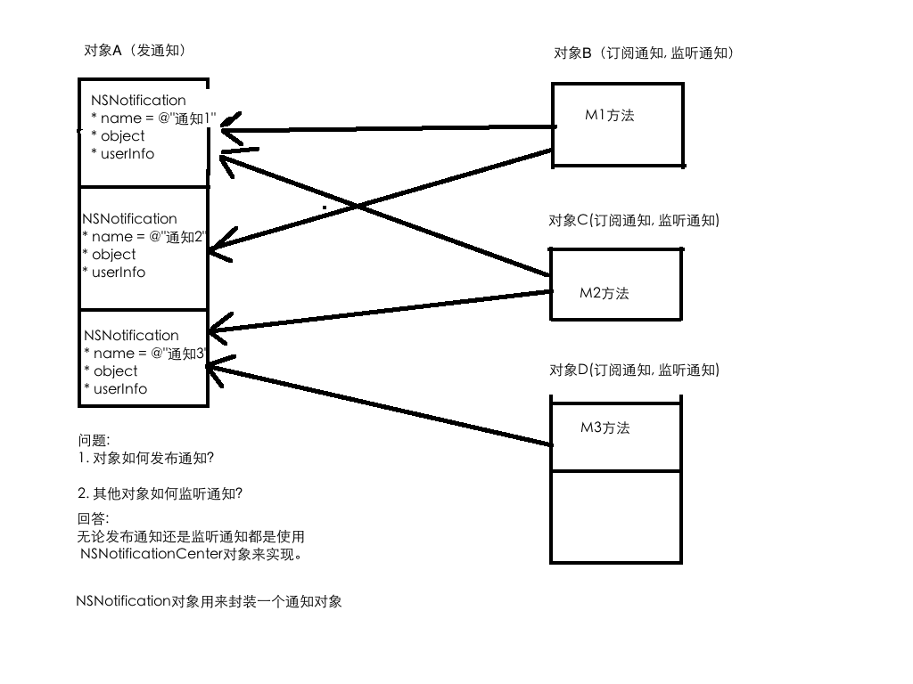
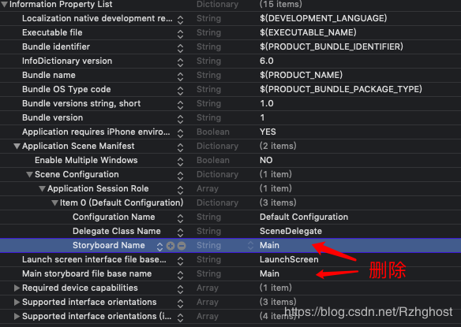
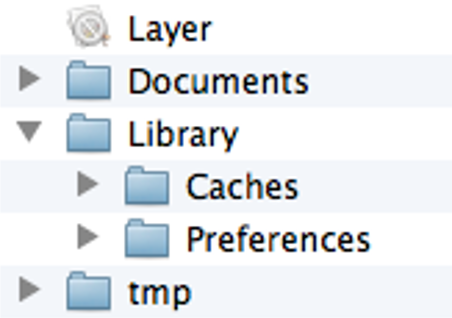

# iOS

什么是iOS这里就不介绍了，都要接触开发了，应该对系统的基本信息都挺清楚了。本篇笔记重点将记下iOS 开发过程中所涉及到的知识点。

主要开发流程和web相似，先完成view层，再实现具体功能，然后调试测试，测试完成就可以发布。

## iOS UIView

UIView所有组件的父类，组件的创建和销毁的处理是UIViewController。每一个新的界面都是一个UIView，切换界面就涉及到UIView的创建和销毁，UIView与用户的交互。

UIViewController是UIView的控制器，负责创建、显示、销毁UIView；负责监听UIView内部的事件；负责处理UIView与用户的交互。

UIViewController内部有个UIView属性，就是它负责管理的UIView对象 ：

@property(nonatomic,retain) UIView *view;

**UIView与UIViewController的关系**

- UIView只负责对数据的展示，采集用户的输入、监听用户的事件等。

- 其他的操作比如：每个UIView的创建、销毁、用户触发某个事件后的事件处理程序等这些都交给UIViewController来处理。

创建完组件后，先编写好功能，在把组件关联上代码就可以了，关联过程

```objc
#import "ViewController.h"
@interface ViewController ()
@property (weak, nonatomic) IBOutlet UITextField *txtNum1;
@property (weak, nonatomic) IBOutlet UITextField *txtNum2;
@property (weak, nonatomic) IBOutlet UILabel *sum;
- (IBAction)compute;

@end

@implementation ViewController

- (void)viewDidLoad {
    [super viewDidLoad];
    // Do any additional setup after loading the view.
}

- (IBAction)compute {
    NSLog(@"");
    // 获取用户的输入
    NSString *num1 = self.txtNum1.text;
    NSString *num2 = self.txtNum2.text;
    
    // 处理
    int n1 = [num1 intValue];
    int n2 = num2.intValue;
    int res = n1 + n2;
    // 显示在label上
    self.sum.text = [NSString stringWithFormat:@"%d",res];
    // 收回输入键盘
  	// 法一：谁交出键盘谁就是第一响应者，让第一响应者 resign 就可以让键盘收回去
    //[self.txtNum1 resignFirstResponder];
    //[self.txtNum2 resignFirstResponder];
    // 法二：让当前控制器控制的组件全部停止编辑，那么键盘也就会跟着收回了
  	[self.view endEditing:YES];
}
@end
  // 如果需求是已进入界面就弹出键盘，并且焦点在文本框上，就可以吧文本框设置为第一响应者
// [self.txtNum2 becomeFirstResponder];
```


关联后对应地方会发生改变，如果想取消关联，字节点击触发事件类型后面的×就好了

注意：要用到的控件都要关联上。

- 关联的返回值IBAction、属性类型IBOutlet，这样才能做到关联view的控件

控件的位置大小相关的属性：frame（CGRect）、center（CGPoint）、bounds（CGRect）；因此center只能控制位置（坐标原点为中心，为frame的坐标原点为左上角），虽然bounds他是个CGRect但是他的CGPoint始终是零，是无效的，因此bounds只能控制大小，以中心点放大（frame放大坐标点是左上角）。

### 简单动画

```objc
// 法一：头尾式
- (IBAction)scale:(UIButton *)sender {
  // 开启一个动画
  	[UIView beginAnimations:nil context:nil];
  // 定义动画持续时间
    [UIView setAnimationDuration:.5];
  // =======要执行动画的方法========
    CGRect bounds = self.img.bounds;
    if (sender.tag == 4) {
        bounds.size.width += 10;
        bounds.size.height += 10;
    } else {
        bounds.size.width -= 10;
        bounds.size.height -= 10;
    }
    self.img.frame = bounds;
  // 提交方法
  [UIView commitAnimations];
}
// 法二：block式
- (IBAction)scale:(UIButton *)sender {
    CGRect frame = self.img.frame;
    if (sender.tag == 4) {
        frame.size.width += 100;
        frame.size.height += 100;
    } else {
        frame.size.width -= 100;
        frame.size.height -= 100;
    }
    [UIView animateWithDuration:1 animations:^{
        self.img.frame = frame;
    }];
}
```

### 动态创建控件

```objc
#import "ViewController.h"

@interface ViewController ()

@end

@implementation ViewController
// 当要显示一个界面的时候，首先创建这个界面对应的控制器
// 控制器创建好以后，接着创建控制器所管理的那个view，当这个view加载完毕后就开始执行下面的方法了
// 所以只要viewDidLoad方法被执行了，就表示控制器所管理的view创建好了
- (void)viewDidLoad {
    [super viewDidLoad];
    // web开发熟悉的感觉，比storyboard舒服多了，能用键盘操作的绝不用鼠标
  	// 创建一个纯净的按钮 如果想创建系统默认的按钮 [UIButton buttonWithType:UIButtonTypeSystem]
    UIButton *btn = [UIButton new];
    // 设置按钮上的属性
    [btn setTitle:@"点我吧" forState:UIControlStateNormal];
    [btn setTitleColor:[UIColor redColor] forState:UIControlStateNormal];
    [btn setTitle:@"你点个锤子" forState:UIControlStateHighlighted];
    [btn setTitleColor:[UIColor blueColor] forState:UIControlStateHighlighted];
    CGRect frame;
    frame.origin = CGPointMake(50, 50);
    frame.size = CGSizeMake(96, 96);
    btn.frame = frame;
    UIImage *imgNormal = [UIImage imageNamed:@"btn_01"];
    [btn setBackgroundImage:imgNormal forState:UIControlStateNormal];
    UIImage *imgHighLight = [UIImage imageNamed:@"btn_02"];
    [btn setBackgroundImage:imgHighLight forState:UIControlStateHighlighted];
  	// 添加点击事件
  	[btn addTarget:self action:@selector(btnClick) forControlEvents:UIControlEventTouchUpInside];
    // 把按钮加到UIView中
    [self.view addSubview:btn];
}
- (void)btnClick{
    NSLog(@"我说了，点我干嘛？");
}
@end
```

Tips:程序启动的时候出现的界面（一打开app放logo或者广告的那个界面）可以在LaunchScreen.storyboard上面画；Assets.xcassets 通常放媒体资源

### transform属性

transform可以进行平移、缩放、旋转

```objc
- (IBAction)move {
    // 一次性平移（每次移动都是以原本坐标移动）
    self.btnIcon.transform = CGAffineTransformMakeTranslate(0, 50);
    // 可以多次平移（每一次移动都是基于上一次移动后的坐标）
    self.btnIcon.transform = CGAffineTransformTranslate(self.btnIcon.transform, 0, 50);
}

- (IBAction)rotate {
  	// 一次性
    self.btnIcon.transform = CGAffineTransformMakeRotate(M_PI/4);
    // 可以多次
    self.btnIcon.transform = CGAffineTransformRotate(self.btnIcon.transform, M_PI_4);
    
}

- (IBAction)scale {
  	// 一次性
  	self.btnIcon.transform = CGAffineTransformMakeScale(1.5, 1.5);
  	// 多次
    self.btnIcon.transform = CGAffineTransformScale(self.btnIcon.transform,1.5, 1.5);
}
- (IBAction)goBack {
  	// 复原，无论transform了多少次直接恢复到最原始的状态
    self.btnIcon.transform = CGAffineTransformIdentity;
}
```

**获取所有控件的子控件**：`self.view.subviews` 返回值为NSArray

**获取父控件**：假设一个控件为txt，这个组件也引入到了ViewController中了 `self.txt.superview`就得到了父控件了。

**不引入Controller的状况下获取控件**：想给控件设置一个tag `UITextField *txt = (UITextField *)[self.view viewWithTag:0];` 就得到tag为0的控件了，返回值就是次tag所对应的类，最好强转一下类型。但是不好维护，因为tag只能是数字

**销毁一个控件**：`[txt removeFromSuperview]`调用方法就销毁了

### UIImageView

帧动画相关的属性和方法

@property(nonatomic,copy) NSArray *animationImages;

需要播放的序列帧图片数组（里面全是UIImage对象，会按顺序显示里面的图片）

@property(nonatomic) NSTimeInterval animationDuration;

帧动画的持续时间

@property(nonatomic) NSInteger animationRepeatCount;

帧动画的执行次数，默认是无限循环

`- (void)startAnimating;`开始执行帧动画

`- (void)stopAnimating;`停止执行帧动画

`- (BOOL)isAnimation;`是否正在执行帧动画

```objc
- (IBAction)drink {
    // 如果前一个动画没执行完就不执行下一个动画
    if (self.imgViewCat.isAnimating){
        return;
    }
    // 动态加载一个图片到一个NSArray中
    NSMutableArray *arrM = [NSMutableArray new];
    for (int i = 0; i < 81; i++) {
      // 通过[UIImage imageNamed:]这种方式加载图片h，加载好的图片会一直存放在内存中，不会释放，如果多图的话就很占内存，因此不要用这种方式
        // %02d 表示保留两位，如果不足两位则补零
        NSString *path = [[NSBundle mainBundle] pathForResource:[NSString stringWithFormat:@"drink_%02d.jpg",i] ofType:nil];
        UIImage *img = [UIImage imageWithContentsOfFile:path];
        [arrM addObject:img];
    }
    // 设置UIImageView 的animationImages属性
    self.imgViewCat.animationImages = arrM;
    // 设置动画持续时间
    self.imgViewCat.animationDuration = (self.imgViewCat.animationImages.count / 24);
    // 重复播放多少次
    self.imgViewCat.animationRepeatCount = 1;
    // 开始
    [self.imgViewCat startAnimating];
    // 清空图片，释放内存
  //注意要等到动画执行完才清空
  	[self.imgViewCat performSelector:@selector(setAnimationImages:) withObject:nil afterDelay:(self.imgViewCat.animationImages.count / 24)];
}
```

注意：做帧动画的话就不要用imageNamed方法了，这样很占内存

**UIButton与UIImageView的异同**

- 相同点：都能显示图片

- 不同点

  - UIButton默认情况就能监听点击事件，而UIImageView默认情况下不能

  - UIButton可以在不同状态下显示不同的图片

  - UIButton既能显示文字，又能显示图片(能显示2张图片，backgroundImage和Image)

- 如何选择
  - UIImageView：仅仅需要显示图片，点击图片后不需要做任何事情
  - UIButton：需要显示图片，点击图片后需要做一些特定的操作

### UIScrollView

是用来实现滚动和缩放的控件。UIScrollView的内容进行滚动和缩放。先创建UIScrollView，再在UIScrollView中加入子控件，最后设置UIScrollVIew的contentSize（内容大小）

- UIScrollView的常见属性

  - contentOffset CGPoint 设置或者得到当前滚动偏移

  - contentSize CGSize 设置scrollView内容区域的大小（可滚动的大小）

  - showsVerticalScrollIndicator BOOL 设置是否可以看到垂直滚动条

  - showsHorizontalScrollIndicator BOOL 设置是否可以看到水平滚动条

  - contentInset UIEdgeInstes 设置内容的内边距，原本的contentSize加了一层外边框

  - bounces BOOL 是否设置弹簧效果

  - scrollEnabled BOOL 设置能否滚动 取值 xxx.isScrollEnabled

  - delegate id<UIScrollViewDelegate> 指向一个代理对象，通过代理对象实现协议的方法，来进行滚动事件的监听（只要实现了代理的方法，就会自动触发代理事件）

    - scrollViewWillBeginDragging: (UIScrollView *)scrollView用户开始拖拽的时候执行
    - scrollViewDidScroll: (UIScrollView *)scrollView滚到你到具体位置执行
    - scrollViewDidEndDragging:  (UIScrollView *)scrollView willDecelerate:(BOOL) decelerate 停止拖拽执行
    - ....

    ```objc
    // 记得第一步现在storyboard中吧UIScrollView和UIPageControl放好，然后关联代码
    // 滚动的时候输出offset
    #import "ViewController.h"
    #import "Question.h"
    // 遵守协议
    @interface ViewController () <UIScrollViewDelegate>
    @property (weak, nonatomic) IBOutlet UIImageView *imgView;
    @property (weak, nonatomic) IBOutlet UIScrollView *scrollView;
    @end
    
    @implementation ViewController
    
    - (void)viewDidLoad {
        [super viewDidLoad];
        self.scrollView.contentSize = self.imgView.frame.size;
      // 代理对象执行本viewController
        self.scrollView.delegate = self;
    }
    // 开始拖拽触发
    - (void)scrollViewWillBeginDragging:(UIScrollView *)scrollView{
        NSLog(@"beginDrag");
    }
    // 拖动时触发
    - (void)scrollViewDidScroll:(UIScrollView *)scrollView{
        NSLog(@"%@",NSStringFromCGPoint(scrollView.contentOffset));
    }
    @end
    ```

- UIScrollView 实现缩放

  - 设置代理对象
  - 设置可放大缩小的最值
  - 实现代理对象的\- (UIView *)viewForZoomingInScrollView:(UIScrollView *)scrollView方法，返回值就是要实现缩放的控件

  ```objc
  #import "ViewController.h"
  #import "Question.h"
  // 遵守协议
  @interface ViewController () <UIScrollViewDelegate>
  @property (weak, nonatomic) IBOutlet UIImageView *imgView;
  @property (weak, nonatomic) IBOutlet UIScrollView *scrollView;
  
  @end
  @implementation ViewController
  
  - (void)viewDidLoad {
      [super viewDidLoad];
      self.scrollView.contentSize = self.imgView.frame.size;
      // 设置代理对象
      self.scrollView.delegate = self;
      // 设置缩放的最值
      self.scrollView.maximumZoomScale = 3.5;
      self.scrollView.minimumZoomScale = .1;
      
  }
  // 将能缩放的控件返回
  - (UIView *)viewForZoomingInScrollView:(UIScrollView *)scrollView{
      return self.imgView;
  }
  @end
  ```

- UIScrollView的常用代理方法

  - scrollViewWillBeginDragging: (UIScrollView *)scrollView 用户开始拖拽的时候执行
  - scrollViewDidScroll: (UIScrollView *)scrollView 正在滚动
  - scrollViewDidEndDragging:  (UIScrollView *)scrollView willDecelerate:(BOOL) decelerate 停止拖拽执行
  - \- (UIView *)viewForZoomingInScrollView:(UIScrollView *)scrollView方法，返回值就是要实现缩放的控件
  - \- (void)scrollViewDidZoom:(UIScrollView *)scrollView 正在缩放
  - \- (void)scrollViewWillBeginZooming:(UIScrollView *)scrollView withView:(nullable UIView *)view  开始缩放
  - \- (void)scrollViewDidEndZooming:(UIScrollView *)scrollView withView:(nullable UIView *)view atScale:(CGFloat)scale; 停止缩放

- UIScrollView和UIPageControl的分页

  - UIPageCotrol 是一个现成的控件，是用于索引轮播图的
  - 想要关联 UIPageCotrol 和UIScrollView 
    - 设置总页数 numberOfPages
    - 设置当前页 currentPage
  - 轮播图

  ```objc
  #import "ViewController.h"
  #import "Question.h"
  // 遵守协议
  @interface ViewController () <UIScrollViewDelegate>
  
  @property (weak, nonatomic) IBOutlet UIScrollView *scrollView;
  @property (weak, nonatomic) IBOutlet UIPageControl *pageControl;
  @property (nonatomic, strong) NSTimer *timer;
  
  @end
  
  @implementation ViewController
  
  - (void)viewDidLoad {
      [super viewDidLoad];
      // 设置轮播图
      self.scrollView.delegate = self;
      CGFloat imgH = 162.5;
      CGFloat imgW = 375;
      CGFloat imgY = 0;
      for (int i = 0; i < 5; i++) {
          UIImageView *imgView = [UIImageView new];
          CGFloat imgX = i * imgW;
          imgView.frame = CGRectMake(imgX, imgY, imgW, imgH);
          imgView.image = [UIImage imageNamed:[NSString stringWithFormat:@"img_%02d",i + 1]];
          [self.scrollView addSubview:imgView];
      }
      self.scrollView.contentSize = CGSizeMake(imgW * 5, 0);
      self.scrollView.showsHorizontalScrollIndicator = NO;
      self.scrollView.pagingEnabled = YES;
      // 设置轮播图的点
      self.pageControl.numberOfPages = 5;
      self.pageControl.currentPage = 0;
      // 创建定时器控件, 1秒执行一次，可重复执行
      self.timer = [NSTimer scheduledTimerWithTimeInterval:1.5 target:self selector:@selector(scrollImage) userInfo:nil repeats:YES];
      // 为了防止因为某些控件的操作影响滚动操作的线程(比如UITextView)，因此要把timer的优先级设置的和控件一样高
      // 先获取当前的消息循环对象
      NSRunLoop *runLoop = [NSRunLoop currentRunLoop];
      [runLoop addTimer:self.timer forMode:NSRunLoopCommonModes];
  }
  
  - (void)scrollImage{
      NSInteger page = self.pageControl.currentPage;
      if (page == self.pageControl.numberOfPages - 1) {
          page = 0;
          self.scrollView.contentOffset = CGPointMake(0, 0);
          self.pageControl.currentPage = page;
          return;
      } else {
          page++;
      }
      self.pageControl.currentPage = page;
      CGFloat offsetX = page * self.scrollView.frame.size.width;
      [self.scrollView setContentOffset:CGPointMake(offsetX, 0) animated:YES];
  }
  - (void)scrollViewWillBeginDragging:(UIScrollView *)scrollView{
      // 清除计数器
      [self.timer invalidate];
      self.timer = nil;
  }
  
  - (void)scrollViewDidEndDragging:(UIScrollView *)scrollView willDecelerate:(BOOL)decelerate{
      // 重新设置计数器
      self.timer = [NSTimer scheduledTimerWithTimeInterval:1.5 target:self selector:@selector(scrollImage) userInfo:nil repeats:YES];
      NSRunLoop *runLoop = [NSRunLoop currentRunLoop];
      [runLoop addTimer:self.timer forMode:NSRunLoopCommonModes];
      
  }
  
  - (void)scrollViewDidScroll:(UIScrollView *)scrollView{
      CGFloat offsetX = scrollView.contentOffset.x;
    // 滚动过2/3就显示下一页
      offsetX = offsetX + scrollView.frame.size.width / 3;
      self.pageControl.currentPage = (int)(offsetX / scrollView.frame.size.width);
  }
  @end
  ```

- NSTimer的使用, 计时器控件: 上面轮播图例子就用到了

  - 在 viewDidLoad 中启动定时器
    - 调用timerWithXxx创建的timer，把这个timer对象手动加到”消息循环”中才能启动
    - 调用scheduledTimerWithXxx创建的timer，自动启动（创建完毕后自动启动）。

### UITableView

广泛用于界面布局的一个控件，必须要DataSource属性，是指定一个数据源对象。

**使用UITableView步骤：**

1. 创建UITableView
2. 设置数据源对象（数据源对象必须遵守代理对象协议<UITableViewDataSource>）通常都是当前控制器对象
3. 实现协议的方法
   - \- (NSInteger)tableView:(UITableView *)tableView numberOfRowsInSection:(NSInteger)section;        
     - required返回每组显示几条数据
     - tableView 就是当前tableView
     - section 就是当前在哪一组
   - \- (UITableViewCell *)tableView:(UITableView *)tableView cellForRowAtIndexPath:(NSIndexPath *)indexPath;     
     -  required 返回每组显示怎样的数据
     - tableView 同上
     - indexPath indexPath.section第几组 indexPath.row第几个
   - \- (NSInteger)numberOfSectionsInTableView:(UITableView *)tableVie; optional 
     - 返回要显示几组数据，如果不实现本方法则默认值为1
   - \- (NSString *)tableView:(UITableView *)tableView titleForHeaderInSection:(NSInteger)section; 
     - 设置组标题类似于Word文档页眉的感觉
   - \- (NSString *)tableView:(UITableView *)tableView titleForFooterInSection:(NSInteger)section; 
     - 设置组尾的描述类似于Word文档的页脚
   - \- (void)tableView:(UITableView *)tableView commitEditingStyle:(UITableViewCellEditingStyle)editingStyle forRowAtIndexPath:(NSIndexPath *)indexPath; 
     - 实现这个方法后系统给我们家的左滑出现删除按钮。这个方式就是点击按钮后的点击事件。

**属性**：

- UITableView 本身属性
  - rowHight 设置全部cell的行高。但是想每一个行高都不一样那就只能通过代理<UITableViewDelegate>方法实现
  - separatorColor 分割线的颜色
  - separatorStyle 分割线的样式 ，可以设置取消分割线
  - tableHeaderView 一般可以放广告
  - tableFooterView 一般可以放加载更多，只能修改其frame的X和height，Y和width是不能改的
- allowsSelection BOOL 是否允许被选中
  
- UITableViewCell 属性
  - accessoryView 可以给cell的最右端设置想要的组件，自定义
  - accessoryType 给cell最右端设置几种样式的组件
  - imageView 图片框
  - textLabel 大label 在imageView右边（中间位置）
  - detailTextLabel 小label 在textlabel下面
  - backgroundColor 设置cell颜色，注意没有selectedBackgroundColor
  - backgroundView 设置背景，自定义
  - selectedBackgroundView 设置选中时候的背景，自定义

**方法**：

-  [self.tableView setSeparatorInset:UIEdgeInsetsMake(0, 0, 0, 0)];
  
- 设置分割线长度（相当于分割线位置插入内边距），这样写就是宽度沾满屏幕，设置上下是没用的，只会有左右的生效（上左下右）
  
- [self.tableView reloadData]; 重新刷新数据

- [self.tableView reloadRowsAtIndexPaths:(NSArray *) withRowAnimation:(UITableViewRowAnimation)] 局部刷新，可以刷新多条数据

  - NSIndexPath *idxPath = [NSIndexPath indexPathForRow: 0 inSection:0]; 0行0组
  - 然后把idxPath放入NSArray中传给第一个参数

  注意，如果总行数发生变化则不能使用局部刷新，因为tableView是基于scrollView的，数据增删了，滚动的height就变了，如果用局部更新则height更新不了，因此会直接报错
  
- \- (void)reloadSections:(NSIndexSet *)sections withRowAnimation:(UITableViewRowAnimation)animation 局部刷新，刷新一组

  - 参数一：一个组的类，创建方法和NSIndexPath差不多
  - 参数二：动画方法枚举
  
- [self.tableView indexPathForSelectedRow]; 

  - 返回值是NSIndexPath
  - 得到当前被选中的cell的indexPath
  
-  [self.tableView deleteRowsAtIndexPaths:@[indexPath] withRowAnimation:UITableViewRowAnimationLeft];

   -  删除一组 row
   -  参数一：一个属性为 indexPath 的数组
   -  参数二：系统给我们提供的动画效果

   调用这个方法前必须先删除数据源的数据，再执行这句话，否则会报错。

```objc
#import "ViewController.h"
#import "CarGroup.h"
// 遵守协议
@interface ViewController () <UITableViewDataSource, UITableViewDelegate>
@property (weak, nonatomic) IBOutlet UITableView *tableView;
@property (nonatomic, strong) NSArray *groups;
@end

@implementation ViewController
- (NSArray *)groups{
    if (!_groups) {
        NSString *path = [[NSBundle mainBundle] pathForResource:@"heros.plist" ofType:nil];
        NSArray *arrDict = [NSArray arrayWithContentsOfFile:path];
        NSMutableArray *arrM = [NSMutableArray new];
        for (NSDictionary *item in arrDict) {
            CarGroup *model = [CarGroup carGroupWithDictionary:item];
            [arrM addObject:model];
        }
        _groups = arrM;
    }
    return _groups;
}

- (void)viewDidLoad {
    [super viewDidLoad];
    [self groups];
  // 设置代理对象和数据源对象
    self.tableView.dataSource = self;
    self.tableView.delegate = self;
//    self.tableView.rowHeight = 60;
}

- (CGFloat)tableView:(UITableView *)tableView heightForRowAtIndexPath:(NSIndexPath *)indexPath{
    // 自定义设置每一行的行高 协议UITableViewDelegate
    if (indexPath.row % 2 == 1){
        return 60;
    } else {
        return 100;
    }
}
- (NSInteger)numberOfSectionsInTableView:(UITableView *)tableView{
    //option 这个方法如果不实现则默认为一组
    return 1;
}
- (NSInteger)tableView:(UITableView *)tableView numberOfRowsInSection:(NSInteger)section{
    // required 每一组显示几条数据
    return self.groups.count;
}
- (UITableViewCell *)tableView:(UITableView *)tableView cellForRowAtIndexPath:(NSIndexPath *)indexPath{
    // 参数indexPath 属性 indexPath.section 表示当前是第几组 indexPath.row 表示是第几行
    // required 每一组的每一条实现怎样的单元格数据
    UITableViewCell *cell = [[UITableViewCell alloc] initWithStyle:UITableViewCellStyleSubtitle reuseIdentifier:nil];
    CarGroup *model = self.groups[indexPath.row];
    cell.imageView.image = [UIImage imageNamed:model.icon];
    cell.textLabel.text = model.name;
    cell.detailTextLabel.text = model.intro;
    cell.accessoryType = UITableViewCellAccessoryDisclosureIndicator;

    return cell;
}
@end
```

如果每一行都创建一个UITableViewCell那会很浪费性能，因此为了一稿性能，我们要Cell重用。创建比屏幕能显示的cell多一个，多出来那一个放入缓存池(队列)中，用于修改重用的。这个队列数据结构不用自己创建了，框架已经帮我们写好了

```objc
- (UITableViewCell *)tableView:(UITableView *)tableView cellForRowAtIndexPath:(NSIndexPath *)indexPath{
    // 在创建单元格的时候指定一个重用ID
    NSString *ID = @"hero_cell";
    // 当需要一个新的单元格的时候，先去观察池中根据重用ID,查找是否有可用的单元格
    // 有则使用
    UITableViewCell *cell = [tableView dequeueReusableCellWithIdentifier:ID];
    if (cell == nil) {
        // 无则新创建，注意这里创将建和上面列子那部分创建reuseIdentifier是有指定的，这个参数就是用来指定重用ID的
        cell = [[UITableViewCell alloc] initWithStyle:UITableViewCellStyleSubtitle reuseIdentifier:ID];
    }
    CarGroup *model = self.groups[indexPath.row];
    cell.imageView.image = [UIImage imageNamed:model.icon];
    cell.textLabel.text = model.name;
    cell.detailTextLabel.text = model.intro;
    cell.accessoryType = UITableViewCellAccessoryDisclosureIndicator;

    return cell;
}
```

可以直接在Main.storyboard中把原来的Controller删掉，再拖出一个UITableViewController，这个直接帮我们放好了TableView，不过记得在UITableViewController的属性中**勾上Is Initial View Controller**，即设置为默认窗口，并且**控制器的class也要改成ViewController**，记得先给ViewController.h 中继承的类改成UITableViewController或者自己新建一个继承自UITableViewController的类，不然是设置不上的。

如果类继承自UITableViewController 中 self.view == self.tableView。这两者完全等价。

**静态单元格只能通过UITableViewController实现(纯使用Stroyboard就可以了，因为是代码实现所以不用关联代码的controller也行)**

##### 动态创建行高：

**注意：如果每一行的行高是动态创建的，那么就要新建一个带fram的模型，在字典转模型的时候就要把每一行的行高算出来**，因为动态创建行高的方法是要比新建cell先执行的，如果在cell创建是再设行高是没办法给tableview的行高赋值的。

详细例子可参考weibo[实例](https://github.com/Jamsdfn/NativeApp/tree/master/iOS/weibo/imgViewer)。

可以纯用 storyboard 涉及 tableView，把 tableView 的属性 -> content ->static cells 就好了，如果设置的静态单元格，那个对应的 controller 可以不实现 DataSource 协议的方法

### 数据选择控件

#### UIPickerView

那种类似密码锁滚动效果的那个数据选择控件，这个控件和tableView差不多，也要delegate、和 DataSource。记得在控制器中关联上，或者在storyboard中直接拖线，使用方法和tableVIew也差不多。

二级联动城市菜单

```objc
#import "ViewController.h"
#import "Province.h"
@interface ViewController () <UIPickerViewDataSource, UIPickerViewDelegate>


@property (nonatomic, strong) NSArray *provinces;
@property (weak, nonatomic) IBOutlet UILabel *province;
@property (weak, nonatomic) IBOutlet UILabel *city;
@property (weak, nonatomic) IBOutlet UIPickerView *pickerView;
@property (nonatomic, strong) Province *selectedProvince;

@end

@implementation ViewController

- (void)viewDidLoad {
    [super viewDidLoad];
    // Do any additional setup after loading the view.
    [self pickerView:self.pickerView didSelectRow:0 inComponent:0];
//    [self pickerView:self.pickerView didSelectRow:0 inComponent:0];
   }

- (NSArray *)provinces{
    if (!_provinces) {
        NSString *path = [[NSBundle mainBundle] pathForResource:@"02cities.plist" ofType:nil];
        NSArray *arr = [NSArray arrayWithContentsOfFile:path];
        NSMutableArray *arrM = [NSMutableArray new];
        for (NSDictionary *item in arr) {
            Province *province = [Province provinceWithDictionary:item];
            [arrM addObject:province];
        }
        _provinces = arrM;
    }
    return _provinces;
}

- (NSInteger)numberOfComponentsInPickerView:(UIPickerView *)pickerView{
    return 2;
}

- (NSInteger)pickerView:(UIPickerView *)pickerView numberOfRowsInComponent:(NSInteger)component{
    if (component == 0) {
        return self.provinces.count;
    } else {
        // 先获取第一个组的数据，才能确定这一组的数据（二级联动）
        NSInteger selectedProvince = [pickerView selectedRowInComponent:0];
        // 第一组和第二组数据在滚动的时候都会调用titleForRow这个方法，如果这里不把数据保存下来的话，第二组滚动的时候回频繁的创建一个新的对象，然而在这个新的对象中调用的被选择的row是旧的那个row，因此有可能会出现数组越界的错误。
        self.selectedProvince = self.provinces[selectedProvince];
        return self.selectedProvince.cities.count;
    }
}

- (NSString *)pickerView:(UIPickerView *)pickerView titleForRow:(NSInteger)row forComponent:(NSInteger)component{
    if (component == 0) {
        Province *province = self.provinces[row];
        return province.name;
    } else {
        // 用保存的数据，无论你第一组动的时候怎么调用这个方法也row也不会越界
        return self.selectedProvince.cities[row];
    }
}

// 滚动第一组要刷新数据
- (void)pickerView:(UIPickerView *)pickerView didSelectRow:(NSInteger)row inComponent:(NSInteger)component{
    if (component == 0) {
        [pickerView reloadComponent:1];
        // 为了防止第二组原本停在一个位置，这个位置本身就超越了第一组数据中的数组范围。因为reload本身只是刷新数据,已选位置是不会改变的，因此要把一算位置改成第一行
        [pickerView selectRow:0 inComponent:1 animated:NO];
    }
    NSInteger selCity = [pickerView selectedRowInComponent:1];
    self.province.text = self.selectedProvince.name;
    self.city.text = self.selectedProvince.cities[selCity];
}
@end
```

也可以在pickerView中放入view

\- (UIView *)pickerView:(UIPickerView *)pickerView viewForRow:(NSInteger)row forComponent:(NSInteger)component reusingView:(UIView *)view; 

**设置行号**：\- (CGFloat)pickerView:(UIPickerView *)pickerView rowHeightForComponent:(NSInteger)component;

#### UIDatePicker

日期选择控件，通常和自定义键盘操作联系在一起，因为其本质就是用来做日期选择的。首先要一个文本框，还要UIDatePicker 设置为文本框的inputView。还要一个UIToolbar 设置为文本框的UIAccessoryView。

控件也可以用懒加载，控件的懒加载要用strong修饰（为了防止控件无人使用的时候被销毁），设置方法和数据懒加载一样，先判断有没有，没有就创建

```objc
#import "ViewController.h"
#import "Contry.h"
#import "ContryView.h"
@interface ViewController ()
@property (weak, nonatomic) IBOutlet UITextField *textField;
@property (nonatomic, strong) UIDatePicker *datePicker;
@property (nonatomic, strong) UIToolbar *toolbar;
@end
@implementation ViewController

- (void)viewDidLoad {
    [super viewDidLoad];
    self.textField.inputView = self.datePicker;
    self.textField.inputAccessoryView = self.toolbar;
}
- (UIDatePicker *)datePicker{
    if (!_datePicker) {
        // 不需要设置frame，它会自动占据键盘的位置
        _datePicker = [[UIDatePicker alloc] init];
        _datePicker.datePickerMode = UIDatePickerModeDate;
        _datePicker.locale = [[NSLocale alloc] initWithLocaleIdentifier:@"zh-Hans"];
    }
    return _datePicker;
}
- (UIToolbar *)toolbar{
    if (!_toolbar) {
        _toolbar = [UIToolbar new];
      // 只用设置键盘的高就可以了，toolbar系统会自动撑开
        _toolbar.frame = CGRectMake(0, 0, 0, 44);
        UIBarButtonItem *cancelItem = [[UIBarButtonItem alloc] initWithTitle:@"取消" style:UIBarButtonItemStylePlain target:self action:@selector(cancelItemClick)];
        UIBarButtonItem *confirmItem = [[UIBarButtonItem alloc] initWithTitle:@"确认" style:UIBarButtonItemStylePlain target:self action:@selector(confirmItemClick)];
        UIBarButtonItem *flexSpace = [[UIBarButtonItem alloc] initWithBarButtonSystemItem:UIBarButtonSystemItemFlexibleSpace target:nil action:nil];
        // 给bar加上barbuttonItem
        _toolbar.items = @[cancelItem, flexSpace, confirmItem];
        
    }
    return _toolbar;
}

- (void)cancelItemClick{
    [self.view endEditing:YES];
}

- (void)confirmItemClick{
    // 获取选中的日期
    NSDate *date = self.datePicker.date;
    // 将日期设置给文本框
    NSDateFormatter *formatter = [NSDateFormatter new];
    formatter.dateFormat = @"yyyy年MM月dd日";
    NSString *str = [formatter stringFromDate:date];
    self.textField.text = str;
    // 关闭键盘
    [self.view endEditing:YES];
}

@end

```

## 字典转模型

模型其实就是类，就是把字典装变为类对象来保存。好处：第一，在打代码的时候有智能提示，第二，如果是字典的话key写错了，不会报错，程序运行运行才会出问题，可能好找好久的bug，而用模型存在输错了马上报错。第三，可以使用面向对象的特征，让程序变得更灵活

注意：模型的属性和字典的键的数量和名字完全一致，并且一定要封装`-(instancetype)initWithDictionary:(NSDictionary *)dict; `这个初始化的对象方法和 `+ (instancetype)XxxWithDictionary:(NSDictionary *)dict; `这个返回本类的类方法。这是必备的

```objc
#import <Foundation/Foundation.h>
@interface App : NSObject

@property (nonatomic, copy) NSString *name;
@property (nonatomic, copy) NSString *icon;

- (instancetype)initWithDictionary:(NSDictionary *)dict;
+ (instancetype)appWithDictionary:(NSDictionary *)dict;

@end
 #import "App.h"
@implementation App
- (instancetype)initWithDictionary:(NSDictionary *)dict{
    if (self = [super init]) {
        // self.name = dict[@"name"];
        // self.icon = dict[@"icon"];
      	// 如果属性名和字典key一模一样的话执行一句代码就可以了
      	[self setValuesForKeysWithDictionary:dict];
    }
    return self;
}
+ (instancetype)appWithDictionary:(NSDictionary *)dict{
    return [[self alloc] initWithDictionary:dict];;
}
@end
```

**给tableView夹索引条**

类似于通信录旁边那种，这个索引条是根据分组的顺序对应的，不是根据索引条的名字

\- (NSArray<NSString *> *)sectionIndexTitlesForTableView:(UITableView *)tableView;

返回一个字符串数组

```objc
- (NSArray<NSString *> *)sectionIndexTitlesForTableView:(UITableView *)tableView{
      // 这个模型有一个索引title，所以可以这样，这个方法是把字典数组中的value提到一个数组中返回出去
    return [self.groups valueForKeyPath:@"title"];
}
```

## xib封装

新建文件 User Interface -> Empty 选择后创建的就是xib。然后想storyboard那样吧组件拉出来，组成想要的形状，之后创建一个与xib同名的类，把xib的继承对象修改给这个新创建的类，再像storyboard那样往新类中连线。然后UIViewController中创建新类的对象就好了，通过此对象的属性也能访问到xib的属性。


```objc
// 创建AppView对象 用于连线 AppView.h
#import <UIKit/UIKit.h>
@class App;
@interface AppView : UIView
@property (nonatomic, strong) App *model;
+ (instancetype)appView;
@end
// AppView.m
#import "AppView.h"
#import "App.h"
@interface AppView ()
@property (weak, nonatomic) IBOutlet UIImageView *imgViewIcon;
@property (weak, nonatomic) IBOutlet UILabel *lblName;
@property (weak, nonatomic) IBOutlet UIButton *btn;
@end

@implementation AppView
- (void)setModel:(App *)model{
    _model = model;
    
    self.imgViewIcon.image = [UIImage imageNamed:model.icon];
    self.lblName.text = model.name;
    
}

+ (instancetype)appView{
  // 因为xib安装到App上手变成了加密方式的nil，所以方法名是loadNibNamed,并且这个方法返回的是数组，因此再调用一个lastObject来选择最后一个view（创建的时候只创建了一个）
    // 注意loadNibNamed参数不要加后缀
    return [[[NSBundle mainBundle] loadNibNamed:@"AppView" owner:nil options:nil] lastObject];
}
@end
  
// viewController中的使用
- (void)viewDidLoad {
    [super viewDidLoad];
    // Do any additional setup after loading the view.
    [self apps];
    int colmuns = 3;
    CGFloat viewWidth = self.view.frame.size.width;
    CGFloat marginTop = 30;
    
    for (int i = 0; i < self.apps.count; i++) {
        App *item = self.apps[i];
        int col = i % 3;
        int row = i / 3;
      // 创建容器的对象
        AppView *appView = [AppView appView];
      // 计算坐标
        CGFloat marginX = (viewWidth - colmuns * appView.frame.size.width)/(colmuns + 1);
        CGFloat marginY = marginX;
        CGFloat appX = marginX + col * (appView.frame.size.width + marginX);
        CGFloat appY = marginTop + row * (appView.frame.size.height  + marginY);
        appView.frame = CGRectMake(appX, appY, appView.frame.size.width, appView.frame.size.height);
        [self.view addSubview:appView];
      // 给view容器的自控键赋值
        appView.model = item;
        
    }
    
}
```

**xib文件的加载过程**：

- 根据路径, 搜索对应的xib文件(nib文件)
-  加载xib文件的时候, 会按顺序加载xib文件中的每个控件。
- 对于每个控件, 创建的时候都会查找对应的Class属性中配置的是那个类, 那么就创建对应的类的对象。
-  创建好某个控件以后, 按照在xib中配置的属性的值, 依次为对象的属性赋值。
- 创建该控件下的子控件, 并设置属性值。然后把该控件加到父控件中。
-  最后返回一个数组, 这个数组中包含创建的根元素对象。

**xib类什么时候加载完成**

如果想在xib的类中调用自身的控件可以实现 \- (void)awakeFromNib; 在这个方法中就可以调用自身的控件了，相当于 UIViewController 的viewDidLoad方法。比如xib创建的子控件有轮播图，那个想要设置scrollView的contentSize，就要在awakeFromNib中设置。

只有在这个方法中才能操作控件。

## 自定义代理

```objc
// A.h
// 如果方法不多通常不用再，协议定义不用再开一个文件，写在A.h就好了
@protocol ADelegate <NSObject>
@required
  // 根据规范要把自身给传进去
- (void)delegateFuncton:(A *)a;
@end
  
@interface A : NSObjec
// B 必须遵守ADelegate 协议，通常情况下必须用weak
@property (nonatomic, weak) id<ADelegate> B;
  
- (void)test;

@end
 // B.h
@implementation A
  
- (void)test{
  [self.B delegateFuncton:self];
}
  
@end
```

UI控件的代理属性必须使用weak，因为控制器本身就有一个强指针指向控件，并且通常情况下控制器都是作为代理对象的，如果控件代理属性还用强指针只会控制器本身的话，这就造成循环引用了，会导致内存泄漏。

## 通知

iOS 大部分原生的事件都是以通知发送的，一个通知可以由多个对象监听。



**通知的发布**

通知中心(NSNotificationCenter)提供了相应的方法来帮助发布通知

\- (void)postNotification:(NSNotification *)notification;

- 发布一个notification通知，可在notification对象中设置通知的名称、通知发布者、额外信息等

\- (void)postNotificationName:(NSString *)aName object:(id)anObject;

- 发布一个名称为aName的通知，anObject为这个通知的发布者

\- (void)postNotificationName:(NSString *)aName object:(id)anObject userInfo:(NSDictionary *)aUserInfo;

- 发布一个名称为aName的通知，anObject为这个通知的发布者，aUserInfo为额外信息

**通知的监听**


通知中心(NSNotificationCenter)提供了方法来注册一个监听通知的监听器(Observer)

\- (void)addObserver:(id)observer selector:(SEL)aSelector name:(NSString *)aName object:(id)anObject;

- **observer**：监听器，即谁要接收这个通知的对象

- **aSelector**：收到通知后，回调监听器的这个方法，并且把通知对象当做参数传入

- **aName**：通知的名称。如果为nil，那么无论通知的名称是什么，监听器都能收到这个通知

- **anObject**：通知发布者。如果为anObject和aName都为nil，监听器都收到所有的通知。

即后两个参数如果为nil，即能监听到本参数的全集

```objc
@interface NotificationLister : NSObject
@property (nonatomic, copy) NSString *name;
 - (void)m1:(NSNotification *)noteInfo;
@end
  
@implementation NotificationLister
-(void)m1:(NSNotification *)noteInfo{
  // noteInfo 就是监听到的通知内容
  
}
@end
// main
NotificationSender *sender = [NotificationSender new];
NotificationLister *listener = [NotificationLister new];
NSNotificationCenter *center = [NSNotificationCenter defaultCenter];
// 监听通知
[center addObserver:listener selector:@selector(m1:) name:notification1 object:sender];
// 发布通知
[center postNotificationName:@"notification1" object:sender userInfo@{@"title":@"hello world"}];
```

事件监听到的内容noteInfo {name = 通知名字；object = 发布通知的对象；userInfo = 发布消息是传入的字典}。**注意要先监听通知再发布通知**

**通知的移除**

一定要在**监听对象被回收前把通知也一起移除**，不然会发生野指针错误

```objc
@interface NotificationLister : NSObject
@property (nonatomic, copy) NSString *name;
 - (void)m1:(NSNotification *)noteInfo;
@end
  
@implementation NotificationLister
-(void)m1:(NSNotification *)noteInfo{
  // noteInfo 就是监听到的通知内容
}
// *************!!!!!!!!***********
- (void)dealloc {
  // 监听对象移除前移除通知
  [[NSNotificationCenter defaultCenter] removeObserver:self];
}
// *************!!!!!!!!***********
@end
// main
NotificationSender *sender = [NotificationSender new];
NotificationLister *listener = [NotificationLister new];
NSNotificationCenter *center = [NSNotificationCenter defaultCenter];
// 监听通知
[center addObserver:listener selector:@selector(m1:) name:notification1 object:sender];
// 发布通知
[center postNotificationName:@"notification1" object:sender userInfo@{@"title":@"hello world"}];
```

### 原生通知事件

键盘状态改变的时候,系统会发出一些特定的通知

- UIKeyboardWillShowNotification // 键盘即将显示

- UIKeyboardDidShowNotification // 键盘显示完毕

- UIKeyboardWillHideNotification // 键盘即将隐藏

- UIKeyboardDidHideNotification // 键盘隐藏完毕

- UIKeyboardWillChangeFrameNotification // 键盘的位置尺寸即将发生改变

- UIKeyboardDidChangeFrameNotification // 键盘的位置尺寸改变完毕

系统发出键盘通知时,会附带一下跟键盘有关的额外信息(字典),字典常见的key如下:

- UIKeyboardFrameBeginUserInfoKey // 键盘刚开始的frame

- UIKeyboardFrameEndUserInfoKey // 键盘最终的frame(动画执行完毕后)

- UIKeyboardAnimationDurationUserInfoKey // 键盘动画的时间

- UIKeyboardAnimationCurveUserInfoKey // 键盘动画的执行节奏(快慢)

上述字典key对应的value的类型都是NSString


UIDevice类提供了一个单例对象，它代表着设备，通过它可以获得一些设备相关的信息，比如电池电量值(batteryLevel)、电池状态(batteryState)、设备的类型(model，比如iPod、iPhone等)、设备的系统(systemVersion)

通过[UIDevice currentDevice]可以获取这个单例对象


UIDevice对象会不间断地发布一些通知，下列是UIDevice对象所发布通知的名称常量：

UIDeviceOrientationDidChangeNotification // 设备旋转

UIDeviceBatteryStateDidChangeNotification // 电池状态改变

UIDeviceBatteryLevelDidChangeNotification // 电池电量改变

UIDeviceProximityStateDidChangeNotification // 近距离传感器(比如设备贴近了使用者的脸部)

## 自动适配

autoresizeing 十分不推荐使用，因此这里就略过

### autolayout

- 参照

  通过参照其他空间或者父控件来设置当前控件的位置和大小

- 约束

  通过添加约束限制控件的位置和大小

- Storyboard 的方式就不在这个介绍了，就是找到地方改就好了

- 代码的方式添加约束

  - 一个约束就是一个约束对象，然后把约束对象添加到控件上
  - 记得一样要先把autoresizing禁用了 `view.translatesAutoresizingMakeIntoConstraints = NO;` 要给谁添加约束这个view就是谁
  - 加了约束后不要再设置frame了
  - 记得要加完整的约束控件才会出来
  - \- (void)addConstraint:(NSLayoutConstraint *)constraint; 加一个约束
  - \- (void)addConstraints:(NSArray<__kindof NSLayoutConstraint *> *)constraints; 加一组约束

  ```objc
  #import "ViewController.h"
  
  @interface ViewController ()
  
  @property (nonatomic, weak) NSLayoutConstraint *test;
  
  @end
  
  @implementation ViewController
  
  - (void)viewDidLoad {
      [super viewDidLoad];
      // 创建蓝色view
      UIView *blue = [UIView new];
      blue.backgroundColor = [UIColor blueColor];
      
      [self.view addSubview:blue];
      // 禁用autoresizing
      blue.translatesAutoresizingMaskIntoConstraints = NO;
      // 创建并添加约束
      // 一个对象 的 某属性 怎么 另外一个对象 的 某属性 乘以多少倍 加上多少
    // obj1.prop = obj2.prop * multiplier + constantValue
    	// blue 高 等于 1 × 50
      NSLayoutConstraint *blueHC = [NSLayoutConstraint constraintWithItem:blue attribute:NSLayoutAttributeHeight relatedBy:NSLayoutRelationEqual toItem:nil attribute:NSLayoutAttributeNotAnAttribute multiplier:1 constant:50];
      [blue addConstraint:blueHC];
    	// blue left 等于 blue父级的view left × 1 ＋ 50
      NSLayoutConstraint *blueLC = [NSLayoutConstraint constraintWithItem:blue attribute:NSLayoutAttributeLeft relatedBy:NSLayoutRelationEqual toItem:blue.superview attribute:NSLayoutAttributeLeft multiplier:1 constant:30];
      [self.view addConstraint:blueLC];
      NSLayoutConstraint *blueRC = [NSLayoutConstraint constraintWithItem:blue attribute:NSLayoutAttributeRight relatedBy:NSLayoutRelationEqual toItem:blue.superview attribute:NSLayoutAttributeRight multiplier:1 constant:-30];
      [self.view addConstraint:blueRC];
      // 相对于safeArea
      NSLayoutConstraint *blueTC = [NSLayoutConstraint constraintWithItem:blue attribute:NSLayoutAttributeTop relatedBy:NSLayoutRelationEqual toItem:self.view.safeAreaLayoutGuide attribute:NSLayoutAttributeTop multiplier:1 constant:30];
      [self.view addConstraint:blueTC];
    // 顶部的距离加动画
    	self.test = blueTC;
    // 加一个动画的按钮
    	UIButton *btn = [UIButton new];
      [btn setTitle:@"btn" forState:UIControlStateNormal];
      [btn setTitleColor:[UIColor blackColor] forState:UIControlStateNormal];
      btn.frame = CGRectMake(0,500, 100, 100);
      [self.view addSubview:btn];
      [btn addTarget:self action:@selector(btnclick) forControlEvents:UIControlEventTouchUpInside];
  }
  - (void)btnclick{
     // 先重新复制
      self.test.constant += 100;
      [UIView animateWithDuration:1 delay:1 options:UIViewAnimationOptionCurveLinear animations:^{
        // 再重新布局，记得要把这句话加在动画的block内，没有这句话就没有动画
          [self.view layoutIfNeeded];
      } completion:^(BOOL finished) {}];
  }
  @end
  ```

### Trait Variations

xcode7时的是size class ，不过size class不够直观，新版xcode都是用trait variations 可以置换的切换机型看效果。注意：因为iphone近年来出现的刘海屏会挡住屏幕的一部分，所以最顶层的view记得加上safe area 不然显示内容会被刘海屏挡住一部分

## UIApplication

### 设置消息数量及联网指示器

* 当一个iOS程序启动后，首先创建的第一个对象就是UIApplication对象。

* 利用UIApplication可以做一些应用级别的操作。

  * 应用级别操作：

    * QQ有消息的时候右上角的消息条数。

    ```objc
    // 获取UIApplication对象。
    UIApplication *app = [UIApplication sharedApplication];
    
    // 设置右上角, 有10条消息
    app.applicationIconBadgeNumber = 10;
    
    // 取消显示消息
    app.applicationIconBadgeNumber = 0;
    ```

```objc
// 当点击按钮时, 设置右上角消息
- (IBAction)click:(id)sender {

// 获取UIApplication对象
UIApplication *app = [UIApplication sharedApplication];

// iOS 10+ 系统要求设置通知的时候必须经过用户许可。
UNUserNotificationCenter *center = [UNUserNotificationCenter currentNotificationCenter];
     //iOS 10+ 使用以下方法注册，才能得到授权
[center requestAuthorizationWithOptions:UNAuthorizationOptionBadge completionHandler:^(BOOL granted, NSError * _Nullable error) {}];
// 这之后才可以设置
app.applicationIconBadgeNumber = 10; // 有10条消息

}
```

* 联网操作时，状态栏上的等待图标指示器。waiting图标。

```objc
UIApplication *app = [UIApplication sharedApplication]; app.networkActivityIndicatorVisible = YES;
```

### 打开一些资源

* 利用UIApplication打开某个资源：

```objc
// 系统会自动根据协议识别使用某个app打开。
UIApplication *app = [UIApplication sharedApplication];
// 打开一个网页:
[app openURL:[NSURL URLWithString:@"http://ios.icast.cn"]];// <iOS 10
[app openURL:[NSURL URLWithString:@"http://ios.icast.cn"] options:@{} completionHandler:NULL];// >iOS 10

// 打电话
[app openURL:[NSURL URLWithString:@"tel://10086"]];

// 发短信
[app openURL:[NSURL URLWithString:@"sms://10086"]];

// 发邮件
[app openURL:[NSURL URLWithString:@"mailto://12345@qq.com"]];
```

* 使用openURL方法也可以打开其他应用，在不同应用之间互相调用对方。
  * 美图秀秀, 点击分享到"新浪微博", 打开"新浪微博"选择账号, 跳转回"美图秀秀", 开始分享
  * 喜马拉雅, 使用微博、QQ 账号 登录。都需要应用程序间跳转。

## 导航控制器

一个iOS中的app很少只有一个控制器组成，除非这个app极其简单，当app中有多个控制器的时候，就需要对这些控制器进行管理，有多个view时，可以用一个大的view去管理1个或多个小view，控制器也是类似，可以用1个控制器去管理多个控制器。如，用一个控制器A去管理3个控制器B、C、D

- 控制器A被称为控制器B、C、D的“父控制器”

- 控制器B、C、D被称为控制器A的“子控制器”

为了便于管理控制器，iOS提供了两个比较特殊的控制器

- UINavigationController 导航控制器

- UITabBarController    标签控制器

### UINavigationController

创建导航控制器时设置一个根控制器，然后根据用户操作才进行push（进入下一个控制器控制的界面） pull（回到上一个控制器控制的界面）操作。根据函数名可以看出其实导航栏就是个栈

```objc
// 自定义控制器
- (void)scene:(UIScene *)scene willConnectToSession:(UISceneSession *)session options:(UISceneConnectionOptions *)connectionOptions {
    // 创建窗口 指定大小
    self.window = [[UIWindow alloc] initWithFrame:[UIScreen mainScreen].bounds];
    self.window.windowScene = (UIWindowScene *)scene;
       // 创建一个新的控制器
    RedViewController *redvc = [RedViewController new];
    UINavigationController *nav = [[UINavigationController alloc] initWithRootViewController:redvc];
    self.window.rootViewController = nav;
       // 将窗口作为应用程序的主窗口 并 可见
    [self.window makeKeyAndVisible];
}
// redController 有一个按钮，
- (IBAction)go2Green:(UIButton *)sender {
    // 创建一个绿色控制器
    GreenViewController *greenvc = [GreenViewController new];
    // 跳转
    [self.navigationController pushViewController:greenvc animated:YES];
    // 系统会在导航条默认给我们加一个返回按钮
}
// GreenController 有一个按钮
- (IBAction)pop2Green:(id)sender {
  // 返回上一个控制器，和系统导航条中的返回按钮一样功能
    [self.navigationController popViewControllerAnimated:NO];
  // 返回根控制器
  //[self.navigationController popToRootViewControllerAnimated:YES];
  // 返回指定的控制器
  	// 拿到控制器栈
  // NSArray *Controllerstack = self.navigationController.viewControllers;
  	// 回到栈的第二个数据的位置
//注意只能给参数传进在栈中的控制器，如果新创建一个控制器传给第一个参数则会报错
  // [self.navigationController popToViewController:Controllerstack[1] animated:YES];
}
```

也可以通过storyboard建导航条，和别的控件差不多，这里就不演示了，和tableView controller 的storyboard创建方法差不多，先把默认的控制器删掉，再直接拉一个导航控制器出来，再这个控制器上右键就可以拖线连到下一个控制器（在控制器中放一个按钮，可以直接拖线到下一个控制器，选择show就好了，但是返回只能用代码实现）

- self.navigationItem.title 设置当前控制器的导航条的标题
- self.navigationItem.titleView 给导航栏添加控件(通常是btn)
- self.navigationItem.leftBarButtonItem=(UIBarButtonItem *) 左边放一个按扭，同理右边
- self.navigationItem.leftBarButtonItems = @[] 导航条左边放一组barbutton（同理右边）
- self.navigaitonItem.backBarButtonItem=（UIBarButtonItem *） 设置返回按钮（要在父控制器中设置，如果已经设置的leftBarButtonItem就会覆盖掉这个backItem）

**view生命周期的方法**


#### Segue

Storyboard上每一根用来界面跳转的线，都是一个UIStoryboardSegue对象(简称segue)。

每一个Segue对象，都有3个属性

- 唯一标识表示去那个
  
- @property (nonatomic, readonly) NSString *identifier;
  
- 来源控制器
  
- @property (nonatomic, readonly) id sourceViewController;
  
- 目标控制器

  - @property (nonatomic, readonly) id destinationViewController;

  因此可以根据segue来进行控制器之间的传值

**segue通常分为自动型和手动型**

- 自动型：通常给按钮这一类的控件通过拖线的方式连接两个控制器（从控件到控制器）。这样就会自动舔砖到下一个控制器。如果点击某个控件后，不需要进行任何判断，一点要跳转到下一个界面(唯一)，那么建议使用自动型segue。
- 手动型：从源控制器拖到目标控制器。手动型的segue需要一个表示唯一标识，在恰当的时候使用perform方法执行跳转(`[self performSegueWithIdentifier:@"ID" sender:nil];`)。因此如果跳转前要进行逻辑判断，建议使用手动型segue。如果源控制器有多个目标控制器，只能用手动型进行跳转。

**performSegueWithIdentifier:sender:方法的完整执行过程**

[self performSegueWithIdentifier:@“login2contacts” sender:nil];

- 根据identifier去storyboard中找到对应的线，新建UIStoryboardSegue对象

  - 设置Segue对象的sourceViewController（来源控制器）

  - 新建并且设置Segue对象的destinationViewController（目标控制器）

- 调用sourceViewController的下面方法，做一些跳转前的准备工作并且传入创建好的Segue对象(因此我们可以重写这个方法在这个方法里传值，无论自动型或者是手动型都会自动调用这个方法)

  - \- (void)prepareForSegue:(UIStoryboardSegue *)segue sender:(id)sender;

  - 这个sender是当初performSegueWithIdentifier:sender:中传入的sender

- 调用Segue对象的- (void)perform;方法开始执行界面跳转操作

  - 取得sourceViewController所在的UINavigationController

  - 调用UINavigationController的push方法将destinationViewController压入栈中，完成跳转

### UITabBarController

跟UINavigationController类似，UITabBarController也可以轻松地管理多个控制器，轻松完成控制器之间的切换，典型例子就是QQ、微信等应用(就是底部的导航条)。

```objc
- (void)scene:(UIScene *)scene willConnectToSession:(UISceneSession *)session options:(UISceneConnectionOptions *)connectionOptions {
    // 创建窗口 指定大小
    self.window = [[UIWindow alloc] initWithFrame:[UIScreen mainScreen].bounds];
    self.window.windowScene = (UIWindowScene *)scene;
       // 创建一个新的控制器
    UITabBarController *tabBar = [UITabBarController new];
    RedViewController *r1 = [RedViewController new];
    RedViewController *r2 = [RedViewController new];
    RedViewController *r3 = [RedViewController new];
    r1.view.backgroundColor = [UIColor redColor];
    r2.view.backgroundColor = [UIColor blueColor];
    r3.view.backgroundColor = [UIColor grayColor];
  // 一个个添加控制器
    [tabBar addChildViewController:r1];
    [tabBar addChildViewController:r2];
    [tabBar addChildViewController:r3];
  	// 添加一组自控制器
  	// tabBar.viewControllers = @[r1, r2, r3];
    self.window.rootViewController = tabBar;
       // 将窗口作为应用程序的主窗口 并 可见
    [self.window makeKeyAndVisible];
}
// 创建好后因为有三个子控制器，所以底部导航条被分成三份，点对应的地方就可以跳转了
```

#### UITabBarButton

导航条对应区域显示的按钮，UITabBarButton里面显示什么内容，由对应子控制器的tabBarItem属性决定

UITabBarItem有以下属性影响着UITabBarButton的内容

- @property(nonatomic,copy) NSString *title;
  - 标题文字

- @property(nonatomic,retain) UIImage *image;
  - 图标

- @property(nonatomic,retain) UIImage *selectedImage;
  - 选中的图标

- @property(nonatomic,copy) NSString *badgeValue;
  - 提醒数字，就是徽章

## iOS 生命周期

**iOS 13以下生命周期**

对应到方法就是一些AppDelegate里头的方法以及一些可以注册监听的通知.

​		 当应用程序启动后：

  * didFinishLaunchingWithOptions
  * applicationDidBecomeActive
    当应用程序进入后台：
  * applicationWillResignActive
  * applicationDidEnterBackground（通常在这一步保存数据）
    当应用程序从后台进入前台：
  * applicationWillEnterForeground
  * applicationDidBecomeActive
    当应用被销毁时：</br>
  * [在应用程序打开时，直接通过双击"home"键，模拟器command+shift+双击"h"]
  * applicationWillResignActive
  * applicationDidEnterBackground
  * applicationWillTerminate
  * [先按一下"home"键，模拟器command+shift+"h"键，先让程序进入后台]
  * applicationWillResignActive
  * applicationDidEnterBackground
  * 之后再销毁程序的时候不会执行任何方法，程序崩溃

**iOS 13及以上的改动**

原本AppDelegate(UIApplicationDelegate)控制生命周期的行为移交给了SceneDelegate(UIWindowSceneDelegate)
如果直接使用Xcode 11(当然,目前是beta版)创建一个新的App.我们会发现.Appdelegate.m内代码少了一些生命周期的东西,多了一些其他的代码.并且多了一个SceneDelegate的类

注意.AppDelegate.h中没有了window,window移到了SceneDelegate.h

```objc
//.h
@property (strong, nonatomic) UIWindow * window;
//.m
- (void)scene:(UIScene *)scene willConnectToSession:(UISceneSession *)session options:(UISceneConnectionOptions *)connectionOptions {
    // Use this method to optionally configure and attach the UIWindow `window` to the provided UIWindowScene `scene`.
    // If using a storyboard, the `window` property will automatically be initialized and attached to the scene.
    // This delegate does not imply the connecting scene or session are new (see `application:configurationForConnectingSceneSession` instead).
}


- (void)sceneDidDisconnect:(UIScene *)scene {
    // Called as the scene is being released by the system.
    // This occurs shortly after the scene enters the background, or when its session is discarded.
    // Release any resources associated with this scene that can be re-created the next time the scene connects.
    // The scene may re-connect later, as its session was not neccessarily discarded (see `application:didDiscardSceneSessions` instead).
}


- (void)sceneDidBecomeActive:(UIScene *)scene {
    // Called when the scene has moved from an inactive state to an active state.
    // Use this method to restart any tasks that were paused (or not yet started) when the scene was inactive.
}


- (void)sceneWillResignActive:(UIScene *)scene {
    // Called when the scene will move from an active state to an inactive state.
    // This may occur due to temporary interruptions (ex. an incoming phone call).
}


- (void)sceneWillEnterForeground:(UIScene *)scene {
    // Called as the scene transitions from the background to the foreground.
    // Use this method to undo the changes made on entering the background.
}


- (void)sceneDidEnterBackground:(UIScene *)scene {
    // Called as the scene transitions from the foreground to the background.
    // Use this method to save data, release shared resources, and store enough scene-specific state information
    // to restore the scene back to its current state.
}
```

苹果文档如是说

- In iOS 13 and later, use UISceneDelegate objects to respond to life-cycle events in a scene-based app.

- In iOS 12 and earlier, use the UIApplicationDelegate object to respond to life-cycle events.

**在iOS13以前后iOS13以后是不一样的，我们可以iOS13的声明周期改为旧的声明周期**

旧的不在info.plist中添加UIApplicationSceneManifest.

或者是Xcode11以上的删除UIApplicationSceneManifest(Application Scene Manifest).以及appdelegate.m中注释掉scene有关的代码.还有,在Appdelegate.h中添加一个window属性

`@property (strong, nonatomic) UIWindow * window;`

然后就走的以前的Appdelegate的那些方法了.

如果要使用的话,记住需要判断一下版本.建议是用一个统一的类来处理这个问题.在内部转换成统一的通知名.方法等.方便处理

需要注意的点是,不使用场景的情况下别忘了在AppDelegate.h中添加window属性

`@property (strong, nonatomic) UIWindow * window;`

## iOS13 自定义控制器

这次iOS13的发布，其改动步子有点大了，尤其是是其多场景窗口（多任务）已经颠覆了老应用的设计基础了
这里记录下一些界面层面的适配体会：
如果是Xcode 10及以下创建的老项目，用Xcode 11打开，老项目基本能正常运行。但是如果用Xcode 11创建新项目，还按照老项目思路写代码就会有坑了。

用Xcode 11创建一个Single View App项目，会多生成一些文件和代码

多了SceneDelegate代理
Info.plist里面多了Application Scene Manifest配置
多出来的这些文件和代码，影响最直观的是多场景窗口和导航控制器。

### **适配方案——不支持多场景窗口**

这种适配方案最简单。
将多出来的文件和代码删除就好了

删除SceneDelegate代理文件 (可选)
**删除 Info.plist里面的Application Scene Manifest配置**（一定要删除）
删除 AppDelegate代理的两个方法：
application:configurationForConnectingSceneSession:options:
application: didDiscardSceneSessions:
这两个方法一定要删除，否则使用纯代码创建的Window和导航控制器UINavigationController不会生效。

**注意**：如果不使用iPad的多窗口的话建议大家不要使用场景！

### **适配方案——支持多场景窗口**

首先还是要删除info.plist 的一些配置



尽管我不会为每个应用自定义窗口和导航，但我我依然会使用纯代码创建UIWindow和UINavigationController，具体如下

```objc
//SceneDelegate.m
- (void)scene:(UIScene *)scene willConnectToSession:(UISceneSession *)session options:(UISceneConnectionOptions *)connectionOptions {
    self.window = [[UIWindow alloc] initWithFrame:[UIScreen mainScreen].bounds];
  // 主要是这一句代码 和 以前的代码不一样，是多出来的一句
    self.window.windowScene = (UIWindowScene*)scene;
  // 这个是个ViewController是一个继承自UIViewController的类
    UINavigationController *rootNavgationController = [[UINavigationController alloc] initWithRootViewController:[ViewController new]];
    self.window.rootViewController = rootNavgationController;
  // 代码创建的window默认是隐藏的
    [self.window makeKeyAndVisible];
}
```

### **同时兼容iOS13和iOS12及以下**

多场景窗口、SceneDelegate等只有在iOS13才可以，若要考虑iOS12及以下的运行环境，那么上述解决方案就要考虑环境版本匹配了，完整代码如下

AppDelegate部分代码

```objc
//AppDelegate.h

@interface AppDelegate : UIResponder <UIApplicationDelegate>
// xcode 11 要自己加
@property (strong, nonatomic) UIWindow *window;

@end

//AppDelegate.m
@implementation AppDelegate
- (BOOL)application:(UIApplication *)application didFinishLaunchingWithOptions:(NSDictionary *)launchOptions {
    // Override point for customization after application launch.
    if (@available(iOS 13,*)) {
        return YES;
    } else {
      // 这里就是老版本的自定义控制器的代码
        self.window = [[UIWindow alloc] initWithFrame:[UIScreen mainScreen].bounds];
        UINavigationController *rootNavgationController = [[UINavigationController alloc] initWithRootViewController:[ViewController new]];
        self.window.rootViewController = rootNavgationController;
        [self.window makeKeyAndVisible];
        return YES;
    }
}


@end
```


SceneDelegate部分代码

```objc
//SceneDelegate.h
@interface SceneDelegate : UIResponder <UIWindowSceneDelegate>

@property (strong, nonatomic) UIWindow * window;

@end

//SceneDelegate.m
@implementation SceneDelegate
- (void)scene:(UIScene *)scene willConnectToSession:(UISceneSession *)session options:(UISceneConnectionOptions *)connectionOptions {
- 
    self.window = [[UIWindow alloc] initWithFrame:[UIScreen mainScreen].bounds];
    self.window.windowScene = (UIWindowScene*)scene;
    UINavigationController *rootNavgationController = [[UINavigationController alloc] initWithRootViewController:[ViewController new]];
    self.window.rootViewController = rootNavgationController;
    [self.window makeKeyAndVisible];
}

@end
```

## 数据存储

iOS应用数据存储常用的方式：XML属性列表（plist）归档、Preference(偏好设置)、NSKeyedArchiver归档(NSCoding)、SQLite3、Core Data

### 应用沙盒

众所周知，iOS应用的环境是沙盒环境，每个iOS应用都有自己的应用沙盒(应用沙盒就是应用的文件夹)，与其他文件系统隔离。应用必须待在自己的沙盒里，其他应用不能访问该沙盒。

- 应用沙盒的目录，如下图

  

**应用程序包**：(上图中的Layer)包含了所有的资源文件和可执行文件

- **Documents**：保存应用运行时生成的需要持久化的数据，iTunes同步设备时会备份该目录。例如，游戏应用可将游戏存档保存在该目录

- **tmp**：保存应用运行时所需的临时数据，使用完毕后再将相应的文件从该目录删除。应用没有运行时，系统也可能会清除该目录下的文件。iTunes同步设备时不会备份该目录

- **Library/Caches**：保存应用运行时生成的需要持久化的数据，iTunes同步设备时不会备份该目录。一般存储体积大、不需要备份的非重要数据

- **Library/Preference**：保存应用的所有偏好设置，iOS的Settings(设置)应用会在该目录中查找应用的设置信息。iTunes同步设备时会备份该目录

**沙盒路径的获取**

- **沙盒根目录**：NSString *home = **NSHomeDirectory**();
- **临时文件目录**: NSString *tmp = **NSTemporaryDirectory**();

- **Documents**：(2种方式)
  - 利用沙盒根目录拼接”Documents”字符串
    1. NSString *home = NSHomeDirectory();

    2. NSString *documents = [home stringByAppendingPathComponent:@"Documents"];

    不建议用，因为万一新版本的操作系统修改目录名,那么整个工程用到沙盒的地方都要改

  - 利用NSSearchPathForDirectoriesInDomains函数

    NSArray *array = NSSearchPathForDirectoriesInDomains(NSDocumentDirectory, NSUserDomainMask, NO);

    - NSDocumentDirectory 搜索 documents 文件夹(目标文件)

    - NSUserDomainMask 代表从用户文件夹下找(在沙盒路径下找)

    -  YES 代表展开路径中的波浪字符“~”, 即真是的路径的路径; NO 则是一个相对的路径"~/Documents"

    在iOS中，只有一个目录跟传入的参数匹配，所以这个集合里面只有一个元素

    - NSString *documents = [array objectAtIndex:0];(这就得到的 documents 路径)

- **Caches**

  - 和 documents 的两个方法一模一样,只是参数改成 NSCachesDirectory

- **Preference**

  - 通过NSUserDefaults类存取该目录下的设置信息,这个类是个单例对象[NSUserDefaults standardUserDefaults]。完全不用关心路径,自动创建自动读取

    - 可以把它当做一个字典,这个字典关闭 app 后不会丢失数据。

    - [ [NSUserDefaults standardUserDefaults] set<#type#>:（type）param forKey:@"keyname"];的方法赋值如 

      ```objc
      [[NSUserDefaults standardUserDefaults] setObject:@"test" forKey:@"key"];
      [[NSUserDefaults standardUserDefaults] setBool:YES forKey:@"isOk"];
      ```

    - [[NSUserDefaults standardUserDefaults] <#type#>ForKey:@"keyname"];

      ```objc
      NSString *str = [[NSUserDefaults standardUserDefaults] objectForKey:@"key"];
      BOOL flag = [[NSUserDefaults standardUserDefaults] boolForKey:@"isOk"];
      ```

  - 注意：UserDefaults设置数据时，不是立即写入，而是根据时间戳定时地把缓存中的数据写入本地磁盘。所以调用了set方法之后数据有可能还没有写入磁盘应用程序就终止了。出现以上问题，可以通过调用synchornize方法强制写入`[[NSUserDefaults standardUserDefaults] synchornize];` 建议都加上这句话

### 归档解档

这是专门又来做自定义对象存储的，通常用来存储模型。归档就是存对象，解档就是取对象

**归档**

```objc
// 获取 tmp 文件夹路径,这里只是测试所以脂肪在 tmp 文件夹下
NSString *tmpPath = NSTemporaryDirectory();
// 文件名字+路径,名字后缀什么的可以随便去，只要和系统文件不冲突就型
NSString *filePath = [tmpPath stringByAppendingPathComponent:@"test.data"];
Teacher *t = [Teacher new];
t.name = @"Alice";
t.age = @"22";
// iOS 12.0+ 后废弃次方法,这个方法要对象遵守 NSCoding 协议实现 encodeWithCoder、initWithCoder 方法
// [NSKeyedArchiver archiveRootObject:t toFile:filePath];
// iOS 12.0+ 的方法 需要遵守 NSSecureCoding 协议,比以前的方法多实现一个supportsSecureCoding 方法
NSData *data = [NSKeyedArchiver archivedDataWithRootObject:t requiringSecureCoding:YES error:nil];
[data writeToFile:filePath atomically:YES];
// Teacher

//@interface Teacher : NSobject <NSCoding>
@interface Teacher : NSobject <NSSecureCoding>
@property (copy) NSStirng *name;
@property int age;

@end
  
@implementation Teacher
-(void)encodeWithCoder:(NSCoder *)coder{
  // 写上你要存储的属性
  [coder encodeObject:_name forKey:@"name"];
  [coder encodeInt:_age forKey:@"age"];
}
- (instancetype)initWithCoder:(NSCoder *)coder
{
    self = [super init];
    if (self) {
        _name = [coder decodeObjectForKey:@"name"];
        _phoneNumber = [coder decodeIntForKey:@"age"];
    }
    return self;
}

// 如果是 iOS12.0 以上则加上
+ (BOOL)supportsSecureCoding{
    return YES;
}
@end
```

**解档**：

```objc
// 废弃方法
//Teacher *tea =[NSKeyedUnachiver unarchiveObjectWithFile:filePath];
// iOS12.0+ 支持的方式
NSData *data = [NSData dataWithContentsOfFile:filePath];
Teacher *model = [NSKeyedUnarchiver unarchivedObjectOfClass:[Contact class] fromData:data error:nil];
NSLog(@"%@ %@",model.name, model.age);
```

***注意！！！*** 如果属性包含其他数据类型或自定义类型，则使用unarchivedObjectOfClasses把所有类型写入集合中，且自定义类型也需实现NSSecureCoding协议！

```objc
// 这里和旧方法有很大不同，旧方法属性包含其他数据类型直接解档也没问题，而新方法中要用两位一个方法 
// 注意！ 这里是 unarchivedObjectOfClasses 方法, 不是 class 
// 第一个参数要传一个集合，里面存放着这个对象凡是涉及到的所有对象
NSSet *set = [[NSSet alloc] initWithObjects:[Contact class],[NSMutableArray class], nil];
self.contacts = [NSKeyedUnarchiver unarchivedObjectOfClasses:set fromData:data error:&err];
```

## iOS 小技巧

**状态栏状态设置**：

```objc
- (UIStatusBarStyle)preferredStatusBarStyle{
  // 设置状态栏样式（默认，dark，light）
		return UIStatusBarStyleDefault;
}
- (BOOL)prefersStatusBarHidden{
  // 是否隐藏状态栏
    return YES;
}
```


**快速得到app路径**：

```objc
// [NSBundle mainBundle]得到的是app根路径；pathForResource： ofType: 方法是快速查找到某文件的路径。
NSString *path = [[NSBundle mainBundle] pathForResource:@"pic.plist" ofType:nil];
```


**创建plist存放数据**：plist文件本质上其实是XML文件（可扩展标记语言），那么为什么后缀是plist呢，其实只是为了方便xcode显示


**占位符**：%02d 占位符表示保留两位整形数据，不足两位则前面补零


**根据label内容算出label高宽**：

\- (CGRect)boundingRectWithSize:(CGSize)size options:(NSStringDrawingOptions)options attributes:(nullable NSDictionary<NSAttributedStringKey, id> *)attributes context:(nullable NSStringDrawingContext *)context

- 一个在UIKit框架内的字符串对象的方法，返回值为CGRect
- 参数一：限制label的高宽，不限制可以写CGSizeMake(MAXFLOAT, MAXFLOAT)
- 参数二：options：计算的方式
- 参数三：使用的是什么字体，参数要是一个字典
- 参数四：填个nil

```objc
// 例子是按照默认字体12号字来计算大小，因此在设置frame前要先发label的字体大小设置为12
CGSize textSize = [self.lblNickName.text boundingRectWithSize:CGSizeMake(MAXFLOAT, MAXFLOAT) options:NSStringDrawingUsesLineFragmentOrigin attributes:@{NSFontAttributeName: [UIFont systemFontOfSize:12]} context:nil].size;
```


**label自动换行**：属性设置为0就好了 lbl.numberOfLines = 0;


**可以通过代理textField监听键盘按下事件触**：<UITextFieldDelegate>


**UITableViewHeaderFooterView**:注意，如果自定义一个类继承自此类用于自定义header或者footer的view，那么设置其子控件的frame放在layoutSubviews中设置，因为只有此时的self.frame/self.bounds 才是有值的。

```objc
// 当header真正创建的时候，即系统给header加frame的时候
- (void)layoutSubviews{
    [super layoutSubviews];
    self.btnGroupTitle.frame = self.bounds;
    CGFloat lblW = 100;
    CGFloat lblH = self.bounds.size.height;
    CGFloat lblY = 0;
    CGFloat lblX = self.bounds.size.width - 10 - lblW;
    self.lblCount.frame = CGRectMake(lblX, lblY, lblW, lblH);
}

// 在一个新的header已经完成加载到某个父控件中的时候执行这个方法。
- (void)didMoveToSuperview {
    if (self.group.isVisible) {
        self.btnGroupTitle.imageView.transform = CGAffineTransformMakeRotation(M_PI/2);
        
    } else {
        self.btnGroupTitle.imageView.transform = CGAffineTransformMakeRotation(0);
    
}
```


**控件设置圆角**：先设置圆角半径，在裁剪圆角`lblMsg.layer.cornerRadius = 20;lblMsg.layer.masksToBounds = YES;`


**生成随机数**：0 - n 随机数 arc4random_uniform(n+1);


**info.plist文件**：生成项目自动生成的文件，修改这个文件可以控制一些app信息，比如app的名字，默认是项目名字，也可以修改一些版本号等

- Bundle name ：app名字
- Bundle version string, short：发布时候版本名字
- Bundle version：内部测试的版本号
- Bundle identifier：应用的唯一标识
- Main storyboard file base name：app默认加载的界面

我们可以用代码获取 info.plist 文件信息[NSBundle mainBundle].infoDictionary;


**PCH 文件**：PCH文件是整个项目的预编译文件prefix header，通常用于引入头文件后或者加一些宏。在项目界面点build Settings 搜索 prefix header 在同名的那个项那里原本是空的，玻门双击加上地址就好了./xxxx/xx.. 相对路径的起点目录是工程的目录。

常用地宏

```objc
// 通常在公司开发，我们都会重定义一下NSLog的名字，改为公司名缩写Log
// 如果发布的时候有太多的NSLog的话，苹果是不允许通过的，用以下的宏就可以一次性解决这个问题
#ifdef DEBUG

#define XXLog(...) NSLog(__VA_ARGS__)

#else

#define XXLog(...)

#endif
// 这个宏是用来兼容C的，因为通常这个PCH文件也会用到OC的东西如#import，如果项目里有C文件没有下面的这个宏的话就会报错
#ifdef __OBJC__

// OC相关的内容

#endif
```


