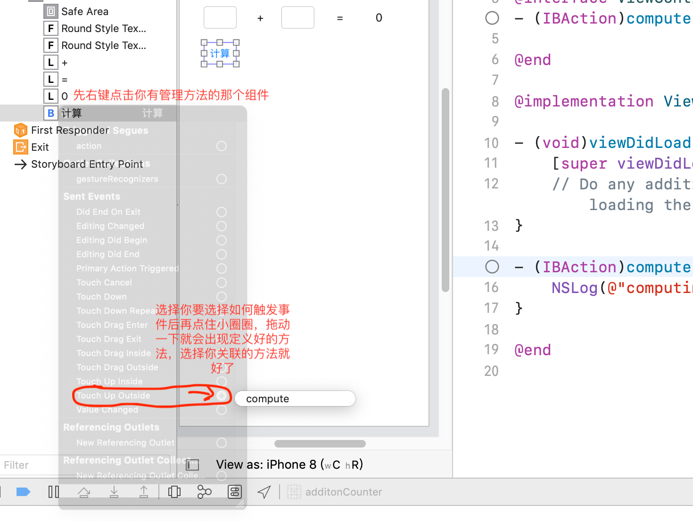
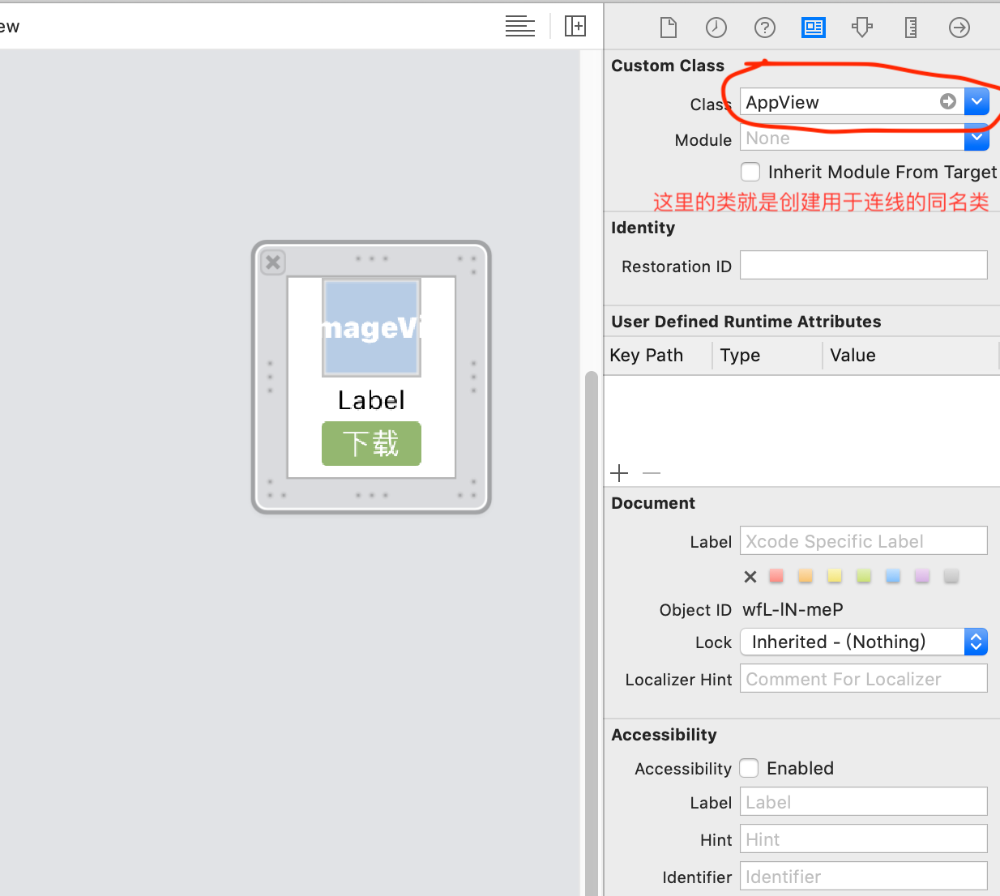

# iOS

什么是iOS这里就不介绍了，都要接触开发了，应该对系统的基本信息都挺清楚了。本篇笔记重点将记下iOS 开发过程中所涉及到的知识点。

主要开发流程和web相似，先完成view层，再实现具体功能，然后调试测试，测试完成就可以发布。

## iOS UIView

UIView所有组件的父类，组件的创建和销毁的处理是UIViewController。每一个新的界面都是一个UIView，切换界面就涉及到UIView的创建和销毁，UIView与用户的交互。

### UIViewController

UIViewController是UIView的控制器，负责创建、显示、销毁UIView；负责监听UIView内部的事件；负责处理UIView与用户的交互。

UIViewController内部有个UIView属性，就是它负责管理的UIView对象 ：

@property(nonatomic,retain) UIView *view;

**UIView与UIViewController的关系**

- UIView只负责对数据的展示，采集用户的输入、监听用户的事件等。

- 其他的操作比如：每个UIView的创建、销毁、用户触发某个事件后的事件处理程序等这些都交给UIViewController来处理。

创建完组件后，先编写好功能，在把组件关联上代码就可以了，关联过程

```objc
#import "ViewController.h"
@interface ViewController ()
@property (weak, nonatomic) IBOutlet UITextField *txtNum1;
@property (weak, nonatomic) IBOutlet UITextField *txtNum2;
@property (weak, nonatomic) IBOutlet UILabel *sum;
- (IBAction)compute;

@end

@implementation ViewController

- (void)viewDidLoad {
    [super viewDidLoad];
    // Do any additional setup after loading the view.
}

- (IBAction)compute {
    NSLog(@"");
    // 获取用户的输入
    NSString *num1 = self.txtNum1.text;
    NSString *num2 = self.txtNum2.text;
    
    // 处理
    int n1 = [num1 intValue];
    int n2 = num2.intValue;
    int res = n1 + n2;
    // 显示在label上
    self.sum.text = [NSString stringWithFormat:@"%d",res];
    // 收回输入键盘
  	// 法一：谁交出键盘谁就是第一响应者，让第一响应者 resign 就可以让键盘收回去
    //[self.txtNum1 resignFirstResponder];
    //[self.txtNum2 resignFirstResponder];
    // 法二：让当前控制器控制的组件全部停止编辑，那么键盘也就会跟着收回了
  	[self.view endEditing:YES];
}
@end

```



关联后对应地方会发生改变，如果想取消关联，字节点击触发事件类型后面的×就好了

注意：要用到的控件都要关联上。

- 关联的返回值IBAction、属性类型IBOutlet，这样才能做到关联view的控件

控件的位置大小相关的属性：frame（CGRect）、center（CGPoint）、bounds（CGRect）；因此center只能控制位置（坐标原点为中心，为frame的坐标原点为左上角），虽然bounds他是个CGRect但是他的CGPoint始终是零，是无效的，因此bounds只能控制大小，以中心点放大（frame放大坐标点是左上角）。

#### 简单动画

```objc
// 法一：头尾式
- (IBAction)scale:(UIButton *)sender {
  // 开启一个动画
  	[UIView beginAnimations:nil context:nil];
  // 定义动画持续时间
    [UIView setAnimationDuration:.5];
  // =======要执行动画的方法========
    CGRect bounds = self.img.bounds;
    if (sender.tag == 4) {
        bounds.size.width += 10;
        bounds.size.height += 10;
    } else {
        bounds.size.width -= 10;
        bounds.size.height -= 10;
    }
    self.img.frame = bounds;
  // 提交方法
  [UIView commitAnimations];
}
// 法二：block式
- (IBAction)scale:(UIButton *)sender {
    CGRect frame = self.img.frame;
    if (sender.tag == 4) {
        frame.size.width += 100;
        frame.size.height += 100;
    } else {
        frame.size.width -= 100;
        frame.size.height -= 100;
    }
    [UIView animateWithDuration:1 animations:^{
        self.img.frame = frame;
    }];
}
```

#### 动态创建控件

```objc
#import "ViewController.h"

@interface ViewController ()

@end

@implementation ViewController
// 当要显示一个界面的时候，首先创建这个界面对应的控制器
// 控制器创建好以后，接着创建控制器所管理的那个view，当这个view加载完毕后就开始执行下面的方法了
// 所以只要viewDidLoad方法被执行了，就表示控制器所管理的view创建好了
- (void)viewDidLoad {
    [super viewDidLoad];
    // web开发熟悉的感觉，比storyboard舒服多了，能用键盘操作的绝不用鼠标
  	// 创建一个纯净的按钮 如果想创建系统默认的按钮 [UIButton buttonWithType:UIButtonTypeSystem]
    UIButton *btn = [UIButton new];
    // 设置按钮上的属性
    [btn setTitle:@"点我吧" forState:UIControlStateNormal];
    [btn setTitleColor:[UIColor redColor] forState:UIControlStateNormal];
    [btn setTitle:@"你点个锤子" forState:UIControlStateHighlighted];
    [btn setTitleColor:[UIColor blueColor] forState:UIControlStateHighlighted];
    CGRect frame;
    frame.origin = CGPointMake(50, 50);
    frame.size = CGSizeMake(96, 96);
    btn.frame = frame;
    UIImage *imgNormal = [UIImage imageNamed:@"btn_01"];
    [btn setBackgroundImage:imgNormal forState:UIControlStateNormal];
    UIImage *imgHighLight = [UIImage imageNamed:@"btn_02"];
    [btn setBackgroundImage:imgHighLight forState:UIControlStateHighlighted];
  	// 添加点击事件
  	[btn addTarget:self action:@selector(btnClick) forControlEvents:UIControlEventTouchUpInside];
    // 把按钮加到UIView中
    [self.view addSubview:btn];
}
- (void)btnClick{
    NSLog(@"我说了，点我干嘛？");
}
@end
```

Tips:程序启动的时候出现的界面（一打开app放logo或者广告的那个界面）可以在LaunchScreen.storyboard上面画；Assets.xcassets 通常放媒体资源

#### transform属性

transform可以进行平移、缩放、旋转

```objc
- (IBAction)move {
    // 一次性平移（每次移动都是以原本坐标移动）
    self.btnIcon.transform = CGAffineTransformMakeTranslate(0, 50);
    // 可以多次平移（每一次移动都是基于上一次移动后的坐标）
    self.btnIcon.transform = CGAffineTransformTranslate(self.btnIcon.transform, 0, 50);
}

- (IBAction)rotate {
  	// 一次性
    self.btnIcon.transform = CGAffineTransformMakeRotate(M_PI/4);
    // 可以多次
    self.btnIcon.transform = CGAffineTransformRotate(self.btnIcon.transform, M_PI_4);
    
}

- (IBAction)scale {
  	// 一次性
  	self.btnIcon.transform = CGAffineTransformMakeScale(1.5, 1.5);
  	// 多次
    self.btnIcon.transform = CGAffineTransformScale(self.btnIcon.transform,1.5, 1.5);
}
- (IBAction)goBack {
  	// 复原，无论transform了多少次直接恢复到最原始的状态
    self.btnIcon.transform = CGAffineTransformIdentity;
}
```

**获取所有控件的子控件**：`self.view.subviews` 返回值为NSArray

**获取父控件**：假设一个控件为txt，这个组件也引入到了ViewController中了 `self.txt.superview`就得到了父控件了。

**不引入Controller的状况下获取控件**：想给控件设置一个tag `UITextField *txt = (UITextField *)[self.view viewWithTag:0];` 就得到tag为0的控件了，返回值就是次tag所对应的类，最好强转一下类型。但是不好维护，因为tag只能是数字

**销毁一个控件**：`[txt removeFromSuperview]`调用方法就销毁了

#### UIImageView

帧动画相关的属性和方法

@property(nonatomic,copy) NSArray *animationImages;

需要播放的序列帧图片数组（里面全是UIImage对象，会按顺序显示里面的图片）

@property(nonatomic) NSTimeInterval animationDuration;

帧动画的持续时间

@property(nonatomic) NSInteger animationRepeatCount;

帧动画的执行次数，默认是无限循环

`- (void)startAnimating;`开始执行帧动画

`- (void)stopAnimating;`停止执行帧动画

`- (BOOL)isAnimation;`是否正在执行帧动画

```objc
- (IBAction)drink {
    // 如果前一个动画没执行完就不执行下一个动画
    if (self.imgViewCat.isAnimating){
        return;
    }
    // 动态加载一个图片到一个NSArray中
    NSMutableArray *arrM = [NSMutableArray new];
    for (int i = 0; i < 81; i++) {
      // 通过[UIImage imageNamed:]这种方式加载图片h，加载好的图片会一直存放在内存中，不会释放，如果多图的话就很占内存，因此不要用这种方式
        // %02d 表示保留两位，如果不足两位则补零
        NSString *path = [[NSBundle mainBundle] pathForResource:[NSString stringWithFormat:@"drink_%02d.jpg",i] ofType:nil];
        UIImage *img = [UIImage imageWithContentsOfFile:path];
        [arrM addObject:img];
    }
    // 设置UIImageView 的animationImages属性
    self.imgViewCat.animationImages = arrM;
    // 设置动画持续时间
    self.imgViewCat.animationDuration = (self.imgViewCat.animationImages.count / 24);
    // 重复播放多少次
    self.imgViewCat.animationRepeatCount = 1;
    // 开始
    [self.imgViewCat startAnimating];
    // 清空图片，释放内存
  //注意要等到动画执行完才清空
  	[self.imgViewCat performSelector:@selector(setAnimationImages:) withObject:nil afterDelay:(self.imgViewCat.animationImages.count / 24)];
}
```

注意：做帧动画的话就不要用imageNamed方法了，这样很占内存

**UIButton与UIImageView的异同**

- 相同点：都能显示图片

- 不同点

  - UIButton默认情况就能监听点击事件，而UIImageView默认情况下不能

  - UIButton可以在不同状态下显示不同的图片

  - UIButton既能显示文字，又能显示图片(能显示2张图片，backgroundImage和Image)

- 如何选择
  - UIImageView：仅仅需要显示图片，点击图片后不需要做任何事情
  - UIButton：需要显示图片，点击图片后需要做一些特定的操作

### 字典转模型

模型其实就是类，就是把字典装变为类对象来保存。好处：第一，在打代码的时候有智能提示，第二，如果是字典的话key写错了，不会报错，程序运行运行才会出问题，可能好找好久的bug，而用模型存在输错了马上报错。第三，可以使用面向对象的特征，让程序变得更灵活

注意：模型的属性和字典的键的数量和名字完全一致，并且一定要封装`-(instancetype)initWithDictionary:(NSDictionary *)dict; `这个初始化的对象方法和 `+ (instancetype)XxxWithDictionary:(NSDictionary *)dict; `这个返回本类的类方法。这是必备的

```objc
#import <Foundation/Foundation.h>
@interface App : NSObject

@property (nonatomic, copy) NSString *name;
@property (nonatomic, copy) NSString *icon;

- (instancetype)initWithDictionary:(NSDictionary *)dict;
+ (instancetype)appWithDictionary:(NSDictionary *)dict;

@end
 #import "App.h"
@implementation App
- (instancetype)initWithDictionary:(NSDictionary *)dict{
    if (self = [super init]) {
        self.name = dict[@"name"];
        self.icon = dict[@"icon"];
    }
    return self;
}
+ (instancetype)appWithDictionary:(NSDictionary *)dict{
    return [[self alloc] initWithDictionary:dict];;
}
@end
```

### xib封装

新建文件 User Interface -> Empty 选择后创建的就是xib。然后想storyboard那样吧组件拉出来，组成想要的形状，之后创建一个与xib同名的类，把xib的继承对象修改给这个新创建的类，再像storyboard那样往新类中连线。然后UIViewController中创建新类的对象就好了，通过此对象的属性也能访问到xib的属性。



```objc
// 创建AppView对象 用于连线 AppView.h
#import <UIKit/UIKit.h>
@class App;
@interface AppView : UIView
@property (nonatomic, strong) App *model;
+ (instancetype)appView;
@end
// AppView.m
#import "AppView.h"
#import "App.h"
@interface AppView ()
@property (weak, nonatomic) IBOutlet UIImageView *imgViewIcon;
@property (weak, nonatomic) IBOutlet UILabel *lblName;
@property (weak, nonatomic) IBOutlet UIButton *btn;
@end

@implementation AppView
- (void)setModel:(App *)model{
    _model = model;
    
    self.imgViewIcon.image = [UIImage imageNamed:model.icon];
    self.lblName.text = model.name;
    
}

+ (instancetype)appView{
  // 因为xib安装到App上手变成了加密方式的nil，所以方法名是loadNibNamed,并且这个方法返回的是数组，因此再调用一个lastObject来选择最后一个view（创建的时候只创建了一个）
    // 注意loadNibNamed参数不要加后缀
    return [[[NSBundle mainBundle] loadNibNamed:@"AppView" owner:nil options:nil] lastObject];
}
@end
  
// viewController中的使用
- (void)viewDidLoad {
    [super viewDidLoad];
    // Do any additional setup after loading the view.
    [self apps];
    int colmuns = 3;
    CGFloat viewWidth = self.view.frame.size.width;
    CGFloat marginTop = 30;
    
    for (int i = 0; i < self.apps.count; i++) {
        App *item = self.apps[i];
        int col = i % 3;
        int row = i / 3;
      // 创建容器的对象
        AppView *appView = [AppView appView];
      // 计算坐标
        CGFloat marginX = (viewWidth - colmuns * appView.frame.size.width)/(colmuns + 1);
        CGFloat marginY = marginX;
        CGFloat appX = marginX + col * (appView.frame.size.width + marginX);
        CGFloat appY = marginTop + row * (appView.frame.size.height  + marginY);
        appView.frame = CGRectMake(appX, appY, appView.frame.size.width, appView.frame.size.height);
        [self.view addSubview:appView];
      // 给view容器的自控键赋值
        appView.model = item;
        
    }
    
}
```

**xib文件的加载过程**：

- 根据路径, 搜索对应的xib文件(nib文件)
-  加载xib文件的时候, 会按顺序加载xib文件中的每个控件。
- 对于每个控件, 创建的时候都会查找对应的Class属性中配置的是那个类, 那么就创建对应的类的对象。
-  创建好某个控件以后, 按照在xib中配置的属性的值, 依次为对象的属性赋值。
- 创建该控件下的子控件, 并设置属性值。然后把该控件加到父控件中。
-  最后返回一个数组, 这个数组中包含创建的根元素对象。

## iOS 小技巧

**快速得到app路径**：

```objc
// [NSBundle mainBundle]得到的是app根路径；pathForResource： ofType: 方法是快速查找到某文件的路径。
NSString *path = [[NSBundle mainBundle] pathForResource:@"pic.plist" ofType:nil];
```

**创建plist存放数据**：plist文件本质上其实是XML文件（可扩展标记语言），那么为什么后缀是plist呢，其实只是为了方便xcode显示

**占位符**：%02d 占位符表示保留两位整形数据，不足两位则前面补零