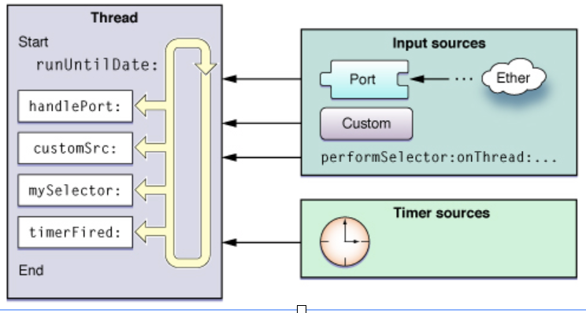
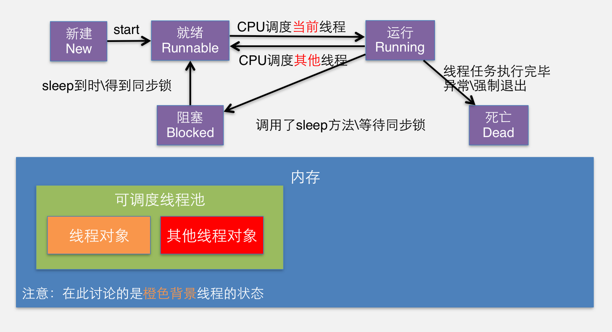
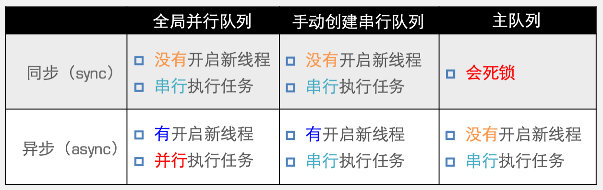

# iOS-多线程

多线程的本质就是多个任务同时执行。

## 相关概念

**同步**：多个任务只能依次执行的，如果有一个地方卡住了，整个程序就卡住了（程序阻塞）。

**异步**：多个任务同时执行，一个地方卡住了，程序还能继续往下运行

**进程**：指的是系统中正在运行的应用程序，每个进程之间是独立的，每个进程均运行在其专用的受保护的内存空间内。

**线程**：一个进程有多个线程组成（一个进程至少有一个线程），线程是进程的基本执行单元，一个进程的所有任务都是在线程执行的。

**多线程**：

- 一个进程中可以开启多个线程，一个线程依次执行多个任务

- 多线程可以解决程序阻塞的问题
- 多线程可以提高程序的执行效率

**操作系统**：操作系统有单任务操作系统（可以理解为一次只能执行一个应用）、多任务操作系统（多个应用可以同时执行）。

**CPU**：（单核CPU）

- 同一时间只能处理一个线程，只有一个线程在执行，这时候的多线程的概念其实只是快速在多个线程之间来回切换执行而已。
- 只要cpu调度线程的时间足够快，看起来多个线程就行是同时执行。
- 如果线程非常多，cpu单单在线程之间切换就消耗大量cpu，每个线程被调度的次数就会降低，线程的执行效率也会跟着降低。
- 多核CPU就可以看成是多个单核CPU来理解就行了

**主线程**：程序运行后，默认会开启一个线程，称为主线程或UI线程。主线程一般用来刷新UI界面，处理UI事件。注意：别把耗时的操作放入主线程，耗时的操作会卡住主线程，严重影响UI的流程度，用户体验差

## 消息循环

Runloop就是消息循环，每一个线程内部都有一个消息循环。只有主线程的消息循环是默认开启的，子线程的消息循环默认关闭。即消息循环一直循环等待事件的输入，根据事件来触发响应的方法。

消息循环的目的：

- 保证程序不退出
- 负责处理输入事件
- 如果没有事件发生就会让程序进入休眠状态

**输入事件**：Runloop接收输入时间来自两种不同的来源：输入源（input source）和定时源（time source）。输入源就是触摸事件等。NSTimer的定时器的事件也是输入事件



**消息循环的模式**：消息循环是在一个指定的模式下运行的，把输入事件添加到消息循环中的时候要设置模式的，消息循环的模式必须与输入事件设置的模式必须匹配，只有匹配了才会执行。默认情况下是NSDefaultRunLoopMode

- NSDefaultRunLoopMode 
  - 默认模式
- UITrackingRunLoopMode 
  - 当滚动scrollView的时候，消息循环的模式自动改变，变成此模式
- 如果想两个模式都执行那设置的时候可以设置为 NSRunLoopCommonModes，这是一些常用模式的集合模式

**子线程的消息循环**：上文说过，子线程的消息循环默认是关闭的，可以在子线程中通过 `[[NSRunLoop currentRunLoop] run]` 来开启

```objc
- (void)viewDidLoad {
    [super viewDidLoad];
    NSThread *thread = [[NSThread alloc] initWithTarget:self selector:@selector(demo) object:nil];
    [thread start];
    // 子线程中的消息循环中添加输入源
    [self performSelector:@selector(test) onThread:thread withObject:nil waitUntilDone:NO];
}
- (void)demo{
    NSLog(@"I'm secondry Thread");
    // 如果用run开启子线程的消息循环，因为这是一个消息循环，相当于一个死循环
    // 所以terminal打印不了runloop end
    // 但是如果这个消息循环中没有输入源，这个消息循环会立即退出
//    [[NSRunLoop currentRunLoop] run];
    
    // 开启消息循环后两秒后退出
    [[NSRunLoop currentRunLoop] runUntilDate:[NSDate dateWithTimeIntervalSinceNow:2]];
    NSLog(@"runloop end");
}

// 执行在子线程中的消息循环
- (void)test{
    NSLog(@"I'm func on runloop");
}
```

## 多线程的优缺点

优点：

- 能适当提高程序的执行效率
- 能适当的提高资源的利用率（内存，CPU）
- 线程上的人物执行完成后，线程会自动销毁

缺点：

- 开启线程需要占用一定的内存空间（默认情况下，一个线程占512KB）
- 如果开启大量的线程，会占用大量的内存空间，降低程序的性能
- 线程越多，cpu在调度线程上的开销就很大
- 程序设计更加复杂，比如线程间的通信、多线程的数据共享

## iOS中多线程的技术方案

- pthread
  - 一套通用的多线程API，适用于Unix、Linux、Windows等系统，跨平台可移植但使用难度大
  - 用的是C语言，线程的生命周期是由程序员管理的
  - 几乎不用
- NSThread
  - 使用面向对象封装了pthread，简单易用，可直接操作线程对象
  - 用的是OC，线程的声明周期也是有程序员管理的
  - 偶尔使用
- GCD
  - 一个自动管理的线程技术，充分利用设备的多核
  - C语言，线程的生命周期是自动管理的
  - 经常使用
- NSOperation
  - 用面向对象封装了GCD，是GCD的超集，基于GCD，比GCD多了些更简单实用的功能
  - OC，线程的生命周期也是自动管理的
  - 经常使用

### pthread

pthread_create(<#pthread_t _Nullable *restrict _Nonnull#>, <#const pthread_attr_t *restrict _Nullable#>, <#void * _Nullable (* _Nonnull)(void * _Nullable)#>, <#void *restrict _Nullable#>)

- 参数1：线程编号的地址

- 参数2：线程的属性

- 参数3：线程要执行的函数

- 线程4：函数需要的参数

返回值，创建成功还是失败，0成功 1失败

```objc
// 合适的位置 
pthread_t pthread;
NSString *str = @"lisi";
int result = pthread_create(&pthread, NULL, demo, (__bridge void *)(str));
if (result == 0) {
    NSLog(@"成功");
}else{
    NSLog(@"失败");
}
// 要执行的demo函数的函数体
void *demo(void *param) {
    NSString *str = (__bridge NSString *)(param);
    NSLog(@"hello %@",str);
    return NULL;
}
```

### NSThread

常见NSThread对象后 调用 [对象名 start];

- [[NSThread alloc] initWithTarget:<#(nonnull id)#> selector:<#(nonnull SEL)#> object:<#(nullable id)#>]
  - 参数一：方法所属的对象
  - 参数二：方法
  - 参数三：方法的参数，类型是id，只要是OC对象都行
- [[NSThread alloc] initWithBlock:^{<#code#>}]
  - 参数：block，不能穿参数

直接调用类方法

- [NSThread detachNewThreadSelector:@selector(demo:) toTarget:self withObject:@{@"name":@"jack"}];
- [NSThread detachNewThreadWithBlock:^{NSLog(@"test %@",[NSThread currentThread]);}];

当前控制器的self让方法后台执行

- [self performSelectorInBackground:@selector(demo:) withObject:@{@"name":@"jerry"}];

```objc
// way 1
NSThread *thread = [[NSThread alloc] initWithTarget:self selector:@selector(demo) object:@{@"name":@"Thread1"}];
[thread start];// 记得要调用start方法
- (void)demo{
     NSLog(@"%@ %@",sender[@"name"], [NSThread currentThread]);// 查看当前线程的信息
}
// way 2
[[NSThread alloc] initWithBlock:^{
	 NSLog(@"test %@",sender[@"name"], [NSThread currentThread]);
}]

// way 3 类方法，直接创建并且调用
[NSThread detachNewThreadSelector:@selector(demo:) toTarget:self withObject:@{@"name":@"jack"}];
// way 4 
[NSThread detachNewThreadWithBlock:^{
    NSLog(@"test %@",[NSThread currentThread]);
}];
```

#### 线程状态



- [NSThread sleepForTimeInterval:3] 线程睡眠3秒
- [NSThread sleepUntilDate:<#(nonnull NSDate *)#>]; 线程睡眠直到一个时间点才醒
- [NSThread exit] 强制退出，让线程死亡，注意 线程死亡后就不能再start了

**线程属性：**

- thread.name 名字
- thread.threadPriority = 1; 线程优先级 double [0,1] 默认为0.5
  - 优先级：CPU调度时执行下一个线程的概率的感觉，但取不到0%和100%，即使是一个为1一个为0 也不能保证1执行完了才执行0的那个

#### 线程安全问题

线程调用共享资源：一块资源可能被多个线程共享，也就是多个线程都可以访问同一个资源（变量、对象、文件等）

如果多个线程同时访问一块资源时，很容易发生混乱和数据安全问题，比如两个线程都对一个变量减一，都让其减一，如果有个线程读取变量但未进行减一操作（先减一再重新赋值），就到下一个进程了，而下一个进成读取的也是同一个值，那么明明对这个变量减了两次，但变量重复赋值了同一个数字，因此结果只变成减了一次。这就是线程不安全的原因。

**互斥锁**

为了**让线程安全**，我们应该把取值减一赋值**这几个步骤同步执行**，即执行这三个步骤时别的线程进不来。这样就解决了这个问题（这个锁就是**互斥锁**）。也就是**其余线程都会进入sleep**，直到执行完这个锁中的代码后，其他线程才会唤醒，**加锁后会影响性能，因此锁内的应该越少越好**

```objc
- (void)demo{
    while (YES) {
        // 这几个代码应该要同步，不能异步执行，否则会出现线程安全问题。
        // 通常对谁操作，谁（这个对象）就作为锁放进括号中
        @synchronized (self) {
            if (self.number > 0){
                self.number--;
                NSLog(@"%d",self.number);
            }else{
                NSLog(@"--------------");
                break;
            }
        }
        
    }
}
```

注意：互斥锁内不能放死循环。

**自旋锁**：如果其他线程发现一个线程正在执行锁定代码，那么就会进入**死循环**（可以理解为一直等待），**直到这个线程执行完锁内代码**后才跳出循环去这行这个锁定代码，因为是进入死循环这是**十分耗性能**的，所以**自旋锁更适合执行不耗时的代码**

**原子属性**：就是我们在用@property的时候第一个 @property（atomic）加上这个property属性后，这个对象的成员变量就是线程安全的，其实就是系统自动帮我们给属性加了**自旋锁**（在这里只是同时写的时候不出现问题，**不能保证同时读写不出问题**）。默认property就给我们加了原子属性，但是加上了自旋锁效率会变低。

iOS开发建议是，所有属性都用nonatomic，尽量避免多线程争夺同一资源，尽量将加锁、资源抢夺的业务逻辑放在服务器中处理，减小客户端压力

**注意：**iOS中UIKit中大部分对UI的操作都是线程不安全的，因此官方规定，**只能在主线程中操作UI**，因此主线程也叫UI线程。如果想在子线程中操作UI，只能调用`[self performSelectorOnMainThread:SEL withObject:(id)param waitUntilDone:isSynchronize];`

```objc
- (void)viewDidLoad {
    [super viewDidLoad];
    
    [NSThread detachNewThreadWithBlock:^{
        [self demo];
    }];
    NSLog(@"11111");
}
- (void)demo{
    NSData *data = [NSData dataWithContentsOfURL:[NSURL URLWithString:@"https://iknow-pic.cdn.bcebos.com/d043ad4bd11373f092c78684a60f4bfbfbed0434"]];
    NSLog(@"%@",data);
    // 只能在主线程中操作UI
    // 最后一个参数YES则表示，等待这个方法执行完才会执行后面的代码。(是否同步操作)
    [self performSelectorOnMainThread:@selector(showImg:) withObject:[UIImage imageWithData:data] waitUntilDone:NO];
    NSLog(@"render finish");
}
- (void)showImg:(UIImage *)image{
    NSLog(@"render start");
    self.imageView.image = image;
    [self.imageView sizeToFit];
    self.scrollView.contentSize = image.size;
}
```

### GCD

- 什么是GCD

  - 全称是Grand Central Dispatch

  - 纯C语言，提供了非常多强大的函数

- GCD的优势

  - GCD是苹果公司为多核的并行运算提出的解决方案

  - GCD会自动利用更多的CPU内核（比如双核、四核）
  - GCD会自动管理线程的生命周期（创建线程、调度任务、销毁线程）
  - 程序员只需要告诉GCD想要执行什么任务，不需要编写任何线程管理代码

- GCD的两个核心

  - 任务：执行什么操作

  - 队列：用来存放任务，就是数据结构的队列

- GCD使用的两个步骤

  - 创建任务：确定要做的事情

  - 将任务添加到队列中

    - GCD会自动将队列中的任务取出，放到对应的线程中执行

    - 任务的取出遵循队列的FIFO原则：先进先出，后进后出


```objc
-(void)touchesBegan:(NSSet<UITouch *> *)touches withEvent:(UIEvent *)event{
    // 创建队列
    dispatch_queue_t queue = dispatch_get_global_queue(0, 0);
    // 创建任务
    // 异步执行，会自动帮我们创建线程，任务执行完后线程不会直接销毁
    // 而是放入线程池中等待一定时间，如果还没有任务进来就自动销毁，有任务输入就复用线程
    dispatch_async(queue, ^{
        NSLog(@"%@",[NSThread currentThread]);
    });
}
```

**GCD的队列类型**：并发队列、串行队列、主队列、全局队列

- 并发队列（Concurrent Dispatch Queue）
  - 可以让多个任务并发（同时）执行（自动开启多个线程同时执行任务）
  - 并发功能只有在异步（dispatch_async）函数下才有效
  - dispatch_queue_create("test", DISPATCH_QUEUE_CONCURRENT); 
    - 第一个参数为名字，第二个参数是一个宏

- 串行队列（Serial Dispatch Queue）
- 让任务依次执行，因此如果是同步执行的话就在主线程依次执行，如果是异步执行则，在那一个子线程中依次执行
  - dispatch_queue_create("test", DISPATCH_QUEUE_SERIAL);
    - 第一个参数为名字，第二个参数是宏

- 主队列，异步任务 dispatch_get_main_queue()

- - 不开线程，同步执行，即使你用async方法调用也不开线程，在主线程中同步执行
  - 主队列特点：如果主线程正在执行代码暂时不调度任务，等主线程执行结束后在执行任务，即**执行完主线程的代码才调用主队列上的任务**
  - 主队列又叫 全局串行队列

- 主队列，同步执行 dispatch_get_main_queue()

- - 程序执行不出来（死锁），只有在主线程上用主队列同步执行才会死锁，子线程上是没事的

  - 死锁的原因，当程序执行到下面这段代码的时候

  - - 主队列(A)：如果主线程正在执行代码，就不调度任务
    - 同步执行(B)：如果第一个任务没有执行，就继续等待第一个任务执行完成，再执行下一个任务此时互相等待，程序无法往下执行
    - A等B执行完再执行，而B要等A执行完再执行，因此AB都不执行了主程序就卡死了

- 全局队列：本质是并发队列

- 全局队列和并发队列的区别

- - 并发队列有名称，可以跟踪错误，全局队列没有
  - 在ARC中不需要考虑释放内存， dispatch_release(q);不允许调用。在MRC中需要手动释放内存，并发队列是create创建出来的 在MRC中见到create就要release，全局队列不需要release（只有一个）
  - 一般我们使用全局队列
  - dispatch_get_global_queue(0, 0); 
    - 第一个参数是服务质量（线程的优先级）
    - 第二个参数没任何意义，传0就好了



**Barrier 阻塞**

主要用于在多个异步操作完成之后，统一对非线程安全的对象进行更新，适用于大规模的I/O操作。当访问数据库或文件的时候，更新数据的时候不能和其他更新或读取的操作一同执行（比如同一个时刻，对同一个数组进行添加操作），可以使用dispatch_barrier_async解决。

barrier也就是，先把等待队列中的任务执行完才执行barrier中的任务

```objc
// 自己定义一个全局的并行队列，不能用global那个会报错
for (int i = 0; i < 1000; i++) {
	dispatch_async(self->_queue, ^{
        NSString *path = [[NSBundle mainBundle] pathForResource:[NSString stringWithFormat:@"%02d.jpg",i] ofType:nil];
        UIImage *image = [UIImage imageWithContentsOfFile:path];
        dispatch_barrier_async(self->_queue, ^{
            [self.photoList addObject:image];
            NSLog(@"%d 保存完成", i)
        })
        NSLog(@"%d 下载完成",i);
    });
}
```

**延迟执行**：等一段时间再执行任务，精度到纳秒

dispatch_after(<#dispatch_time_t when#>, <#dispatch_queue_t _Nonnull queue#>, <#^(void)block#>)

- 参数一：延时多久
- 参数二：队列
- 参数三：block 任务

```objc
dispatch_after(dispatch_time(DISPATCH_TIME_NOW, (int64_t)(1 * NSEC_PER_SEC)), dispatch_get_main_queue(), ^{
    NSLog(@"你好");
});
```

**一次性执行**：字面意思，一个任务只能调用一次。线程安全的

dispatch_once(<#dispatch_once_t * _Nonnull predicate#>, <#^(void)block#>)

- 参数一：一个记录有无执行的参数，默认是零，执行后变为-1
- 参数二：任务

```objc
static dispatch_once_t onceToken;
dispatch_once(&onceToken, ^{
    NSLog(@"你好");
});
```

我在OC笔记中单例对象的写法，如果不加锁的话也是线程不安全的，如果第一次执行的时候多个线程都进去了，那就又可以有一个或几个单例对象的地址是不一样的。我们可以加锁或者直接用dispatch_once。用once效率高

```objc
// 对比一下OC笔记中的写法，其实不用重写allocWithZone的这种写法也是可以的,保证一个类中只写一次下面的代码就好了
// 加锁
+ (instancetype)sharedInstance
{
    static id instance = nil;
    @synchronized (self) {
        if (!instance) {
            instance = [[self alloc] init];
        }
    }
    return instance;
}
// dispatch_once
+ (instancetype)sharedInstance {
    static id instance = nil;
    static dispatch_once_t onceToken;
    dispatch_once(&onceToken, ^{
        if (!instance) {
          instance = [[self alloc] init];
        }
    });
    return instance;
}
```

**调度组**：

通常用来通知主线程，子线程的操作都执行完了

```objc
- (void)test{
    // 创建组
    dispatch_group_t group = dispatch_group_create();
    dispatch_queue_t queue = dispatch_get_global_queue(0, 0);
    dispatch_group_async(group, queue, ^{
        NSLog(@"正在下载第一首");
    });
    dispatch_group_async(group, queue, ^{
        NSLog(@"正在下载第二首");
    });
    dispatch_group_async(group, queue, ^{
        NSLog(@"正在下载第三首");
    });
    // 为了直接通知主线程，这里队列的参数写成主队列，是否是主线程要看是否是主线程队列
    dispatch_group_notify(group, dispatch_get_main_queue(), ^{
        [self show];
    });
}
- (void)show{
    UIAlertController* alert = [UIAlertController alertControllerWithTitle:@"通知" message:@"已全部下载完成" preferredStyle:UIAlertControllerStyleAlert];
    UIAlertAction* defaultAction = [UIAlertAction actionWithTitle:@"OK" style:UIAlertActionStyleDefault
       handler:^(UIAlertAction * action) {}];
    [alert addAction:defaultAction];
    [self presentViewController:alert animated:YES completion:nil];
}
```

### NSOperation

NSOperation是一个抽象类不能直接使用（方法没有实现）约束子类都具有共同的属性和方法。

- NSOperation的作用

  - 是OC语言中基于GCD的面向对象的封装
  - 使用起来比GCD更加简单（面向对象）
  - 提供了一些用GCD不好实现的功能
  - 苹果推荐使用，使用NSOperation不用关心线程以及线程的生命周期

- NSOperation的子类
  - NSInvocationOperation
  - NSBlockOperation
  - 自定义operation

- NSOperation和NSOperationQueue实现多线程的具体步骤
  - 先将需要执行的操作封装到一个NSOperation对象中
  - 然后将NSOperation对象添加到NSOperationQueue中
    - 系统会自动将NSOperationQueue中的NSOperation取出来
    - 将取出的NSOperation封装的操作放到一条新线程中执行

```objc
-(void)touchesBegan:(NSSet<UITouch *> *)touches withEvent:(UIEvent *)event{
    [self deomo];
}
- (void)test{
    NSLog(@"hello %@", [NSThread currentThread]);
}
```

```objc
// way 1 NSInvocationOperation
- (void)demo {
    // 创建操作
    NSInvocationOperation *op = [[NSInvocationOperation alloc] initWithTarget:self selector:@selector(test) object:nil];
    // [op start]; 调用方法，更新状态，但是没有开新的线程，即在主线程中调用方法
    // 创建队列
    NSOperationQueue *queue = [[NSOperationQueue alloc] init];
    // 操作添加到队列中
    [queue addOperation:op];
}
```

```objc
// way 2 NSBlockOperation
// 创建操作
- (void)demo1{
    NSBlockOperation *op = [NSBlockOperation blockOperationWithBlock:^{
        [self test];
    }];
    // [op start]; 调用方法，更新状态，但是没有开新的线程，即在主线程中调用方法
    // 创建队列
    NSOperationQueue *queue = [[NSOperationQueue alloc] init];
    // 操作添加到队列中
    [queue addOperation:op];
}
```

```objc
// way 3 直接操作队列
// 创建队列
- (void)demo2{
    // 如果把queue定义到属性中那就变成全局队列了
    NSOperationQueue *queue = [[NSOperationQueue alloc] init];
    // 操作添加到队列中
    [queue addOperationWithBlock:^{
        [self test];
    }];
}
```

**NSOperation 属性**：

- @property (readonly, getter=isCancelled) BOOL cancelled;

- @property (readonly, getter=isExecuting) BOOL executing;

- @property (readonly, getter=isFinished) BOOL finished;

  - 上三个operation的状态

- @property (readonly, getter=isConcurrent) BOOL concurrent; 

  - 是否是并行操作，将会被废弃用asynchronous

- @property (readonly, getter=isAsynchronous) BOOL asynchronous 

  - 同上

- @property (readonly, getter=isReady) BOOL ready;

  - 是否进入准备状态

- @property (readonly, copy) NSArray<NSOperation *> *dependencies;

  - 依赖

- @property NSOperationQueuePriority queuePriority;

  - 任务的优先级

- @property (nullable, copy) void (^completionBlock)(void)

  - 完成后的回调，注意不是在主线程的回调，而是**新创建一个子线程来回调，因此不能操作ui**
  - 如果想回到主线程更新UI可以这样，直接给主队列添加操作

  ```objc
  [[NSOperationQueue mainQueue] addOperationWithBlock:^{
      NSLog(@"下载完成了，正在操作UI... %@", [NSThread currentThread]);
  }];
  ```
  
  - 或者用 self performSelectorOnMainThread: 方法
  
- @property double threadPriority

  - 线程优先级

- @property NSQualityOfService qualityOfService

  - 服务质量（优先级）

- @property (nullable, copy) NSString *name

  - 名字

**最大并发数**：

最大并发数就是同时执行的任务数比如，同时开3个线程执行3个任务，并发数就是3。NSOperation是不会帮我们重用线程的，多个NSOperation操作就开多个线程，这会占用内存，因此要通过设置队列的最大并发数，让线程重用

- 最大并发数的相关方法，注意这个是队列的方法

\- (NSInteger)maxConcurrentOperationCount;

\- (void)setMaxConcurrentOperationCount:(NSInteger)cnt;

- 执行的过程

1. 把操作添加到队列self.queue addOperationWithBlock

2. 去线程池去取空闲的线程，如果没有就创建线程

3. 把操作交给从线程池中取出的线程执行

4. 执行完成后，把线程再放回线程池中

5. 重复2，3，4知道所有的操作都执行完

**队列的暂停取消恢复**：

- 取消队列的所有操作

\- (void)cancelAllOperations;

提示：也可以调用NSOperation的- (void)cancel方法取消单个操作

- 暂停和恢复队列

\- (void)setSuspended:(BOOL)b; // YES代表暂停队列，NO代表恢复队列

\- (BOOL)isSuspended;

注意：暂停、取消的是后续操作，当前操作会执行完毕

**操作的优先级：**

- 设置NSOperation在queue中的优先级，可以改变操作的执行优先级

\- (NSOperationQueuePriority)queuePriority;

\- (void)setQueuePriority:(NSOperationQueuePriority)p;

- iOS8以后推荐使用服务质量 qualityOfService

**依赖操作：**就是A操作必须依赖于B操作完成了才能操作。注意不能相互依赖会产生死锁，依赖操作可以跨队列

\- (void)addDependency:(NSOperation *)op;

```objc
NSBlockOperation *op1 = [NSBlockOperation blockOperationWithBlock:^{
    NSLog(@"正在下载...");
}];
NSBlockOperation *op2 = [NSBlockOperation blockOperationWithBlock:^{
    NSLog(@"下载完成");
    NSLog(@"正在解压...");
}];
NSBlockOperation *op3 = [NSBlockOperation blockOperationWithBlock:^{
    NSLog(@"升级完成");
}];
[op2 addDependency:op1];
[op3 addDependency:op2];
[self.queue addOperations:@[op1, op2, op3] waitUntilFinished:YES];
```

**NSOperation和GCD的异同**

- GCD

  - GCD是iOS4.0 推出的，主要针对多核cpu做了优化，是C语言的技术

- - GCD是将任务(block)添加到队列(串行/并行/全局/主队列)，并且以同步/异步的方式执行任务的函数

  - GCD提供了一些NSOperation不具备的功能

    - 一次性执行

  - - 延迟执行
    - 调度组

- NSOperation

  - NSOperation是iOS2.0推出的，iOS4之后重写了NSOperation

- - NSOperation将操作(异步的任务)添加到队列(并发队列)，就会执行指定操作的函数

  - NSOperation里提供的方便的操作

    - 最大并发数

  - - 队列的暂定/继续
    - 取消所有的操作
    - 指定操作之间的依赖关系(GCD可以用同步实现)

## 沙盒缓存

沙盒缓存是经常用的，比如聊天信息记录、加载过的图片的，这样做即减小了服务器的压力，也提高了用户体验，减少用户的流量消耗。操作可以看iOS的笔记参照获取沙盒路径。就是把Array、Dictionary、二进制的图片或者视频变成NSData然后writeToFile


