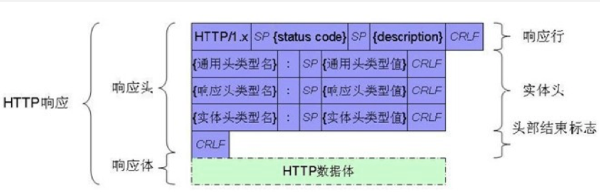
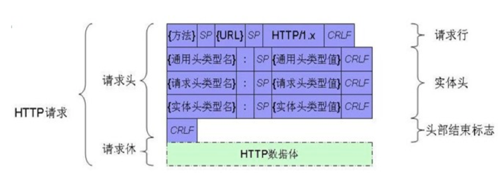

# 网络

## URL

Uniform Resource Locator(统一资源定位符)，网络中每一个资源都对应唯一的地址—URL。

- URL的基本格式

  - 协议://主机地址:端口号/路径

    - 协议： 不同的协议代表不同的资源获取方式

    - 主机地址：主机的唯一标示(IP地址、域名)

    - 路径：资源在主机中的具体位置

  - 举例：

    - http://www.itheima.com/
    - http://www.itheima.com/images/xx00.png
    - ftp://www.itheima.com/movies/cls.avi

- URL的常见协议

- -  HTTP、FTP、mailto、File、tel://、sms://

## HTTP简介

- HyperText Transport Protocol(超文本传输协议)
  - 浏览器和Web服务器通讯时候遵守的约定
  - 互联网使用最多的协议
  - 提供超文本传输服务
  - 通过浏览器打开网站使用的就是HTTP提供的服务，开发App也会经常使用HTTP协议从网络上获取数据

- ### TCP和UDP

- 简单来说TCP协议传输得到的数据是正确的，而UDP得到的数据是有可能有问题的，因为TCP在网络层的协议一定有校验码，而UDP是不一定要校验码的，因此无法确保100%正确，现在阶段的网络传输误码率是非常非常低的，因此UDP也还是不错的选择

- TCP: 要求可靠性高的时候用，因为TCP在建立连接器要经过三次通信才会建立连接通道，并且校验发现错误会要求重发。（比如下载）

- UDP: 要求实时性比较高，经济实惠省流量的时候使用。直接就建立连接的通道，数据错误也不会要求重发（比如打电话，直播）

## Socket（套接字）


Socket又称“套接字”，应用程序通过“套接字”向网络发送请求或向网络做出应答。

网络通信其实就Socket之间的通信，数据在两个Socket之间通过IO传输数据，Socket是纯C语言的，是跨平台的，**HTTP协议是基于Socket的，HTTP协议的底层使用的就是Socket**。Socket就是在应用层和传输层之间的协议。

**Socket的通信过程**：

- 创建Socket

  - 导入头文件
    - \#import <sys/socket.h>
    - \#import <netinet/in.h>
    - \#import <arpa/inet.h>

  - 创建Socket`int socket(int domain, int type, int protocol);`
    - 参数1 domain 协议域 AF_INET--IPV4
    - 参数2 type  socket类型 SOCK_STREAM(TCP)/SOCKET_DGRAM(UDP)
    - 参数3 protocol IPPROTO_TCP/IPPROTO_UDP  如果 传入0 会根据第二个参数选择合适的值
    - 返回值 >0 创建成功 socket的描述符

  - 示例：int clientSocket = socket(AF_INET, SOCK_STREAM, IPPROTO_TCP);

- 连接到服务器

  - 定义函数：int connect(int sockfd, struct sockaddr * serv_addr, int addrlen);
    - sockfd：标识一个套接字。
    - serv_addr：结构体套接字s想要连接的主机地址和端口号。
    - addrlen：结构体的长度。

  ```objc
  struct sockaddr_in addr;
  addr.sin_family = AF_INET;
  addr.sin_addr.s_addr = inet_addr("192.168.88.100");
  addr.sin_port = htons(3000);
  int result = connect(clientSocket, (const struct sockaddr *) &addr, sizeof(addr));
  // 返回值为0则连接成功，非零则连接失败
  ```

- 发送数据给服务器

  ```objc
  NSString *sendMsg = @"GET / HTTP/1.1\r\n"
                       "Host: www.baidu.com\r\n"
                       "Connection: close\r\n\r\n"];
  // 自己封装好请求头（遵守HTTP协议），才发送给服务器发送
  const char *sendMessage = sendMsg.UTF8String;
  ssize_t sendLen = send(clientSocket, sendMessage, strlen(sendMessage), 0);
  NSLog(@"发送的字节数：%ld",sendLen);
  ```

- 从服务器接收数据

  ```objc
  uint8_t buffer[1024];
  ssize_t recvCount = -1;
  NSMutableData *mData = [NSMutableData new];
  do {
      // 循环接收数据，直到服务器传完了才停止
      recvCount = recv(self.clientSocket, buffer, sizeof(buffer), 0);
      if (recvCount) {
          [mData appendBytes:buffer length:recvCount];
      }
  }while(recvCount != 0);
  NSString *res = [[NSString alloc] initWithData:mData encoding:NSUTF8StringEncoding];
  return res;
  ```

- 关闭连接 `close(clientSocket);`

- 获得响应体的内容，即响应头去掉

  ```objc
  // 截取响应头结束位置
  NSRange range = [res rangeOfString:@"\r\n\r\n"];
  // 在响应头结束位置后开始获得html
  NSString *html = [res substringFromIndex:range.location+range.length];
  ```

## JSON 解析

NSDictionary *dict = [NSJSONSerialization JSONObjectWithData:data options:0 error:&error];

- 参数一：NSData类型的二进制数据
- 参数二：options：
  - 0 （通常都传这个）
    - 不做任何处理
  - NSJSONReadingMutableContainers = (1UL << 0) 
    - 把容器（最外层）转成可变的数组或者可变的词典
  -  NSJSONReadingMutableLeaves = (1UL << 1)
    - 如果json内所有东西都变成可变的
  -  NSJSONReadingFragmentsAllowed = (1UL << 2)
    - 如果不是合法的JSON格式，也解析（通常都不用）
- 参数三：NSError 一个对象的地址

```objc
NSError *error;
NSDictionary *dict = [NSJSONSerialization JSONObjectWithData:data options:0 error:&error];
if (error) {
    NSLog(@"JSONparse error: %@",error);
    return;
}
NSLog(@"%@",dict);
```

**解决输出是Unicode源码的问题**：给数组或者字典写一个类扩展，改写其descriptionWithLocale方法Xcode8以前

```objc
- (NSString *)descriptionWithLocale:(id)locale{
    NSMutableString *msg = [NSMutableString new];
    [msg appendString:@"\r\n{\r\n"];
    for (id key in self) {
        [msg appendFormat:@"\t%@: %@,\r\n", key, self[key]];
    }
    [msg appendString:@"}"];
    return msg.copy;
}
```

xcode8以后重写的方法就变了descriptionWithLocale:indext:level: 默认调用变成这个方法了

```objc
- (NSString *)descriptionWithLocale:(id)locale indent:(NSUInteger)level{
    NSMutableString *msg = [NSMutableString new];
    [msg appendString:@"\r\n{\r\n"];
    for (id key in self) {
        [msg appendFormat:@"\t%@: %@,\r\n", key, self[key]];
    }
    [msg appendString:@"}"];
    return msg.copy;
}
```

为了可以nslog类中的方法我们可以重写类的 description方法

```objc
- (NSString *)description
{
    return [NSString stringWithFormat:@"<%@: %p> {videoId: %@, name: %@, length: %@, videoURL: %@, imageURL: %@, desc: %@, teacher: %@, time: %@}", [self class], self, self.videoId, self.name, self.length, self.videoURL, self.imageURL, self.desc, self.teacher, self.time];
}
```

一个分类文件里面可以写多个分类，因此我们可以创建一个文件数组和字典都重写这个方法就好了。

**注意**：我们给JSON做字典转模型的时候一些数组类型我们都用NSNumber接收，因为有可能服务器返回的是null，用int、float这些接收会报错

### JSON序列化

```objc
NSDictionary *dict = @{@"name": @"xiaoming", @"age": @12, @"fun":@"123"};
NSArray *arr = @[@{@"name":@"张三"},@{@"name":@"李四"}];
// 判断对象是否能序列化，能序列化的只有数组和字典，如果字典或者数组中存在自定义对象实惠报错的
if (![NSJSONSerialization isValidJSONObject:v1]) {
    NSLog(@"对象不能序列化");
    return;
}
// 这样直接转化为二进制数据，就可以直接request.HTTPBody=data 直接传了
NSData *dataDict = [NSJSONSerialization dataWithJSONObject:dict options:0 error:nil];
NSData *dataArr = [NSJSONSerialization dataWithJSONObject:arr options:0 error:nil];
```

### 模型转字典

因为JOSN序列化不能是自定义对象，而我们想把自定义对象序列化发送给服务器就要做模型转字典

```objc
// 参数中的数组就是对象中的属性名，用KVC的方法还可以获取到.m中的真私有属性
NSDictionary *dict = [v1 dictionaryWithValuesForKeys:@[@"videoName",@"size",@"_isYellow"]];
```

```objc
// 模型数组中每个模型转为字典
NSMutableArray *arrM = [NSMutableArray new];
for (Model* model in self.models) {
    NSDictionary *dict = [Model dictionaryWithValuesForKeys:@[@"prop1",@"prop2",@"prop3"]];
    [arrM addObject:dict];
}
NSData *data = [NSJSONSerialization dataWithJSONObject:arrM options:0 error:nil];
```

## Plist 解析

开发的时候无论是网络还是本地通常都不用plist，首先数据量大，再者不可能只做iOS，plist别的语言是解析不了的

```objc
NSError *error;
NSArray *arr = [NSPropertyListSerialization propertyListWithData:data options:0 format:0 error:&error];
if (error) {
    NSLog(@"plistparse error: %@",error);
    return;
}
NSLog(@"%@",arr);
```

## XML

- 什么是XML

  - Extentsible Markup Language（可扩展标记语言）
  - HTML （超文本标记语言）XML与HTML十分类似
  - 非常类似于HTML，HTML的作用是显示数据，XML的目的是存储和传输数据
  - XML是各种应用之间传输数据是以前常用的格式，现在几乎不用，都用JSON
  - W3C的推荐标准
- XML由标记组成
- <tag> 这就是标记，xml的标记是可扩展的，没有预定义
- 有且只有一个根节点
```objc
<Human>
    <Person color="yellow" weight="130" height="150">
        <name>wg</name>
        <age>108</age>
    </Person>
    <Student name="y" />
</Human>
```

- XML格式的解析方式

  - SAX ：iOS上解析，速度快，内存占用小，只读
  - DOM ： mac上的解析方式，iOS无法直接使用，解析过程中内存占用大，读写

- SAX的解析步骤：

  a. 加载xml数据

  b. 找开始节点(包括节点的属性)

  c. 找节点之间的内容

  d. 找结束节点

  e. 直到最后一个节点，解析结束
  
- 网络模型中用copy修饰类中的属性，包括NSNumber

- 否则的话KVC赋值的value是NSMutableString的时候会有问题，值是可变字符串中的最后一个值

```objc
NSXMLParser *parser = [[NSXMLParser alloc] initWithData:data];
// 设置代理, 在哪个线程设置代理，代理方法就执行在那个线程
parser.delegate = self;
// parse方法代表开始执行代理的方法
[parser parse];

// 实现代理方法
- (void)parserDidStartDocument:(NSXMLParser *)parser{
    // 开始解析文档
    
}
- (void)parser:(NSXMLParser *)parser didStartElement:(NSString *)elementName namespaceURI:(NSString *)namespaceURI qualifiedName:(NSString *)qName attributes:(NSDictionary<NSString *,NSString *> *)attributeDict{
    // 找开始节点(包括节点的属性)
    // elementName 节点名称
    // attributeDict 节点标签
    if ([elementName isEqualToString:@"video"]) {
        self.currentVideo = [[MResponse alloc] init];
        self.currentVideo.videoId = @([attributeDict[@"videoId"] intValue]);
        [self.videos addObject:self.currentVideo];
    }
}

- (void)parser:(NSXMLParser *)parser foundCharacters:(NSString *)string{
    // 找节点之间的内容
    [self.mStr appendString:string];
}

- (void)parser:(NSXMLParser *)parser didEndElement:(NSString *)elementName namespaceURI:(NSString *)namespaceURI qualifiedName:(NSString *)qName{
    // 找结束节点
    if (![elementName isEqualToString:@"video"] && ![elementName isEqualToString:@"videos"]) {
        [self.currentVideo setValue:self.mStr forKey:elementName];
    }
    [self.mStr setString:@""];
}

-(void)parserDidEndDocument:(NSXMLParser *)parser{
    // 结束解析文档
    NSLog(@"%@",self.videos);
}

- (void)parser:(NSXMLParser *)parser parseErrorOccurred:(NSError *)parseError{
    // 解析出错
}
```

十分复杂，因此不常用

- DOM方式的解析 Document Object Model

  - DOM--文档对象模型(文档🌲模型)
- 一次性把xml全部加载到内存，内存消耗大
  - 之前的SAX方式只能读取XML，DOM可以修改，添加删除修改节点
- iOS默认不支持DOM解析（不支持NSXML这个类）
  
  - 在iOS解析DOM的话需要第三方框架
    - GData/KissXML(XMPP中使用此框架)
- 适合读写比较小的XML文件
  - 通常用GDataXMLNode这个框架在iOS中使用
    - 引入完这个框架后根据头文件最上方注释的提示
  - 在项目build settings里搜索 Header Search Paths 设置为 /usr/include/libxml2
    - 在项目build settings里搜索 Other Linker Flags 设置为 -lxml2

```objc
NSError *error;
GDataXMLDocument *document = [[GDataXMLDocument alloc] initWithData:data error:&error];
GDataXMLElement *rootElement = document.rootElement;
NSMutableArray *arrM = [NSMutableArray new];
for (GDataXMLElement *ele in rootElement.children) {
    MResponse *v = [MResponse new];
    [arrM addObject:v];
    // 给对象的属性赋值
    // 遍历子标签
    for (GDataXMLElement *subEle in ele.children) {
        //subEle.name 标签的名字 subEle.stringValue就是标签的内容
        [v setValue:subEle.stringValue forKey:subEle.name];
    }
    // 遍历属性
    for (GDataXMLNode *attr in ele.attributes) {
        [v setValue:attr.stringValue forKey:attr.name];
    }
}
if (error) {
    NSLog(@"xmlparse error: %@",error);
    return;
}
NSLog(@"%@", arrM);
```


## 获取网络数据

- 法一：NSData，这种设置方法不能设置请求做一些响应的设置，缓存策略、超时时长、响应头等。

```objc
NSURL *url = [NSURL URLWithString:@"http://127.0.0.1/aaa/demo.json"];
NSData *data = [NSData dataWithContentsOfURL:url];
NSString *str = [[NSString alloc] initWithData:data encoding:NSUTF8StringEncoding];
NSLog(@"%@",str);
```

- 法二：NSURLConnection sendAsynchronousRequest，这个API iOS9就过期了

```objc
NSURL *url = [NSURL URLWithString:@"http://192.168.88.100/aaa/demo.json"];
//    NSMutableURLRequest *request = [NSMutableURLRequest requestWithURL:url];
// **设置缓存策略，和连接延时（超时后不管服务器断不断开连接，客户端都断开**
NSMutableURLRequest *request = [NSMutableURLRequest requestWithURL:url cachePolicy:NSURLRequestUseProtocolCachePolicy timeoutInterval:15];
// 添加响应头
[request setValue:@"Mozilla/5.0 (iPhone; CPU iPhone OS 13_2_3 like Mac OS X) AppleWebKit/605.1.15 (KHTML, like Gecko) Version/13.0.3 Mobile/15E148 Safari/604.1" forHTTPHeaderField:@"User-Agent"];
[NSURLConnection sendAsynchronousRequest:request queue:self.queue completionHandler:^(NSURLResponse * _Nullable response, NSData * _Nullable data, NSError * _Nullable connectionError) {
    if (connectionError) {
        NSLog(@"connect error");
        return;
    }
    NSHTTPURLResponse *httpResponse = (NSHTTPURLResponse*)response;
    if (httpResponse.statusCode != 200 && httpResponse.statusCode != 304) {
        NSLog(@"server error");
        return;
    }
    NSString *str = [[NSString alloc] initWithData:data encoding:NSUTF8StringEncoding];
    NSLog(@"%@", str);
}];
```

- 法三 NSURLSession

```objc
- (void)dataTask1 {
    NSURL *url = [NSURL URLWithString:@"http://192.168.1.6/aaa/demo.json"];
    // session任务都是默认挂起的（没有调用）
    [[[NSURLSession sharedSession] dataTaskWithURL:url completionHandler:^(NSData * _Nullable data, NSURLResponse * _Nullable response, NSError * _Nullable error) {
        if (error) {
            NSLog(@"connection error");
            return;
        }
        NSHTTPURLResponse *httpRes = (NSHTTPURLResponse*)response;
        if (httpRes.statusCode != 200 && httpRes.statusCode != 304) {
            NSLog(@"server error");
            return;
        }
        NSDictionary *dict = [NSJSONSerialization JSONObjectWithData:data options:0 error:NULL];
        NSLog(@"%@",dict);
        // 记得最后再调用resume方法开启使用task
    }] resume];
}
```

## HTTP 请求

- 在HTTP/1.1协议中，定义了8种发送http请求的方法

- - GET、POST、HEAD、PUT、DELETE、OPTIONS、TRACE、CONNECT、PATCH

- 最常用的是GET、POST

**报文**




**注意**：在url中如果出现汉字要进行URL转义，即转为百分号加十六进制的格式。

### GET请求

其实就是对url地址进行拼接，把查询字符串拼接在url上(url?后面的键值对称为查询字符串)

```objc
NSString *username = @"张三";
NSString *password = @"123";
NSString *strUrl = [NSString stringWithFormat:@"http://192.168.88.100/login/login.php?username=%@&password=%@",username,password];
// 查询字符串（也就是？那部分键值对）部分转义汉字
strUrl = [strUrl stringByAddingPercentEncodingWithAllowedCharacters:[NSCharacterSet URLQueryAllowedCharacterSet]];
NSURL *url = [NSURL URLWithString:strUrl];
```

### POST请求

post请求要给请求加请求体

```objc
NSString *username = @"张三";
NSString *password = @"zhang";
NSString *strUrl = @"http://192.168.88.100/login/login.php";
NSURL *url = [NSURL URLWithString:strUrl];
NSMutableURLRequest *request = [NSMutableURLRequest requestWithURL:url cachePolicy:0 timeoutInterval:15];
request.HTTPMethod = @"post";
NSString *body = [NSString stringWithFormat:@"username=%@&password=%@",username,password];
// 要把查询字符串转化为二进制数据（NSData）
request.HTTPBody = [body dataUsingEncoding:NSUTF8StringEncoding];
// 然后根据request正常给服务器发数据就好了
```

## base64

- base64编码---本质是编码不是加密

  - 可以将任意的二进制数据编码成字符串，在网络上传输

  - 在终端中演示

    - base64编码

      - base64 xx.png -o abc.txt  编码文件
      - echo -n "Man" | base64      编码字符串

    - base64解码

      - base64 abc.txt -o xx.png -D  解码文件
      - echo -n "TWFu" | base64 -D      解码字符串

- base64编码的原理

  - 编码后的数据由 a-z  A-Z 0-9 + / = 表示 
  - 把一个字符转换成二进制取出前6位查表 
  - 不够6位的时候补0，如果是8位，则补4个0 ，编码后连接两个==
  - 如果最后是4位，补2个0，编码后连接一个=
  - 编码之后文件会变大，是源文件的4/3 —12/8  6/4 — 3/2

### base64编码

```objc
- (NSString*)base64Encode:(NSString*)str {
    NSData *data = [str dataUsingEncoding:NSUTF8StringEncoding];
    return [data base64EncodedStringWithOptions:0];
}
```

### base64解码

```objc
- (NSString*)base64Decode:(NSString*)str {
    NSData *data = [[NSData alloc] initWithBase64EncodedString:str options:0];
    return [[NSString alloc] initWithData:data encoding:NSUTF8StringEncoding];
}
```

## 加密和解密

- 对称算法

- - 加密解密都使用相同的秘钥
  - 速度快，适合对大数据加密
  - DES，3DES，AES

- 非对称算法

- - 算法公开，可逆的加密算法
  - 用公钥加密，用私钥解密
  - 用私钥加密，用公钥解密（几乎不用）
  - 速度慢，适合对小数据加密
  - RSA

- 普遍的加密

- - 秘钥的安全要求很高的话，可以先用RSA加密AES的秘钥（即用对称算法加密，但是那个加密的秘钥再用一层非对称算法加密的到秘钥的秘钥，套娃）

- 散列算法

  - 就是在原数据中提取一部分来加密，其余部分直接舍弃

- - 不可逆加密：MD5、SHA1、SHA256、SHA512

### MD5

- MD5算法

- - 对任意的数据源 计算，生成固定长度的字符串。32个字符
  - 一般用来加密密码
  - 计算文件的md5值，用户可以验证从网络上下载的文件是否在下载的过程中被修改了

- 终端测试md5

- - md5 -s "admin"
  - 结果： 21232f297a57a5a743894a0e4a801fc3

- 模拟用户登录中改用md5加密

**MD5暴力破解**

- 破解md5，暴力破解(md5是不可逆的)

- - 百度--在线破解md5
  - 其实就是一个一个字符串去试，然后一一对应

- 防止被暴力破解

- - 加盐

  - - 原密码+一个复杂的字符串，防止用户输入的密码过于简单

  - HMAC

  - - 原密码+一个字符串 进行混合再 md5计算  把计算的结果+原密码 再进行md5计算

  - md5+时间，每次生成的md5值不一样，这样即使是被拦截到信息，超时了原也就没用了

  - - 一个字符串key  md5计算
    - 把原密码和之前生成的md5值再进行hmac加密
    - 从服务器获取当前时间 到分钟 的字符串
    - 第二步产生的hmac值+时间   和第一步产生的md5值进行hmac加密

```objc
// 普通的md5加密
#import <CommonCrypto/CommonCrypto.h>
- (NSString *)md5String:(NSString*)string {
    const char *str = string.UTF8String;
    uint8_t buffer[CC_MD5_DIGEST_LENGTH];
    
    CC_MD5(str, (CC_LONG)strlen(str), buffer);
    // 为了返回一个OC字符串，再写一个方法
    return [self stringFromBytes:buffer length:CC_MD5_DIGEST_LENGTH];
}
- (NSString *)stringFromBytes:(uint8_t *)bytes length:(int)length {
    NSMutableString *strM = [NSMutableString string];
    
    for (int i = 0; i < length; i++) {
        [strM appendFormat:@"%02x", bytes[i]];
    }
    
    return [strM copy];
}
```

### 钥匙串

- 通过系统提供的钥匙串功能可以在本地保存密码，系统使用AES的方式对密码加密（对称加密）

  - 查看Safari中保存的密码

- 使用第三方框架SSKeychain把密码保存到钥匙串和获取钥匙串中的密码

  - 获取钥匙串中的所有用户

    - [SSKeychain allAccounts]

  - 把密码保存到钥匙串中 service可以用bundleID，

    - kPWDCHAINKEY 这个宏是自己写的 [NSBundle mainBundle].bundleIdentifier

    - [SSKeychain setPassword:self.pwdView.text forService:kPWDCHAINKEY account:self.nameView.text];

  - 从钥匙串中获取密码

    - self.pwdView.text = [SSKeychain passwordForService:kPWDCHAINKEY account:self.nameView.text];

## 文件上传

- 请求体中各项的含义

```objc
// 请求头
Content-Type: multipart/form-data; boundary=bond
// 请求体
--bond    
Content-Disposition: form-data; name="userfile"; filename="03.JPG" 
Content-Type: image/jpeg 

二进制数据
--bond--
```

- 请求体中的内容
  - 分隔符  ------WebKitFormBoundaryuWw18YzUxr2ygEJi  
  - name 表单的name属性值
  - filename 传递给服务器的文件名
  - Content-Type  告诉服务器传递的文件类型
  - text/plain  image/jpeg  image/jpg  image/png  application/octet-stream 等
    - application/octet-stream表示任意的文件类型，
  - 二进制数据 要上传文件的NSData
  - ------WebKitFormBoundaryuWw18YzUxr2ygEJi--

```objc
// 专门凭借请求体的方法
#define kBoundary @"test"
- (NSData*)makeRequestBodyWithfileFieldName:(NSString*)fileField filePath:(NSString*)path{
    NSMutableData *dataM = [NSMutableData new];
    NSMutableString *strM1 = [NSMutableString new];
    [strM1 appendFormat:@"--%@\r\n",kBOUNDARY];
    [strM1 appendFormat:@"Content-Disposition: form-data; name=\"%@\"; filename=\"%@\"\r\n", fileField, [path lastPathComponent]];
    [strM1 appendString:@"Content-Type: application/octet-stream\r\n\r\n"];
    [dataM appendData:[strM1 dataUsingEncoding:NSUTF8StringEncoding]];
    
    [dataM appendData:[NSData dataWithContentsOfFile:path]];
    
    NSString *end = [NSString stringWithFormat:@"\r\n--%@--",kBOUNDARY];
    [dataM appendData:[end dataUsingEncoding:NSUTF8StringEncoding]];
    return dataM.copy; // 这个二进制直接给request.HTTPBody就好了
}
```

**上传多个文件和一个文件请求体差不多直接拼接字符串就好了**

```objc
// 请求头是一样的
// 请求体
--boundary
Content-Disposition: form-data; name="userfile[]"; filename="icon-08.png"
Content-Type: image/png

// 二进制数据
--boundary
Content-Disposition: form-data; name="userfile[]"; filename="timg.jpeg"
Content-Type: image/jpeg

// 二进制数据
--boundary
Content-Disposition: form-data; name="username"   // 这是跟着表单传过来的其他信息


--boundary--
```

**RESTful**

- 什么是RESTful

  - 使用不同的HTTP访问方法，请求一个URL，表达不同的语义
  - 主要由服务器端开发，我们使用
  - RESTful风格让url的可读性更好

- 示例

  - http://www.ooxx.com/video/cls

    - GET    获取服务器上 cls的所有视频

    - POST   新增服务器上 cls的视频

    - PUT    修改服务器上 cls的视频

    - DELETE 删除服务器上 cls的视频

      - http://www.ooxx.com/video/cls/c
      - http://www.ooxx.com/video/cls

## 文件下载

在做文件下载先，应该先发一个HEAD请求，来查看文件信息，然后在做下载

- HEAD请求

  - 不获取响应体，只获取响应头
  - 一般在下载之前先获取文件的大小

- NSURLResponse 的属性

  - MIMEType

    - 返回的文件的类型 Content-Type

  - expectedContentLength

    - 文件的预期大小（实际大小）

  - suggestedFilename

    - 建议保存的文件的名字

- 代码示例：异步请求

  - 输出的data是空的

下载其实就是一个get请求，但是如果下载文件过大，会出现内存暴涨的问题，因为下载完成后一次性把一个大文件写入一个文件中是十分耗内存的，因此下载要解决内存暴涨的问题。我们可以用代理方法来下，不用简单粗暴的直接给服务器发送get请求

- 使用NSURLConnection的代理方法下载，可以一点一点下载文件，解决内存瞬间暴涨的问题
- 代理NSURLConnectionDataDelegate

- NSURLConnectionDataDelegate中的方法

  - 可以获取下载进度
  - 内存不暴涨
  - 保存文件还没有实现

```objc
@proterty (nonatomic,strong) NSOutputStream *stream;
//接收到响应头
- (void)connection:(NSURLConnection *)connection didReceiveResponse:(NSURLResponse *)response{
  //通过响应头获取文件的大小
    NSLog(@"%lld",response.expectedContentLength);
    self.expectedContentLength = response.expectedContentLength;
    // 用数据流的方式下载
    self.stream = [NSOutputStream outputStreamToFileAtPath:@"/Users/duzuhua/Desktop/1.zip" append:YES];
    [self.stream open];
}
//持续接收数据
- (void)connection:(NSURLConnection *)connection didReceiveData:(NSData *)data{
    self.currentFileSize += data.length;
    NSLog(@"%f",self.currentFileSize*1.0f/self.expectedContentLength);
    // 用fileHandle的方法保存文件
    //[self  saveMethod1:data];
    
    // 用流的方式保存文件
    [self.stream write:data.bytes maxLength:data.length];
}
- (void)saveMethod1:(NSData*)data{
    //NSFileManager 负责文件的 删除、复制、是否存在等操作
    //NSFileHandle 负责对文件的处理
    NSString *path = @"/Users/xxxxx/Desktop/4444.mp4";
    //创建文件句柄
    NSFileHandle *file = [NSFileHandle fileHandleForWritingAtPath:path];
    //如果文件不存在file == nil
    if (file == nil) {
        //直接把data写入文件
        [data writeToFile:path atomically:YES];
    }else{
        //把文件指针移动到文件末尾
        [file seekToEndOfFile];
        //把文件指针移动到指定位置
//        [file seekToFileOffset:<#(unsigned long long)#>]
        //写入文件
        [file writeData:data];
        //关闭文件句柄
        [file closeFile];
    }
}

//下载完成
- (void)connectionDidFinishLoading:(NSURLConnection *)connection{
    NSLog(@"over");
    [self.stream close];
}

//下载出错
- (void)connection:(NSURLConnection *)connection didFailWithError:(NSError *)error{
    NSLog(@"错误");
}
```

### NSOutputStream 保存文件

- NSStream 流  抽象类

\- (void)open;

\- (void)close;

- NSOutputStream 输出流 

  - 在内存和硬盘之间创建一个管道，运送一些字节
  - 把字节通过流写入文件

\- (NSInteger)write:(const uint8_t *)buffer maxLength:(NSUInteger)len;

- 示例：

  - 下载完响应头

```objc
//初始化流
NSString *path = @"/Users/xxxxx/Desktop/4444.mp4";
self.stream = [NSOutputStream outputStreamToFileAtPath:path append:YES];
//打开流 如果文件不存在会自动创建文件
[self.stream open];
```

  - 下载结束或下载出错，关闭流
  - 下载的过程中，写入文件

  [self.stream write:data.bytes maxLength:data.length];

- 问题：

  - 如果文件已经存在，再次下载的时候会追加文件

  - 在文件下载之前，先判断时候有文件，如果则删除重新下载

    - 删除文件，如果文件不存在，此代码什么都不会执行

 [[NSFileManager defaultManager] removeItemAtPath:path error:NULL];

### 断点续传

- 文件下载的时候不能像上文那样，文件存在不能直接删除文件。应该做一些决策
- 判断本地文件，如果本地文件存在要判断文件的大小

  - 如果没有本地文件，下载

  - 如果本地文件存在，发送Head请求获取服务器文件大小

    - 本地文件大小==服务器文件大小，不下载
    - 本地文件大小< 服务器文件大小，从之前的位置开始下载
    - 本地文件大小> 服务器文件大小，删除本地文件，从新下载
- Range（ 请求头属性）通知服务器从哪里下到哪里
  - Range: bytes=x-y 从x字节开始下载，下载到y字节
  - Range: bytes=x-  从x字节开始下载，直到最后
  - Range: bytes=-y  从0字节开始下载，下载到y字节、

```objc
#import "DownloadManager.h"

@interface DownloadManager()<NSURLConnectionDataDelegate>
@property (nonatomic, assign) long long expectedContentLength;// 服务器要下载文件大小
@property (nonatomic, assign) long long currentFileSize;// 本地已下的文件大小
@property (nonatomic, strong) NSOutputStream *stream;// 流保存,防止内存暴增
@property (nonatomic, copy) NSString *saveFilePath;// 要保存的位置
// 下载阶段的回调
@property (nonatomic, copy) void (^successBlock)(NSString *path);
@property (nonatomic, copy) void (^processBlock)(float path);
@property (nonatomic, copy) void (^errorBlock)(NSError *error);
@end

@implementation DownloadManager

- (void)download:(NSString *)urlString successBlock:(nonnull void (^)(NSString * _Nonnull))successBlock processBlock:(nonnull void (^)(float))processBlock errorBlock:(nonnull void (^)(NSError * _Nonnull))errorBlock{
    self.successBlock = successBlock;
    self.processBlock = processBlock;
    self.errorBlock = errorBlock;
    NSURL *url = [NSURL URLWithString:urlString];
    [self getServerFileInfo:url];
    // 如果返回值为 -1 则表示下载完成 返回 0 则重头下载 其他值则为已下载的文件大小
    self.currentFileSize = [self checkLoaclFIleInfo];
    if (self.currentFileSize == -1) {
        NSLog(@"finish");
        return;
    }
    [self downloadFile:url];
}

- (void)downloadFile:(NSURL*)url {
    [[NSOperationQueue new] addOperationWithBlock:^{
        NSMutableURLRequest *request = [NSMutableURLRequest requestWithURL:url];
        // 从当前位置下载到最后
        [request setValue:[NSString stringWithFormat:@"bytes=%lld-",self.currentFileSize] forHTTPHeaderField:@"Range"];
        // 这个方法是在当前线程的消息循环中下载的，所以要把他加在子线程中
        NSURLConnection *conn = [[NSURLConnection alloc] initWithRequest:request delegate:self];
        // 因为子线程的消息循环默认是关闭的，因此在设置好下载后要开启消息循环
        [[NSRunLoop currentRunLoop] run];
    }];
}

- (void)getServerFileInfo:(NSURL*)url {
    // 获得服务器文件的信息
    NSMutableURLRequest *request = [NSMutableURLRequest requestWithURL:url];
    request.HTTPMethod = @"head";
    NSURLResponse *response;
    [NSURLConnection sendSynchronousRequest:request returningResponse:&response error:NULL];
    self.expectedContentLength = response.expectedContentLength;
    // 设置保存的路径
    self.saveFilePath = [NSTemporaryDirectory() stringByAppendingPathComponent:response.suggestedFilename];
}
// 返回开始下载的位置，-1则为已下载
- (long long)checkLoaclFIleInfo {
    long long fileSize = 0;
    NSFileManager *fileManager = [NSFileManager defaultManager];
    // 判断文件是否存在，如果文件不存在则返回零，从开始位置下载
    if ([fileManager fileExistsAtPath:self.saveFilePath]) {
        // 获取文件信息
        NSDictionary *fileInfo = [fileManager attributesOfItemAtPath:self.saveFilePath error:NULL];
        // NSFileManager给字典做了分类，所以可以直接拿到文件信息
        // 拿到当前文件大小
        fileSize = fileInfo.fileSize;
        if (fileSize == self.expectedContentLength) {
            // 如果本地文件大小和服务器文件大小一致则已下载完成，返回-1
            return -1;
        }
        if (fileSize > self.expectedContentLength) {
            // 如果文件大小大于服务器文件大小，表明下载出错，要先删除文件后重新下载
            [fileManager removeItemAtPath:self.saveFilePath error:NULL];
            return 0;
        }
    }
    return fileSize;
}

// 下载的代理方法的实现，这里用NSOutputStream进行保存
//接收到响应头,开始下载
- (void)connection:(NSURLConnection *)connection didReceiveResponse:(NSURLResponse *)response{
    self.stream = [NSOutputStream outputStreamToFileAtPath:self.saveFilePath append:YES];
    [self.stream open];
}
//持续接收数据
- (void)connection:(NSURLConnection *)connection didReceiveData:(NSData *)data{
    self.currentFileSize += data.length;
    if (self.processBlock) {
        [[NSOperationQueue mainQueue] addOperationWithBlock:^{
            self.processBlock(self.currentFileSize*1.0f/self.expectedContentLength);
        }];
    }
    [self.stream write:data.bytes maxLength:data.length];
    
}

//下载完成
- (void)connectionDidFinishLoading:(NSURLConnection *)connection{
    [self.stream close];
    if (self.successBlock) {
        // 因为通常成功都要改变dom，所以回到主线程中调用
        [[NSOperationQueue mainQueue] addOperationWithBlock:^{
            self.successBlock(self.saveFilePath);
        }];
    }
}

//下载出错
- (void)connection:(NSURLConnection *)connection didFailWithError:(NSError *)error{
    if (self.errorBlock) {
        [[NSOperationQueue mainQueue] addOperationWithBlock:^{
            self.errorBlock(error);
        }];
    }
}

@end
```

**暂停**：[self.conn cancel]; 其实就是取消下载，然后继续的时候就是断点续传

## NSURLSession

NSURLConnection 已经被舍弃了，用来完全替代USURLConnection，可以理解为官方帮我们封装好了URLConnection，让我们不用再关心底层的东西

- 之前发送网络请求的过程

- - URL --- URLRequest---URLConnection

- NSURLSession----iOS7.0以后

- - 用于替代NSURLConnection
  - 支持后台运行的网络任务
  - 暂停、停止、重启网络任务，不再需要自己封装NSOperation
  - 下载、断点续传、异步下载
  - 上传、异步上传
  - 获取下载、上传的进度

- NSURLSession可以发起以下任务，默认所有的任务都是挂起的

- - DataTask   UploadTask
  - DownloadTask

- NSURLSessionConfigration

- - 统一配置请求的信息

### GET

```objc
NSURL *url = [NSURL URLWithString:@"http://192.168.1.6/aaa/demo.json"];
    // session任务都是默认挂起的（没有调用）
    NSURLSessionDataTask *task = [[NSURLSession sharedSession] dataTaskWithURL:url completionHandler:^(NSData * _Nullable data, NSURLResponse * _Nullable response, NSError * _Nullable error) {
        if (error) {
            NSLog(@"connection error");
            return;
        }
        NSHTTPURLResponse *httpRes = (NSHTTPURLResponse*)response;
        if (httpRes.statusCode != 200 && httpRes.statusCode != 304) {
            NSLog(@"server error");
            return;
        }
        
        NSDictionary *dict = [NSJSONSerialization JSONObjectWithData:data options:0 error:NULL];
        NSLog(@"%@",dict);
    }];
    // 开启使用task
    [task resume];
```

### POST

```objc
NSURL *url = [NSURL URLWithString:@"http://192.168.1.6/login.php"];
    // session任务都是默认挂起的（没有调用）
    NSMutableURLRequest *request = [NSMutableURLRequest requestWithURL:url];
    request.HTTPMethod = @"post";
    NSString *body = @"username=zhangsan&password=zhang";
    request.HTTPBody = [body dataUsingEncoding:NSUTF8StringEncoding];
    [[[NSURLSession sharedSession] dataTaskWithRequest:request completionHandler:^(NSData * _Nullable data, NSURLResponse * _Nullable response, NSError * _Nullable error) {
        if (error) {
            NSLog(@"connection error");
            return;
        }
        NSHTTPURLResponse *httpRes = (NSHTTPURLResponse*)response;
        if (httpRes.statusCode != 200 && httpRes.statusCode != 304) {
            NSLog(@"server error");
            return;
        }
        NSDictionary *dict = [NSJSONSerialization JSONObjectWithData:data options:0 error:NULL];
        NSLog(@"%@",dict);
    }] resume];
```

### Session内存管理

如果不用share的单例，自定义session的话因为通常自定义都是为了设置代理，所以会发生内存泄漏问题

@property (nonatomic, strong) NSURLSession *session;

-  如果设置代理，如果代理指向self，而这里的session又用强指针的话就会发生循环引用
-  为了解决这个问题，在controller生命周期的最后调用 
   -  [self.session invalidateAndCancel];
-   property属性也不能改成弱指针的不然初始化完就自动销毁了

```objc
// 防止循环引用导致这个控制器内存泄漏,控制器将要消失的生命周期
- (void)viewDidDisappear:(BOOL)animated{
    [super viewDidDisappear:animated];
    [self.session invalidateAndCancel];
}
```

### 下载

无论是用代理的方式下载还是直接用block下载，文件下载好之后（执行完block回调或者下载完成的代理方法）都会删除，如果这个文件想重复用可以自己在下载好后复制一份保存起来，如果只用一次，那么把它加载到内存中就好了

直接下载，无法获取下载的状态，只有下载的结果。

```objc
[[[NSURLSession sharedSession] downloadTaskWithURL:[NSURL URLWithString:@"http://192.168.1.6/1.zip"] completionHandler:^(NSURL * _Nullable location, NSURLResponse * _Nullable response, NSError * _Nullable error) {
    // 默认block是在子线程中执行的
    NSLog(@"%@",location);
    // 复制文件到其他位置，不然文件会自动删除。
    NSString *fileInTmp = [NSTemporaryDirectory() stringByAppendingPathComponent:@"test.zip"];
    [[NSFileManager defaultManager] copyItemAtPath:location.path toPath:fileInTmp error:NULL];
}] resume];
```

获取下载信息，就不用sharedSession这个单例，我们自己创建一个session然后设置代理，遵守\<NSURLSessionDownloadDelegate\>协议

```objc
@property (nonatomic, strong) NSURLSession *session;
- (NSURLSession *)session{
    if (!_session) {
        NSURLSessionConfiguration *config = [NSURLSessionConfiguration defaultSessionConfiguration];
        _session = [NSURLSession sessionWithConfiguration:config delegate:self delegateQueue:[NSOperationQueue mainQueue]];
    }
    return _session;
}
- (void)downloadTaskWithProcess {
    // 用代理的方式就不能用block的方法，会冲突，只执行block不执行代理方法
    [[self.session downloadTaskWithURL:[NSURL URLWithString:@"http://192.168.1.6/1.zip"]] resume];
}
// 开始续传的时候调用的方法
- (void)URLSession:(NSURLSession *)session downloadTask:(NSURLSessionDownloadTask *)downloadTask didResumeAtOffset:(int64_t)fileOffset expectedTotalBytes:(int64_t)expectedTotalBytes{
    NSLog(@"续传");
}
// 获取进度
- (void)URLSession:(NSURLSession *)session downloadTask:(NSURLSessionDownloadTask *)downloadTask didWriteData:(int64_t)bytesWritten totalBytesWritten:(int64_t)totalBytesWritten totalBytesExpectedToWrite:(int64_t)totalBytesExpectedToWrite{
    float process = totalBytesWritten * 1.0f / totalBytesExpectedToWrite;
    NSLog(@"%.2f%%",process);
}
// 下载完成
- (void)URLSession:(NSURLSession *)session downloadTask:(NSURLSessionDownloadTask *)downloadTask didFinishDownloadingToURL:(NSURL *)location{
    NSLog(@"finish");
}

```

### 断点续传

- 在界面上放一个scrollView拖动的时候，下载任务不会停止
- 原因：

  - 下载任务是异步执行的（即使把代理方法添加到主队列中）
  - 当发生合适的事件后，通知代理对象
  - 所有的代理方法都是在主线程上异步执行的（任务添加到主队列的时候）
    - \<NSURLSessionDownloadDelegate\>
- 拖动scrollView的时候下载不会停止
- 创建session的时候，队列设置为nil，和写[[NSOperationQueue alloc] init]的效果是一样的

_session = [NSURLSession sessionWithConfiguration:config delegate:self delegateQueue:nil];

- 队列的选择

  - 如果下载完成后更新主界面使用主队列
  - 如果下载完成后执行后续操作。使用新队列

```objc
#import <WebKit/WebKit.h>
#import "ViewController.h"
@interface ViewController ()<NSURLSessionDownloadDelegate>

@property (nonatomic, strong) NSURLSession *session;
@property (nonatomic, strong) NSURLSessionDownloadTask *downloader;
@property (nonatomic, strong) NSData *resumeData;
@property (weak, nonatomic) IBOutlet UIProgressView *progressView;

@end

@implementation ViewController

- (NSURLSession *)session{
    if (!_session) {
        NSURLSessionConfiguration *config = [NSURLSessionConfiguration defaultSessionConfiguration];
        // 代理方法在主队列中执行，这样就可以方便控制UI控件，虽然代理方法是主队列中执行，但是下载还是异步下载的，因此不用担心会卡住页面
        _session = [NSURLSession sessionWithConfiguration:config delegate:self delegateQueue:[NSOperationQueue mainQueue]];
    }
    return _session;
}

- (void)viewDidLoad {
    [super viewDidLoad];
    
}
// 防止循环引用导致这个控制器内存泄漏
- (void)viewDidDisappear:(BOOL)animated{
    [super viewDidDisappear:animated];
    [self.session invalidateAndCancel];
    self.session=nil;
}
// sb的开始按钮监听的方法
- (IBAction)start:(id)sender {
    [self downloadTaskWithProcess];
}
// sb的暂停按钮监听的方法
- (IBAction)pause:(id)sender {
    [self.downloader cancelByProducingResumeData:^(NSData * _Nullable resumeData) {
        // 其实这里的resumeData只是续传的一些信息，而不是真正的数据（原本的数据是系统自动帮我们常见的临时文件，这个文件不用我们自己处理）, NSURLSession 只要读取到这些信息就可以继续下载了，
        self.resumeData = resumeData;
        // 暂停后吧数据保存进沙盒，这样用户重启app的时候就不怕数据丢失
        NSString *path = [NSTemporaryDirectory() stringByAppendingPathComponent:@"test"];
        [self.resumeData writeToFile:path atomically:YES];
        // 为了防止多次点击停止，后resumeData重置为null
        self.downloader = nil;
    }];
    
}
// sb的继续按钮监听的方法
- (IBAction)goOn:(id)sender {
    // 从沙盒中读取文件
    NSString *path = [NSTemporaryDirectory() stringByAppendingPathComponent:@"test"];
    [self.resumeData writeToFile:path atomically:YES];
    NSFileManager *fileManager = [NSFileManager defaultManager];
    // 判断文件是否存在
    if ([fileManager fileExistsAtPath:path]) {
        self.resumeData = [NSData dataWithContentsOfFile:path];
    }
    if (self.resumeData = nil) return;
    self.downloader = [self.session downloadTaskWithResumeData:self.resumeData];
    [self.downloader resume];
}

- (void)downloadTaskWithProcess {
    NSURLSessionDownloadTask *downloader = [self.session downloadTaskWithURL:[NSURL URLWithString:@"http://192.168.1.6/1.zip"]];
    self.downloader = downloader;
    [self.downloader resume];
}
// 开始续传的时候调用的方法
- (void)URLSession:(NSURLSession *)session downloadTask:(NSURLSessionDownloadTask *)downloadTask didResumeAtOffset:(int64_t)fileOffset expectedTotalBytes:(int64_t)expectedTotalBytes{
    NSLog(@"续传");
}
// 获取进度
- (void)URLSession:(NSURLSession *)session downloadTask:(NSURLSessionDownloadTask *)downloadTask didWriteData:(int64_t)bytesWritten totalBytesWritten:(int64_t)totalBytesWritten totalBytesExpectedToWrite:(int64_t)totalBytesExpectedToWrite{
    float process = totalBytesWritten * 1.0f / totalBytesExpectedToWrite;
    // progressView是系统默认的进度条控件，用它来显示进度
    // 因为代理放入了主队列中所以可以直接操作UI
    self.progressView.progress = process;
    NSLog(@"%f",process);
}
// 下载完成
- (void)URLSession:(NSURLSession *)session downloadTask:(NSURLSessionDownloadTask *)downloadTask didFinishDownloadingToURL:(NSURL *)location{
    // 下载好后保存文件
    //NSString *fileInTmp = [NSTemporaryDirectory() stringByAppendingPathComponent:@"111.zip"];
    //[[NSFileManager defaultManager] copyItemAtPath:location.path toPath:fileInTmp error:NULL];
    // 用第三方框架 SSZuoArcguve 下载好后直接帮我们解压到指定目录
    [SSZipArchive unzipFileAtPath:location.path toDestination:NSTemporaryDirectory() uniqueId:nil];
    // 把指定文件目录压缩到一个指定的地方
    // [SSZipArchive createZipFileAtPath:[NSTemporaryDirectory() stringByAppendingPathComponent:@"test.zip"] withContentsOfDirectory:[NSTemporaryDirectory() stringByAppendingPathComponent:@"pro"]];
    NSLog(@"finish");
}
@end
```

#### 压缩解压的第三方插件

SSZipArchive 直接github下载就好了

```objc
// 用第三方框架 SSZuoArcguve 把文件解压到指定目录
[SSZipArchive unzipFileAtPath:location.path toDestination:NSTemporaryDirectory() uniqueId:nil];
// 把指定文件目录压缩到一个指定的地方
[SSZipArchive createZipFileAtPath:[NSTemporaryDirectory() stringByAppendingPathComponent:@"test.zip"] withContentsOfDirectory:[NSTemporaryDirectory() stringByAppendingPathComponent:@"pro"]];
```

### 上传文件

- 演示HTTP的Method，PUT  GET  DElETE （前提是服务器有一个文件服务器供我们操作，这里我使用的是Apache的webDav作为服务器）

- PUT 上传

  - put直接以文件的方式写入
  - post需要服务器端脚本支持
  - put上传成功（201 则为成功创建） （204 为操作成功什么都不返回，通常是修改文件的返回值）

- 通过session发送put请求上传文件

  - 如果直接上传返回状态码401 --没有授权

  - 因为WebDav设置了基本身份验证，所以请求的时候得携带验证的字符串

  - 自己上传或删除一个文件，用charles监视请求，看请求中的内容

    - 请求头有一项Authorization: Basic YWRtaW46MTIzNDU2
    - YWRtaW46MTIzNDU2 是base64 编码的账号和密码
    - 通过base64解码还原 admin:123456
    - 常用的请求头

      - post时候的Content-Type、Range、User-Agent、Authorization
  - 简单的put方法应用

  ```objc
  - (void)uploadTask {
      // 要写入服务器的路径和地址
      NSURL *url = [NSURL URLWithString:@"http://192.168.1.6/uploads/test.js"];
      // 要上传的文件地址
      NSURL *fileUrl = [NSURL fileURLWithPath:@"/Users/xxx/Desktop/test.js"];
      NSMutableURLRequest *request = [NSMutableURLRequest requestWithURL:url];
      // 设置请求方法和设置响应头
      request.HTTPMethod = @"put";
      //YWRtaW46MTIzNDU2 其实就是 base64 编码 解码后就是 配置webDav时的用户名和密码 用户名:密码
      //Authorization: Basic YWRtaW46MTIzNDU2
      [request setValue:[self getAuthorizationValueWithuser:@"admin" pwd:@"123456"] forHTTPHeaderField:@"Authorization"];
      // 上传完成后的回调
      [[[NSURLSession sharedSession] uploadTaskWithRequest:request fromFile:fileUrl completionHandler:^(NSData * _Nullable data, NSURLResponse * _Nullable response, NSError * _Nullable error) {
          if (error) {
              NSLog(@"connection error");
              return;
          }
          NSString *str = [[NSString alloc] initWithData:data encoding:NSUTF8StringEncoding];
          NSLog(@"%@",str);
      }] resume];
  }
  // 拼接响应头的方法
  - (NSString*)getAuthorizationValueWithuser:(NSString*)name pwd:(NSString*)pwd{
      NSString *value = [self base64Encode:[NSString stringWithFormat:@"%@:%@", name, pwd]];
      return [NSString stringWithFormat:@"Basic %@",value];
  }
  
  - (NSString*)base64Encode:(NSString*)str{
      NSData *data = [str dataUsingEncoding:NSUTF8StringEncoding];
      return [data base64EncodedStringWithOptions:0];
  }
  ```

  - 用代理对上传的一些事件进行处理，put上传的代理方法\<NSURLSessionTaskDelegate\>

  ```objc
  #import <WebKit/WebKit.h>
  #import "ViewController.h"
  #import "SSZipArchive.h"
  @interface ViewController ()<NSURLSessionTaskDelegate>
  @property (weak, nonatomic) IBOutlet UIProgressView *progressView;
  
  @property (nonatomic, strong) NSURLSession *session;
  @end
  
  @implementation ViewController
  
  - (NSURLSession *)session{
      if(!_session) {
          NSURLSessionConfiguration *config = [NSURLSessionConfiguration  defaultSessionConfiguration];
          _session = [NSURLSession sessionWithConfiguration:config delegate:self delegateQueue:[NSOperationQueue mainQueue]];
      }
      return _session;
  }
  
  - (void)viewDidLoad {
      [super viewDidLoad];
  }
  // 防止循环引用导致这个控制器内存泄漏
  - (void)viewDidDisappear:(BOOL)animated{
      [super viewDidDisappear:animated];
      [self.session invalidateAndCancel];
      self.session=nil;
  }
  - (void)touchesBegan:(NSSet<UITouch *> *)touches withEvent:(UIEvent *)event{
      [self uploadTask];
  }
  
  - (void)uploadTask {
      NSURL *url = [NSURL URLWithString:@"http://192.168.1.6/uploads/Information.pdf"];
      NSURL *fileUrl = [NSURL fileURLWithPath:@"/Users/duzuhua/Desktop/Information.pdf"];
      NSMutableURLRequest *request = [NSMutableURLRequest requestWithURL:url];
      request.HTTPMethod = @"put";
      //YWRtaW46MTIzNDU2 其实就是 base64 编码 解码后就是 配置webDav时的用户名和密码 用户名:密码
      //Authorization: Basic YWRtaW46MTIzNDU2
      [request setValue:[self getAuthorizationValueWithuser:@"admin" pwd:@"123456"] forHTTPHeaderField:@"Authorization"];
      [[self.session uploadTaskWithRequest:request fromFile:fileUrl] resume];
  }
  
  - (NSString*)getAuthorizationValueWithuser:(NSString*)name pwd:(NSString*)pwd{
      NSString *value = [self base64Encode:[NSString stringWithFormat:@"%@:%@", name, pwd]];
      return [NSString stringWithFormat:@"Basic %@",value];
  }
  
  - (NSString*)base64Encode:(NSString*)str{
      NSData *data = [str dataUsingEncoding:NSUTF8StringEncoding];
      return [data base64EncodedStringWithOptions:0];
  }
  // 上传进度
  - (void)URLSession:(NSURLSession *)session task:(NSURLSessionTask *)task didSendBodyData:(int64_t)bytesSent totalBytesSent:(int64_t)totalBytesSent totalBytesExpectedToSend:(int64_t)totalBytesExpectedToSend{
      // 因为代理方法是主队列，所以可以直接操作UI
      float progress = totalBytesSent * 1.0f /totalBytesExpectedToSend;
      self.progressView.progress = progress;
  }
  // 上传完成后的方法
  - (void)URLSession:(NSURLSession *)session task:(NSURLSessionTask *)task didCompleteWithError:(NSError *)error{
      NSLog(@"上传完成");
  }
  @end
  ```

### 删除文件

成功的状态码为204 (表示操作成功什么都不返回)

```objc
- (void)deleteFile{
    NSURL *url = [NSURL URLWithString:@"http://192.168.1.6/uploads/Information.pdf"];
    NSMutableURLRequest *request = [NSMutableURLRequest requestWithURL:url];
    request.HTTPMethod = @"delete";
    [request setValue:[self getAuthorizationValueWithuser:@"admin" pwd:@"123456"] forHTTPHeaderField:@"Authorization"];
    [[[NSURLSession sharedSession] dataTaskWithRequest:request completionHandler:^(NSData * _Nullable data, NSURLResponse * _Nullable response, NSError * _Nullable error) {
        
        NSString *str = [[NSString alloc] initWithData:data encoding:NSUTF8StringEncoding];
        NSLog(@"删除成功%@",str);
        NSLog(@"%@",response);
    }] resume];
}
```

### NSURLSessionConfiguration

- NSURLSessionConfiguration作用

  - 可以设置请求头(Content-Type  Range User-Agent Authorization等)
  - 可以设置最大连接数
  - 可以设置超时时长，缓存策略
- 类方法，创建对象

  - defaultSessionConfiguration  

    - 会使用磁盘缓存，账户信息存储到钥匙链，如果有cookie会携带cookie

  - ephemeralSessionConfiguration

    - 没有磁盘缓存，不存储账户信息，不携带cookie
    - 数据存储在内存，速度快，如果要存储到磁盘需要自己写

  - backgroundSessionConfigurationWithIdentifier

    - 在一个单独的进程上下载
    - app进入后台或终止之后，依然可以继续下载
- 属性

  - HTTPAdditionalHeaders：添加请求头
  - requestCachePolicy：缓存策略
  - timeoutIntervalForRequest：请求的超时时长
  - allowsCellularAccess：运行蜂窝网络访问
  - HTTPMaximumConnectionsPerHost：主机的最大连接数
- 演示

```objc
NSURLSessionConfiguration *config = [NSURLSessionConfiguration defaultSessionConfiguration];
// 响应头可以直接传一个字典，不用kvc的方式
config.HTTPAdditionalHeaders = @{@"Authorization":[self getAuthorizationStr]};
```


## HTTPS

HTTPS是一种密文加密后的HTTP协议，最后一个字母 S 指的是 SSL/TLS 协议，它位于 HTTP 协议与 TCP/IP 协议中间。HTTPS的通信方式就发生了些许变化，即发送请求前进行https的协商

1. 信任服务器返回的证书（公钥）
2. 客户端产生随机的秘钥
3. 公钥对随机的秘钥进行对称加密（也就是上文加密中的rsa）
4. 把公钥加密后的随机秘钥发送给服务器
5. 使用随机秘钥加密数据和服务器交互

下面这段代码只在一些老版本的加密协议才会用到，如果url地址是https 但是又报了一个错是...-SSL的，那就遵守代理，plist加上ats。

```objc
// 要遵守代理 NSURLSessionDataDelegate，或者准守了这个代理的代理比如 NSURLSessionTaskDelegate
- (void)URLSession:(NSURLSession *)session didReceiveChallenge:(NSURLAuthenticationChallenge *)challenge completionHandler:(void (^)(NSURLSessionAuthChallengeDisposition, NSURLCredential * _Nullable))completionHandler{
    // 判断证书的加密方式（是密码加密还是证书认证）
    if (challenge.protectionSpace.authenticationMethod == NSURLAuthenticationMethodServerTrust) {
        // 设置信任服务器证书
        NSURLCredential *credential = [NSURLCredential credentialForTrust:challenge.protectionSpace.serverTrust];
        completionHandler(0,credential);
    }
}
```


